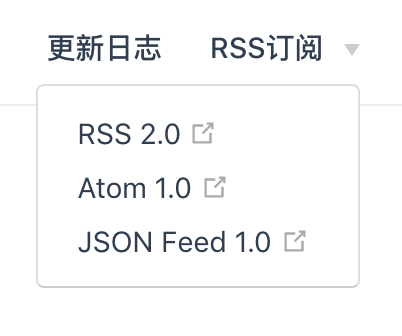

# SQ &nbsp; [](https://github.com/tolerance-go/sq/blob/master/LICENSE) [](https://circleci.com/gh/tolerance-go/sq) [](https://github.com/tolerance-go/sq/pulls)

[HOME](http://47.92.70.143)

用结构化的问题建立自己的领域知识体系，不断提高认知水平和解决问题的能力

## Usage

假设包管理器使用的是 `yarn`

在 `docs` 目录下的一级目录作为文档大分类，一级目录下必须存在 `README.md`，在一级目录下可以新建内容，层级不限，内容也是需要用文件夹形式创建，并且新建 `main.md` 入口文件，最后执行如下命令开启本地预览

```bash
yarn dev
```

侧边栏导航根据文档结构自动生成，执行命令如下，会在构建前自动调用

```bash
yarn generate
```

## 全站自动生成 Feed 订阅文件



参考 vuepress [自定义使用插件](https://vuepress.vuejs.org/zh/plugin/using-a-plugin.html)，大致流程如下：

1. 生产环境下，构建结束后：检测距离到上一个有版本 tag 的 commit（不包括），找到之间所有修改的 md 文件

   如果 head 就是 tag，则跳过，继续寻找上一个 tag 记录

2. 根据修改文件记录，通过调用 github-api 获取所有作者和贡献者信息

3. 根据文件内容生成 front options，覆盖默认 feed 参数

4. 根据文件内容生成 html 标记，vue 组件和相对路径需要提前特殊处理

5. 将对应文件和作者信息打包，通过 [Feed](https://github.com/jpmonette/feed) 生成静态文件输出到 outDir 目录

## Front Matter Config

VuePress 提供了对 [Front Matter](https://vuepress.vuejs.org/zh/guide/markdown.html#front-matter) 的支持，同时本项目扩展了如下参数

README 文件和 main 文件分别代表所容纳的文件夹

- 排序字段 `order`，数字越大越靠后，默认为 0
- `hiddenInSidebar` 控制 README 文件中是否在侧边导航出现，默认为 `false`
- `feed` 参数控制文件是否被自动生成 Feed 订阅内容，默认为 `true`
  - 文件修改记录只在未发布阶段有效
  - 可以通过 [id 子字段](https://github.com/jpmonette/feed#example) 强制更新

## 全局组件

- ContributorsList 获取文件作者和贡献者信息列表自动展示在文件下方

- Visual 在页面使用 iframe 展示 parcel 生成的静态页面，使用 iframe 的好处：

  - RSS 阅读器友好
  - 页面动态化展示
  - 反向提高了 Demo 的独立性

- [Vssue](https://github.com/meteorlxy/vssue) 自动在文章下方展示了评论组件，联动了 Github repo 和 issue，需要点击初始化

## Helper

除了撰写文档，可能还需要 demo 或测试帮助完善内容

### Visual

使用 `parcel`，可以方便引入各种资源构建视图，在 `docs` 目录下，新建 `*.html` 文件，执行如下命令

```bash
yarn dev:visual
```

### Service

使用 `Koa`，可以方便生成所需接口，在 `docs` 目录下，新建 `*.service.ts` 文件，执行如下命令

```bash
yarn dev:server
yarn dev:server:watch // 同时监听文件自动生成在线 swagger 文档，访问 /api-playground
```

### Test

使用 `Jest`，快速执行测试用例，在 `docs` 目录下，新建 `*.test.ts` 文件，执行如下命令

```bash
yarn test
```
