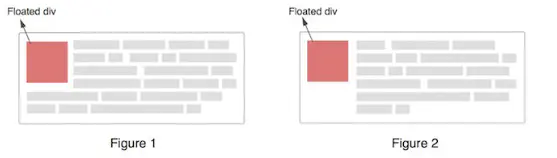

# BFC 是什么

## 概念

一个块格式化上下文（block formatting context） 是 Web 页面的可视化 CSS 渲染出的一部分。它是块级盒布局出现的区域，也是浮动层元素进行交互的区域。

## 如何创建

一个块格式化上下文由以下之一创建：

- 根元素或其它包含它的元素
- 浮动元素 (元素的 float 不是 none)
- 绝对定位元素 (元素具有 position 为 absolute 或 fixed)
- 内联块 (元素具有 display: inline-block)
- 表格单元格 (元素具有 display: table-cell，HTML 表格单元格默认属性)
- 表格标题 (元素具有 display: table-caption, HTML 表格标题默认属性)
- 具有 overflow 且值不是 visible 的块元素，
- display: flow-root
- column-span: all 应当总是会创建一个新的格式化上下文，即便具有 column-span: all 的元素并不被包裹在一个多列容器中。

**一个块格式化上下文包括创建它的元素内部所有内容，除了被包含于创建新的块级格式化上下文的后代元素内的元素。**

## 特性

块格式化上下文对于定位 (参见 float) 与清除浮动 (参见 clear) 很重要。

定位和清除浮动的样式规则只适用于处于同一块格式化上下文内的元素。

浮动不会影响其它块格式化上下文中元素的布局，并且清除浮动只能清除同一块格式化上下文中在它前面的元素的浮动。

## 解决的问题

### 1. 使 BFC 内部浮动元素不会到处乱跑

第一个例子中，in 元素设置为浮动，脱离了文档流，父级别元素没有包住它

<Visual relative="./views/index.html" />

<!-- prettier-ignore -->
<<< @/docs/前端/CSS/BFC是什么/views/index.html

我们设置父级元素 `overflow: hidden;`，创建一个块格式化上下文，此时容器高度就被子元素撑开了

<Visual relative="./views/index2.html" />

<!-- prettier-ignore -->
<<< @/docs/前端/CSS/BFC是什么/views/index2.html

## 2. 利用 BFC 可以消除 Margin Collapse

在正常情况下，在一个容器内的所有 box 将会由上至下依次垂直排列，即我们所说的一个元素占一行，并切垂直相邻的距离(即 margin)是由各自的 margin 决定的，而不是两个 margin 的叠加。

<Visual relative="./views/index3.html" />

<!-- prettier-ignore -->
<<< @/docs/前端/CSS/BFC是什么/views/index3.html

只有当元素在同一个 BFC 中时，垂直方向上的 margin 才会 clollpase.如果它们属于不同的 BFC，则不会有 margin collapse.因此我们可以再建立一个 BFC 去阻止 margin collpase 的发生。

<Visual relative="./views/index4.html" />

<!-- prettier-ignore -->
<<< @/docs/前端/CSS/BFC是什么/views/index4.html

## 3. 利用 BFC 阻止文本换行

有时候，确切的说大多数情况(若没有特殊设置)，文本将会环绕浮动元素(如 Figure 1), 但有时候这并不是我们期望的，我们想要的是 Figure2。

<Visual relative="./views/index5.html" />

<!-- prettier-ignore -->
<<< @/docs/前端/CSS/BFC是什么/views/index5.html

W3C 为这种情况提供了一个解决方案：unless the box establishes a new block formatting context，即为 p 建立 BFC。

<Visual relative="./views/index6.html" />

<!-- prettier-ignore -->
<<< @/docs/前端/CSS/BFC是什么/views/index6.html

## 参考资源

- [什么是 BFC](https://www.jianshu.com/p/682ae6476a14)
