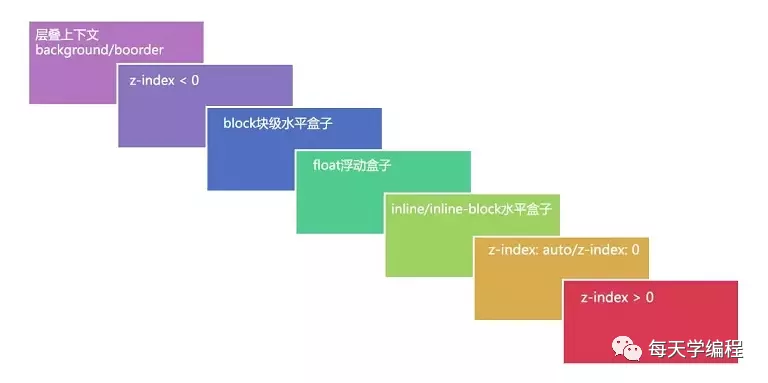

# CSS 层叠上下文、层叠等级、层叠顺序是什么

## 什么是“层叠上下文”

层叠上下文(stacking context)，是 HTML 中一个三维的概念。在 CSS2.1 规范中，每个盒模型的位置是三维的，分别是平面画布上的 X 轴，Y 轴以及表示层叠的 Z 轴。一般情况下，元素在页面上沿 X 轴 Y 轴平铺，我们察觉不到它们在 Z 轴上的层叠关系。而一旦元素发生堆叠，这时就能发现某个元素可能覆盖了另一个元素或者被另一个元素覆盖。

## 如何产生“层叠上下文”

其实，层叠上下文也基本上是有一些特定的 CSS 属性创建的，一般有 3 种方法：

1. HTML 中的根元素<html></html>本身 j 就具有层叠上下文，称为“根层叠上下文”。

2. 普通元素设置 position 属性为非 static 值并设置 z-index 属性为具体数值，产生层叠上下文。

3. CSS3 中的新属性也可以产生层叠上下文。

   父元素的 display 属性值为 flex|inline-flex，子元素 z-index 属性值不为 auto 的时候，子元素为层叠上下文元素；

   元素的 opacity 属性值不是 1；

   元素的 transform 属性值不是 none；

   元素 mix-blend-mode 属性值不是 `normal`；

   元素的 filter 属性值不是 none；

   元素的 isolation 属性值是 isolate；

   will-change 指定的属性值为上面任意一个；

   元素的-webkit-overflow-scrolling 属性值设置为 touch。

## 什么是“层叠等级”

那么，层叠等级指的又是什么？层叠等级(stacking level，叫“层叠级别”/“层叠水平”也行)

1. 在同一个层叠上下文中，它描述定义的是该层叠上下文中的层叠上下文元素在 Z 轴上的上下顺序。

2. 在其他普通元素中，它描述定义的是这些普通元素在 Z 轴上的上下顺序。

结论：

1. 普通元素的层叠等级**优先由其所在的层叠上下文**决定。

2. 层叠等级的比较只有在当前层叠上下文元素中才有意义。不同层叠上下文中比较层叠等级是没有意义的。

## 什么是“层叠顺序”

说完“层叠上下文”和“层叠等级”，我们再来说说“层叠顺序”。“层叠顺序”(stacking order)表示元素发生层叠时按照特定的顺序规则在 Z 轴上垂直显示。由此可见，前面所说的“层叠上下文”和“层叠等级”是一种概念，而这里的“层叠顺序”是一种规则。

在不考虑 CSS3 的情况下，当元素发生层叠时，层叠顺讯遵循上面途中的规则。这里值得注意的是：

1. 左上角"层叠上下文 background/border"指的是层叠上下文元素的背景和边框。

2. inline/inline-block 元素的层叠顺序要高于 block(块级)/float(浮动)元素。

3. 单纯考虑层叠顺序，z-index: auto 和 z-index: 0 在同一层级，但这两个属性值本身是有根本区别的。

## 如果快速判断层叠显示顺序

1. 首先先看要比较的两个元素是否处于同一个层叠上下文中：
   1. 如果是，谁的层叠等级大，谁在上面（怎么判断层叠等级大小呢？——看“层叠顺序”图）。
   2. 如果两个元素不在统一层叠上下文中，请先比较他们所处的层叠上下文的层叠等级。
2. 当两个元素层叠等级相同、层叠顺序相同时，在 DOM 结构中后面的元素层叠等级在前面元素之上。

## 参考资源

- [彻底搞懂 CSS 层叠上下文、层叠等级、层叠顺序、z-index](https://mp.weixin.qq.com/s/16-Ubn2dNqa0vLNqlO1x3w)
