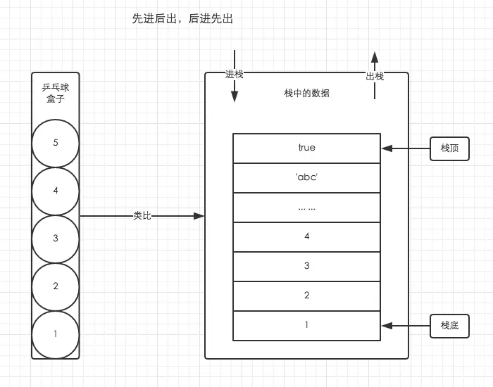
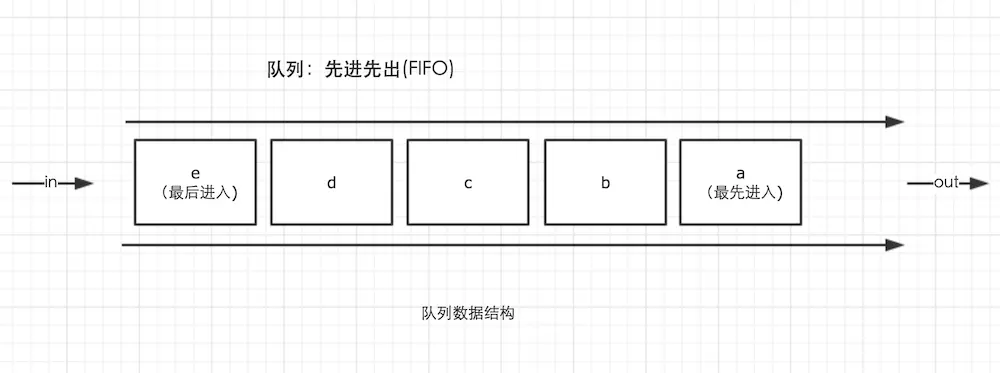

# JS 内存数据结构有哪些

## 栈数据结构

栈的结构就是后进先出（LIFO）。文中使用乒乓球盒子的结构来解释。

处于盒子中最顶层的乒乓球 5，它一定是最后被放进去，但可以最先被使用。而我们想要使用底层的乒乓球 1，就必须将上面的 4 个乒乓球取出来，让乒乓球 1 处于盒子顶层。

## 池数据结构

一般也会归类为栈中。其中栈存放变量，堆存放复杂对象，池存放常量，所以也叫常量池。

## 堆数据结构

堆数据结构是一种树状结构。它的存取数据的方式与书架和书非常相似。我们只需要知道书的名字就可以直接取出书了，并不需要把上面的书取出来。JSON 格式的数据中，我们存储的 key-value 可以是无序的，因为顺序的不同并不影响我们的使用，我们只需要关心书的名字

## 队列

队列是一种先进先出（FIFO）的数据结构，这是事件循环（Event Loop）的基础结构。

## 参考资源

- [JavaScript 深入之内存空间详细图解](https://muyiy.cn/blog/1/1.3.html)

