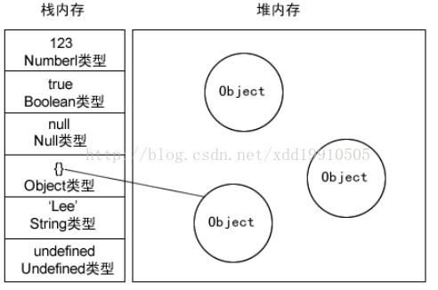

# JS 变量存放的位置在哪里

## 基本类型存放在栈中

保存在栈内存中，因为这些类型在内存中分别占有固定大小的空间，通过按值来访问。基本类型一共有 6 种：

1. Undefined
2. Null
3. Boolean
4. Number
5. String
6. Symbol

## 引用类型存放在堆中

保存在堆内存中，因为这种**值的大小不固定**，因此不能把它们保存到栈内存中，但内存地址大小的固定的，因此保存在堆内存中，在栈内存中存放的只是该对象的访问地址。当查询引用类型的变量时，先从栈中读取内存地址，然后再通过地址找到堆中的值。对于这种，我们把它叫做按引用访问。

闭包中的引用变量并不保存在栈内存中，而是保存在堆内存中，这也就解释了函数之后之后为什么闭包还能引用到函数内的变量。

### 原因

在计算机的数据结构中，栈比堆的运算速度快，Object 是一个复杂的结构且可以扩展：数组可扩充，对象可添加属性，都可以增删改查。将他们放在堆中是为了不影响栈的效率。而是通过引用的方式查找到堆中的实际对象再进行操作。所以查找引用类型值的时候先去栈查找再去堆查找。

## 资源

- [JavaScript深入之内存空间详细图解](https://muyiy.cn/blog/1/1.3.html#%E5%8F%98%E9%87%8F%E7%9A%84%E5%AD%98%E6%94%BE)

