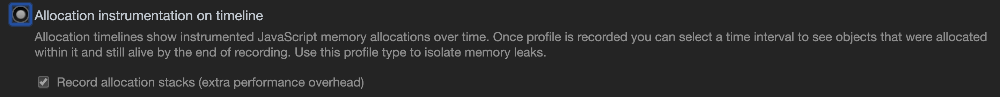

# 内存泄漏识别的方法是什么

## 浏览器方法

1. 打开开发者工具，选择 Memory
2. 在右侧的 Select profiling type 字段里面勾选 timeline
3. 点击左上角的录制按钮。
4. 在页面上进行各种操作，模拟用户的使用情况。
5. 一段时间后，点击左上角的 stop 按钮，面板上就会显示这段时间的内存占用情况。



## 命令行方法

使用 Node 提供的 process.memoryUsage 方法。

```ts
console.log(process.memoryUsage());

// 输出
{
  rss: 27709440,		// resident set size，所有内存占用，包括指令区和堆栈
  heapTotal: 5685248,   // "堆"占用的内存，包括用到的和没用到的
  heapUsed: 3449392,	// 用到的堆的部分
  external: 8772 		// V8 引擎内部的 C++ 对象占用的内存
}
```

判断内存泄漏，以 heapUsed 字段为准。

## 参考资源

- [JavaScript 深入之带你走进内存机制](https://muyiy.cn/blog/1/1.4.html)

<br/>
<br/>
<br/>
<ContributorsList />
<br/>
<br/>
<br/>
<Vssue :title="$title" />
