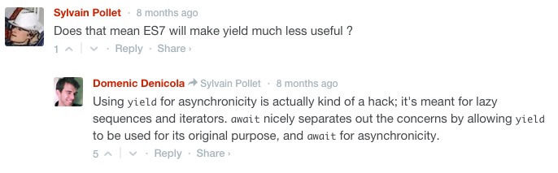

# JS 异步解决方案有哪些

本文将简单列举前端发展过程中，出现的各种主流异步方案

## 1. Callback

在 JS 的世界中，函数可以作为变量传递给另一个函数，被调用函数决定了调用时机，形成了一种 `控制反转` 的局面，回调函数就是这样产生的。

### Callback 如何使用

```ts
Something.save(function (err) {
  if (err) {
    //error handling
    return;
  }
  console.log('success');
});
```

这些所谓的错误优先 (error-first)函数在 Node.js 里占据重要地位：核心模块以及大多数在 NPM 的包都在使用它。

### Callback 缺点

1. 如果使用不当，很容易写出大量回调 (callback hells) 和混乱的代码 (spaghetti code)
2. return 语句却不能返回值，也不能使用 throw 关键字
3. 堆栈信息被断开
   1. 难以调试错误
   2. 外层 try catch 语句也无法直接捕获错误，容易忽略错误处理

### Callback 解决方案

其中一个方案，是使用 [async](https://www.npmjs.com/package/async) 模块，如果你有很多回调函数，你就会明白并行，按顺序运行，甚至使用异步函数映射数组会有多复杂。所以感谢 [Caolan McMahon](https://twitter.com/caolan)，编写了异步模块。

使用异步模块，你可以很轻松地做下面的事情：

```ts
async.map([1, 2, 3], AsyncSquaringLibrary.square, function (err, result) {
  // result will be [1, 4, 9]
});
```

但这种方法对代码的阅读和编写都不够友好，因此出现了 Promises。

## 2. Promises

目前的 JavaScript Promise 规范始于 2012 年，从 ES6 以后提供了支持。然而 Promises 不是 JavaScript 社区发明的，这个术语是 1976 年 Daniel P. Friedman 提出的。

**一个 Promise 代表一个异步操作最终的结果。**

### Promises 如何使用

使用 Promises 后，上面的例子可能像这样：

```ts
Something.save()
  .then(function () {
    console.log('success');
  })
  .catch(function () {
    //error handling
  });
```

### Promise 优点

1. 链式调用，代码更整洁，逻辑更清晰

   你会注意到 Promises 同样使用了回调函数，then 和 catch 注册的回调函数会在异步操作完成或者因为某些原因未能完成时被调用。不过好处是 Promises 可以链式调用。

2. 可以 return 内容
3. 可以 catch 捕获内部异常

```ts
saveSomething().then(updateOtherthing).then(deleteStuff).then(logResults);
```

### Promise 缺点

1. 异常错误会自动静默处理，外部也无法捕获

   ```ts
   let promise = new Promise(() => {
     throw new Error('error');
   });
   console.log(2333333);
   ```

   这次会正常的打印 233333，说明 Promise 内部的错误不会影响到 Promise 外部的代码。

   ```ts
   try {
     let promise = new Promise(() => {
       throw new Error('error');
     });
   } catch {
     console.log('can not print');
   }
   ```

   外部 try/catch 无法捕获异常

2. 无法取消

   Promise 一旦新建它就会立即执行，无法中途取消。

3. 无法得知 pending 状态进度

   当处于 pending 状态时，无法得知目前进展到哪一个阶段（刚刚开始还是即将完成）。

### 兼容

#### 包装回调接口

_你可能会问，当大多数库只暴露一个回调接口的时候该如何使用 Promises 呢？_

这也很容易，你唯一要做的事就是使用 Promise 包装一个回调函数，在里面调用原来的函数，像这样：

```ts
function saveToTheDb(value) {
  return new Promise(function(resolve, reject) {
    db.values.insert(value, function(err, user) { // remember error first ;)
      if (err) {
        return reject(err); // don't forget to return here
      }
      resolve(user);
    })
  }
}
```

#### 返回值判断

一些库或者框架，都已经做了支持，同时提供回调函数和 Promise 接口，如果你在构建一个库，支持两者是一个好办法。你可以很容易地像下面这样做：

```ts
function foo(cb) {
  if (cb) {
    return cb();
  }
  return new Promise(function (resolve, reject) {});
}
```

或者更简单，你可以选择仅提供 Promises 接口，然后用像 [callbackify](https://www.npmjs.com/package/callbackify) 这样的向后兼容工具。Callbackify 基本上和上面的代码做了同样的事情，但用更通用的方法。

## Generators / yield

[JavaScript Generators](https://blog.risingstack.com/introduction-to-koa-generators/) 是一个相对新的概念，他们在 ES6 (又称为 ES2015) 里面有介绍。

> 当函数执行时，你可以在任何地方暂停，做点别的计算，或者其他事情，然后再返回出去，甚至带有一些值还能继续，没有比这更好的方案了

### Generators 如何使用

这就是 generators 函数做的事情，当我们调用一个 generator 函数时，它还没有开始运行，我们要手动来遍历它。

```ts
function* foo() {
  var index = 0;
  while (index < 2) {
    yield index++;
  }
}
var bar = foo();

console.log(bar.next()); // { value: 0, done: false }
console.log(bar.next()); // { value: 1, done: false }
console.log(bar.next()); // { value: undefined, done: true }
```

如果你想使用 generators 轻松地编写异步的 JavaScript，你还需要 [co](https://www.npmjs.com/package/co) 库。

Co 是一个为 Node.js 和浏览器提供的基于 generator 的控制流，使用 promises 漂亮地写出无阻塞的代码。使用 co，我们之前的例子可能会像下面这样：

```ts
co(function* () {
  yield Something.save();
})
  .then(function () {
    // success
  })
  .catch(function (err) {
    //error handling
  });
```

你或许会问，如果是并行操作会怎么样？答案很简单 (内部仅仅是一个 Promise.all)：

```ts
yield[(Something.save(), Otherthing.save())];
```

### Generators 优点

1. 可以启停
2. 外部可以捕获异常

### Generators 缺点

1. 不会自动执行

## Async / await

ES7 中引入了异步函数，当前只能使用通过转译(如 [babel](https://babeljs.io/)) 工具来使用。(声明：现在讨论的是 async 关键字，而不是 async 模块包)

简单来讲，使用 async 关键字，我们可以做 co 和 generators 相结合的工作，而不是 hack。



### Async 如何使用

在其内部， async 关键字使用了 Promises，这也是异步函数会返回一个 Promise 对象的原因。那么，如果我们想要做上面例子中的事情，我们应该将其重写为下面这样：

```ts
async function save(Something) {
  try {
    await Something.save();
  } catch (ex) {
    //error handling
  }
  console.log('success');
}
```

正如你看到的，使用异步函数，必须将 async 关键字放在函数声明前面。在新创建的异步函数中，你可以使用 await 关键字。

使用 async 函数并行运行和使用 yield 的方法很像，除了 Promise.all 没有被隐藏，你需要调用它：

```ts
async function save(Something) {
  await Promise.all[(Something.save(), Otherthing.save())];
}
```

### Async 优缺点

Async 不仅在 Generators 的基础上改善了写法，同时返回了一个 Promise 对象，可以理解为基于 Promise 和 Generators 两者的实现，所以它也同时具备两者的优点和缺点：

优点：

1. 自动执行，像函数调用一样自然
2. 编写控制异步的代码更加优雅
3. 返回值支持链式调用

缺点：

1. 外部无法捕获异常
2. 无法控制启停
3. 无法查看内部状态

## 参考资源

- [异步 JavaScript 进化史](https://zhuanlan.zhihu.com/p/20322843)
- [ES6 系列之我们来聊聊 Promise](https://github.com/mqyqingfeng/Blog/issues/98)
