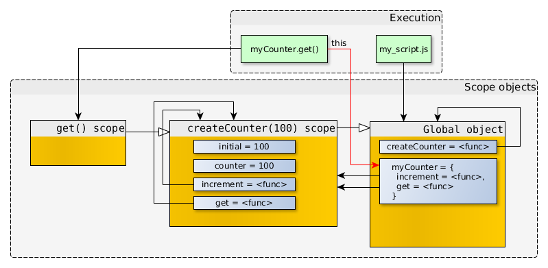

# 作用域和闭包的关系是什么

## 闭包是什么

闭包是指有权访问另外一个函数作用域中的变量的函数

## 闭包有哪些特性

闭包有下面三个特性：

1. 闭包可以访问当前函数以外的变量

2. 即使外部函数已经返回（执行栈已经弹出），闭包仍能访问外部函数定义的变量

3. 闭包可以更新外部变量的值

## 函数闭包为什么可以访问另外一个函数作用域中的变量

这是因为[作用域链](../执行上下文和执行作用域的关系是什么/main.md)的存在，即使是函数结束执行，它返回的函数对象因为包含一个作用域链，结构如下：

```ts
// 作用域链是一个数组
fContext = {
  Scope: [AO, UpperScopeContext.AO, globalContext.VO],
};
```

作用域链中的对象，被放在堆中的

该作用域链包含了定义时所指向的嵌套函数的变量对象引用，因此即使嵌套函数执行完成被销毁了，活动对象内存也不会被自动回收，当前函数依然可以通过作用域链找到它，这就是闭包实现的关键

参考下面这段代码：

```ts
function createCounter(initial) {
  var counter = initial;

  function increment(value) {
    counter += value;
  }

  function get() {
    return counter;
  }

  return {
    increment: increment,
    get: get,
  };
}

// createCounter(100);
var myCounter = createCounter(100);
```

如果 `createCounter(100)` 没有赋值调用结果，那么 createCounter(100) scope 不再被引用，于是就可以被垃圾回收。


但是 `createCounter(100)` 实际上是有返回值的，并且返回值被存储在了 myCounter 中，所以对象之间的引用关系如下图：


即使 `createCounter(100)` 已经返回，但是其作用域仍在，并且只能被内联函数访问。可以通过调用 `myCounter.increment()` 或 `myCounter.get()` 来直接访问 `createCounter(100)` 的作用域。

当 `myCounter.increment()` 或 `myCounter.get()` 被调用时，新的作用域对象会被创建，并且该作用域对象的父作用域对象会是当前可以直接访问的作用域对象。

调用 get() 时，当执行到 return counter 时，在 get() 所在的作用域并没有找到对应的标示符，就会沿着作用域链往上找，直到找到变量 counter，然后返回该变量。



单独调用 `increment(5)` 时，参数 value 保存在当前的作用域对象。当函数要访问 counter 时，没有找到，于是沿着作用域链向上查找，在 `createCounter(100)` 的作用域找到了对应的标示符，`increment()` 就会修改 counter 的值。除此之外，没有其他方式来修改这个变量。闭包的强大也在于此，能够存贮私有数据。


创建两个函数：myCounter1 和 myCounter2

```ts
function createCounter(initial) {
  /* ... see the code from previous example ... */
}

//-- create counter objects
var myCounter1 = createCounter(100);
var myCounter2 = createCounter(200);
```


myCounter1.increment 和 myCounter2.increment 的函数对象拥有着一样的代码以及一样的属性值（name，length 等等），但是它们的 scope 指向的是不一样的作用域对象。

## 参考资源

- [深入浅出图解作用域链和闭包](https://muyiy.cn/blog/2/2.1.html#%E4%BD%9C%E7%94%A8%E5%9F%9F%E9%93%BE)


