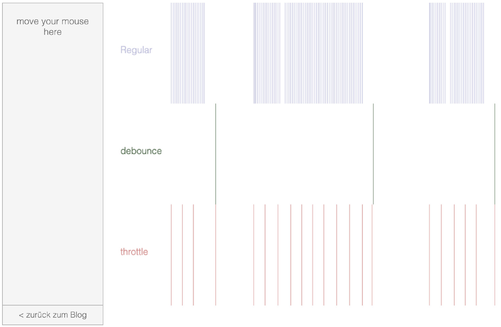

# 如何手动实现一个节流函数 throttle

## 定义

节流函数，顾名思义就是对函数调用次数频率的控制，假设节流时间间隔为 3 秒，第一个调用后 3 秒时间内，不管有多少次调用都无视掉，3 秒后如果还有调用则立即执行，调用频率参考下图



## 原理

实现方案有以下两种

1. 第一种是用时间戳来判断是否已到执行时间，记录上次执行的时间戳，然后每次触发事件执行回调，回调中判断当前时间戳距离上次执行时间戳的间隔是否已经达到时间差（Xms） ，如果是则执行，并更新上次执行的时间戳，如此循环。

2. 第二种方法是使用定时器，比如当 scroll 事件刚触发时，打印一个 hello world，然后设置个 1000ms 的定时器，此后每次触发 scroll 事件触发回调，如果已经存在定时器，则回调不执行方法，直到定时器触发，handler 被清除，然后重新设置定时器。

## 实现

这里我们采用第一种方案来实现，通过闭包保存一个 previous 变量，每次触发 throttle 函数时判断当前时间和 previous 的时间差，如果这段时间差小于等待时间，那就忽略本次事件触发。如果大于等待时间就把 previous 设置为当前时间并执行函数 fn。

我们来一步步实现，首先实现用闭包保存 previous 变量。

```ts
const throttle = (fn, wait) => {
	// 上一次执行该函数的时间
  let previous = 0
  return function(...args) {
    console.log(previous)
    ...
  }
}
```

执行 throttle 函数后会返回一个新的 function，我们命名为 betterFn。

```ts
const betterFn = function(...args) {
  console.log(previous)
    ...
}
```

betterFn 函数中可以获取到 previous 变量值也可以修改，在回调监听或事件触发时就会执行 betterFn，即 betterFn()，所以在这个新函数内判断当前时间和 previous 的时间差即可。

```ts
const betterFn = function (...args) {
  let now = +new Date();
  if (now - previous > wait) {
    previous = now;
    // 执行 fn 函数
    fn.apply(this, args);
  }
};
```

结合上面两段代码就实现了节流函数，所以完整的实现如下。

```ts
// fn 是需要执行的函数
// wait 是时间间隔
const throttle = (fn, wait = 50) => {
  // 上一次执行 fn 的时间
  let previous = 0;
  // 将 throttle 处理结果当作函数返回
  return function (...args) {
    // 获取当前时间，转换成时间戳，单位毫秒
    let now = +new Date();
    // 将当前时间和上一次执行函数的时间进行对比
    // 大于等待时间就把 previous 设置为当前时间并执行函数 fn
    if (now - previous > wait) {
      previous = now;
      fn.apply(this, args);
    }
  };
};

// DEMO
// 执行 throttle 函数返回新函数
const betterFn = throttle(() => console.log('fn 函数执行了'), 1000);
// 每 10 毫秒执行一次 betterFn 函数，但是只有时间差大于 1000 时才会执行 fn
setInterval(betterFn, 10);
```

上面的实现还有个小问题，最后一次调用后的最小间隔时间，如果又调用了一次，那么目前的实现是会无视掉的，因为时间没有超过 wait，那如果尾部的调用我们不想丢掉怎么办呢

看代码，我们将 wait 的判断改为最小间隔之内

```ts
// fn 是需要节流处理的函数
// wait 是时间间隔
function throttle(fn, wait) {
  // previous 是上一次执行 fn 的时间
  // timer 是定时器
  let previous = 0,
    timer = null;

  // 将 throttle 处理结果当作函数返回
  return function (...args) {
    // 获取当前时间，转换成时间戳，单位毫秒
    let now = +new Date();

    // ------ 新增部分 start ------
    // 判断上次触发的时间和本次触发的时间差是否小于时间间隔
    if (now - previous < wait) {
      // 如果小于，则为本次触发操作设立一个新的定时器
      // 定时器时间结束后执行函数 fn
      if (timer) clearTimeout(timer);
      timer = setTimeout(() => {
        previous = now;
        fn.apply(this, args);
      }, wait);
      // ------ 新增部分 end ------
    } else {
      // 第一次执行
      // 或者时间间隔超出了设定的时间间隔，执行函数 fn
      previous = now;
      fn.apply(this, args);
    }
  };
}

// DEMO
// 执行 throttle 函数返回新函数
const betterFn = throttle(() => console.log('fn 节流执行了'), 1000);
// 第一次触发 scroll 执行一次 fn，每隔 1 秒后执行一次函数 fn，停止滑动 1 秒后再执行函数 fn
document.addEventListener('scroll', betterFn);
```

## 参考资源

- [深入浅出节流函数 throttle](https://muyiy.cn/blog/7/7.1.html)
