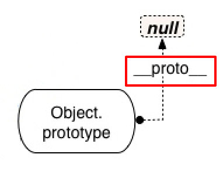
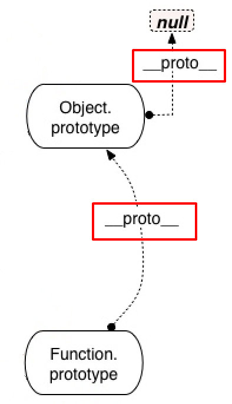
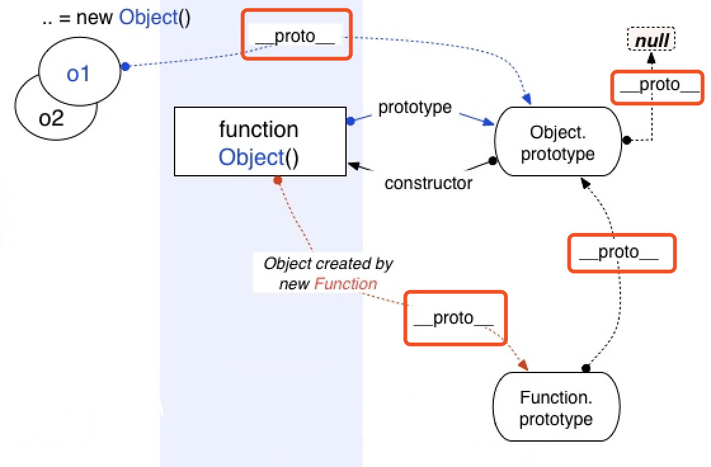
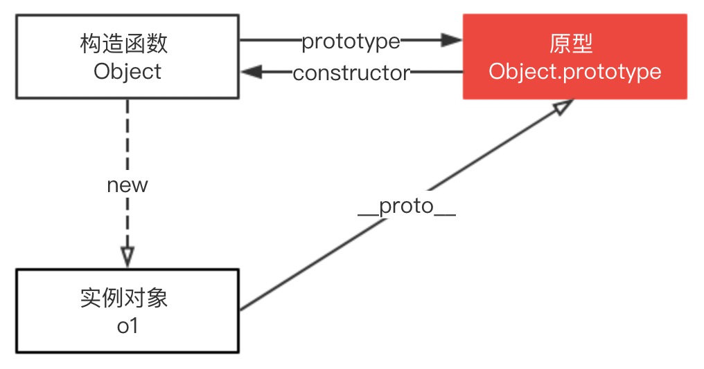
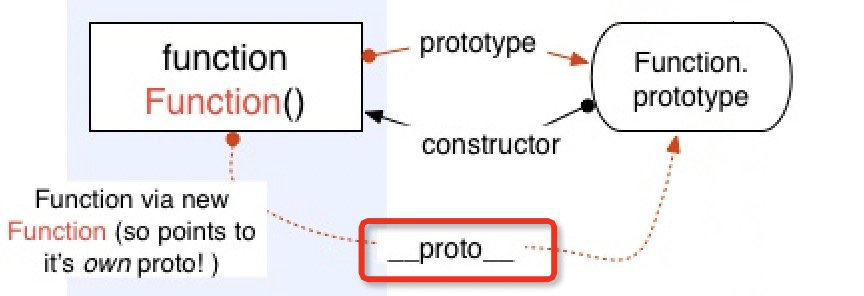
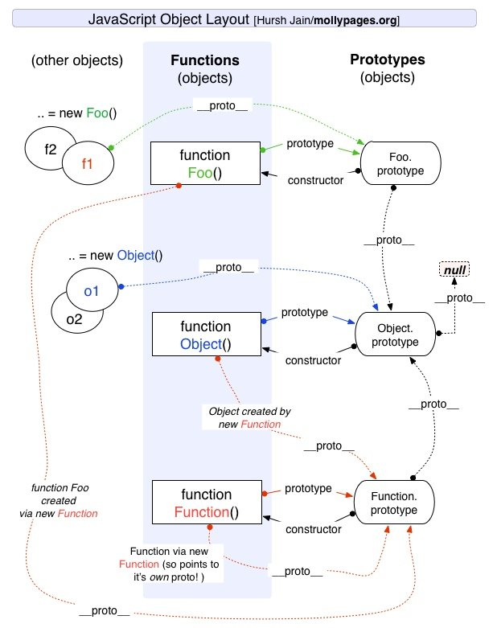

# JS 内建对象的继承关系是什么

## Object.prototype

Object.prototype 表示 Object 的原型对象，其 `[[Prototype]]` 属性是 null，访问器属性 `__proto__` 暴露了一个对象的内部 `[[Prototype]]` 。 Object.prototype 并不是通过 Object 函数创建的，为什么呢？看如下代码

```ts
function Foo() {
  this.value = 'foo';
}
let f = new Foo();
f.__proto__ === Foo.prototype;
// true
```

实例对象的 `__proto__` 指向构造函数的 prototype，即 `f.__proto__` 指向 Foo.prototype，但是 `Object.prototype.__proto__` 是 null，所以 Object.prototype 并不是通过 Object 函数创建的，那它如何生成的？其实 Object.prototype 是浏览器底层根据 ECMAScript 规范创造的一个对象。

顺便说下：Object.prototype 就是原型链的顶端（不考虑 null 的情况下），所有对象继承了它的 toString 等方法和属性。



## Function.prototype

Function.prototype 对象是一个函数（对象），其 `[[Prototype]]` 内部属性值指向内建对象 Object.prototype。Function.prototype 对象自身没有 valueOf 属性，其从 Object.prototype 对象继承了 valueOf 属性。



Function.prototype 的 `[[Class]]` 属性是 Function，所以这是一个函数，但又不大一样。为什么这么说呢？因为原来我们知道应该只有函数才有 prototype 属性，但是 Function.prototype 这个函数就没有。

```ts
Function.prototype;
// ƒ () { [native code] }

Function.prototype.prototype;
// undefined
```

其实 bind 返回的函数也没有 prototype 属性。

```ts
let fun = Function.prototype.bind();
// ƒ () { [native code] }

fun.prototype;
// undefined
```

为什么没有呢，Function.prototype 也是引擎创建出来的函数，引擎认为不需要给这个函数对象添加 prototype 属性，不然 Function.prototype.prototype… 将无休无止并且没有存在的意义。

## Object

Object 作为构造函数时，其 [[Prototype]] 内部属性值指向 Function.prototype，即

```ts
Object.__proto__ === Function.prototype;
// true
```



使用 new Object() 创建新对象时，这个新对象的 [[Prototype]] 内部属性指向构造函数的 prototype 属性，对应上图就是 Object.prototype。



## Function

Function 构造函数是一个函数对象，其 [[Class]] 属性是 Function。Function 的 [[Prototype]] 属性指向了 Function.prototype，即

```ts
Function.__proto__ === Function.prototype;
// true
```



因此我们在做 instanceof 判断的时候，会得到一个好玩的现象

```ts
Object instanceof Function; // 1：true
Function instanceof Object; // 2：true
Object instanceof Object; // 3：true
Function instanceof Function; // 4：true
```

分析原因如下：

1. Object 的 [[Prototype]] 指向 Function.prototype

2. Function 的 [[Prototype]] 指向 Function.prototype，Function.prototype 的 [[Prototype]] 指向 Object.prototype

3. Object 的 [[Prototype]] 指向 Function.prototype ，Function.prototype 的 [[Prototype]] 指向 Object.prototype

4. Function 的 [[Prototype]] 指向 Function.prototype

最后给一个完整的图，看懂这张图原型就没问题了。



## 内置类型构建过程

JavaScript 内置类型是浏览器内核自带的，浏览器底层对 JavaScript 的实现基于 C/C++，那么浏览器在初始化 JavaScript 环境时都发生了什么？

1. 用 C/C++ 构造内部数据结构创建一个 `OP` 即 (Object.prototype) 以及初始化其内部属性但不包括行为。

2. 用 C/C++ 构造内部数据结构创建一个 `FP` 即 (Function.prototype) 以及初始化其内部属性但不包括行为。

3. 将 `FP` 的 [[Prototype]] 指向 `OP`。

4. 用 C/C++ 构造内部数据结构创建各种内置引用类型。

5. 将各内置引用类型的[[Prototype]]指向 `FP`。

6. 将 Function 的 prototype 指向 `FP`。

7. 将 Object 的 prototype 指向 `OP`。

8. 用 Function 实例化出 `OP`，`FP`，以及 Object 的行为并挂载。

9. 用 Object 实例化出除 Object 以及 Function 的其他内置引用类型的 prototype 属性对象。

10. 用 Function 实例化出除 Object 以及 Function 的其他内置引用类型的 prototype 属性对象的行为并挂载。

11. 实例化内置对象 Math 以及 Grobal

至此，所有内置类型构建完成。

## 参考资源

- [深入探究 Function & Object 鸡蛋问题](https://muyiy.cn/blog/5/5.3.html)
