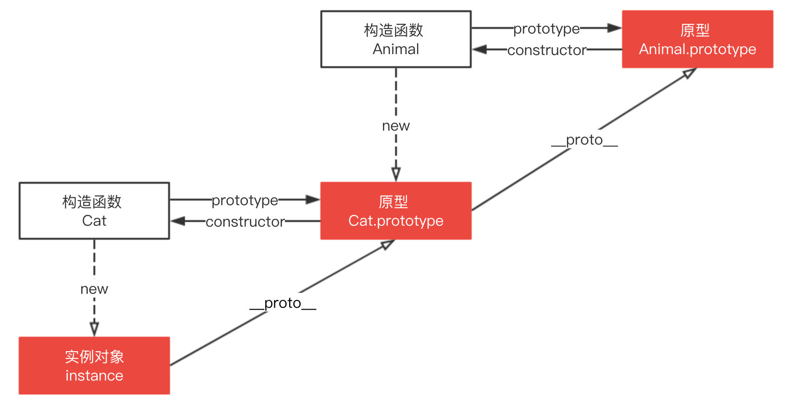

# 如何使用原型链实现继承关系

## 原型链查找规则

原型上的属性和方法定义在 prototype 对象上，而非对象实例本身。当访问一个对象的属性 / 方法时，它不仅仅在该对象上查找，还会查找该对象的原型，以及该对象的原型的原型，一层一层向上查找，直到找到一个名字匹配的属性 / 方法或到达原型链的末尾（null）。

比如调用 foo.valueOf() 会发生什么？

1. 首先检查 foo 对象是否具有可用的 valueOf() 方法。

2. 如果没有，则检查 foo 对象的原型对象（即 Foo.prototype）是否具有可用的 valueof() 方法。

3. 如果没有，则检查 Foo.prototype 所指向的对象的原型对象（即 Object.prototype）是否具有可用的 valueOf() 方法。这里有这个方法，于是该方法被调用。


## 原型链构建规则

原型链的构建是依赖于 prototype 还是 `__proto__` 呢？

使用其他 JavaScript 构造器函数创建的对象，其 [[Prototype]] 值就是该构造器函数的 prototype 属性。


Foo.prototype 中的 prototype 并没有构建成一条原型链，其只是指向原型链中的某一处。原型链的构建依赖于 `__proto__`，如上图通过 `foo.__proto__` 指向 Foo.prototype，foo.`__proto__`.`__proto__` 指向 Bichon.prototype，如此一层一层最终链接到 null。

## instanceof 原理及实现

`instanceof` 运算符用来检测 `constructor.prototype` 是否存在于参数 object 的原型链上。

```ts
function C() {}
function D() {}

var o = new C();

o instanceof C; // true，因为 Object.getPrototypeOf(o) === C.prototype
o instanceof D; // false，因为 D.prototype 不在 o 的原型链上
```

instanceof 原理就是一层一层查找 `__proto__`，如果和 constructor.prototype 相等则返回 true，如果一直没有查找成功则返回 false。

知道了原理后我们来实现 instanceof，代码如下。

```ts
function instance_of(L, R) {
  //L 表示左表达式，R 表示右表达式
  var O = R.prototype; // 取 R 的显示原型
  L = L.__proto__; // 取 L 的隐式原型
  while (true) {
    // Object.prototype.__proto__ === null
    if (L === null) return false;
    if (O === L)
      // 这里重点：当 O 严格等于 L 时，返回 true
      return true;
    L = L.__proto__;
  }
}

// 测试
function C() {}
function D() {}

var o = new C();

instance_of(o, C); // true
instance_of(o, D); // false
```

## 原型链继承

原型链继承的本质是重写原型对象，代之以一个新类型的实例。如下代码，新原型 Cat 不仅有 new Animal() 实例上的全部属性和方法，并且由于指向了 Animal 原型，所以还继承了 Animal 原型上的属性和方法。

```ts
function Animal() {
  this.value = 'animal';
}

Animal.prototype.run = function () {
  return this.value + ' is runing';
};

function Cat() {}

// 这里是关键，创建 Animal 的实例，并将该实例赋值给 Cat.prototype
// 相当于 Cat.prototype.__proto__ = Animal.prototype
Cat.prototype = new Animal();

var instance = new Cat();
instance.value = 'cat'; // 创建 instance 的自身属性 value
console.log(instance.run()); // cat is runing
```

### 原型链继承方案有以下缺点：

#### 1. 多实例共享原型对象，对引用类型的操作会影响其它实例

原型链继承方案中，原型实际上会变成另一个类型的实例，如下代码，Cat.prototype 变成了 Animal 的一个实例，所以 Animal 的实例属性 names 就变成了 Cat.prototype 的属性。

而原型属性上的引用类型值会被所有实例共享，所以多个实例对引用类型的操作会被篡改。如下代码，改变了 instance1.names 后影响了 instance2。

```ts
function Animal() {
  this.names = ['cat', 'dog'];
}
function Cat() {}

Cat.prototype = new Animal();

var instance1 = new Cat();
instance1.names.push('tiger');
console.log(instance1.names); // ["cat", "dog", "tiger"]

var instance2 = new Cat();
console.log(instance2.names); // ["cat", "dog", "tiger"]
```

#### 2. 子类型的原型上的 constructor 属性需要被重写

子类型原型上的 constructor 属性被重写了，执行 Cat.prototype = new Animal() 后原型被覆盖，Cat.prototype 上丢失了 constructor 属性， Cat.prototype 指向了 Animal.prototype，而 Animal.prototype.constructor 指向了 Animal，所以 Cat.prototype.constructor 指向了 Animal。

```ts
Cat.prototype = new Animal();
Cat.prototype.constructor === Animal;
// true
```

解决办法就是重写 Cat.prototype.constructor 属性，指向自己的构造函数 Cat。

```ts
function Animal() {
  this.value = 'animal';
}

Animal.prototype.run = function () {
  return this.value + ' is runing';
};

function Cat() {}
Cat.prototype = new Animal();

// 新增，重写 Cat.prototype 的 constructor 属性，指向自己的构造函数 Cat
Cat.prototype.constructor = Cat;
```



#### 3. 给子类型原型添加属性和方法必须在替换原型之后

给子类型原型添加属性和方法必须在替换原型之后，原因在第二点已经解释过了，因为子类型的原型会被覆盖。

```ts
function Animal() {
  this.value = 'animal';
}

Animal.prototype.run = function () {
  return this.value + ' is runing';
};

function Cat() {}
Cat.prototype = new Animal();
Cat.prototype.constructor = Cat;

// 新增
Cat.prototype.getValue = function () {
  return this.value;
};

var instance = new Cat();
instance.value = 'cat';
console.log(instance.getValue()); // cat
```

### 属性遮蔽

改造上面的代码，在 Cat.prototype 上添加 run 方法，但是 Animal.prototype 上也有一个 run 方法，不过它不会被访问到，这种情况称为属性遮蔽 (property shadowing)。

```ts
function Animal() {
  this.value = 'animal';
}

Animal.prototype.run = function () {
  return this.value + ' is runing';
};

function Cat() {}
Cat.prototype = new Animal();
Cat.prototype.constructor = Cat;

// 新增
Cat.prototype.run = function () {
  return 'cat cat cat';
};

var instance = new Cat();
instance.value = 'cat';
console.log(instance.run()); // cat cat cat
```

那如何访问被遮蔽的属性呢？通过 `__proto__` 调用原型链上的属性即可。

```ts
// 接上
console.log(instance.__proto__.__proto__.run()); // undefined is runing
```

## 参考资源

- [图解原型链及其继承优缺点](https://muyiy.cn/blog/5/5.2.html)
