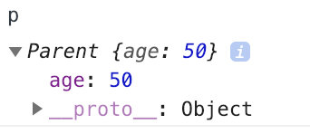
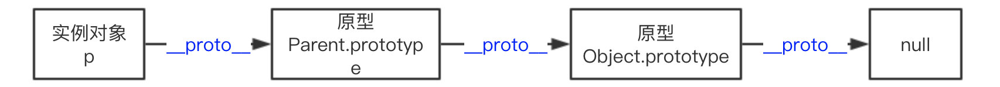

# 构造函数和原型及原型链的关系是什么

## 构造函数

### 什么是构造函数

`constructor` 返回创建实例对象时构造函数的引用。此属性的值是对函数本身的引用，而不是一个包含函数名称的字符串。

```ts
function Parent(age) {
  this.age = age;
}

var p = new Parent(50);
p.constructor === Parent; // true
p.constructor === Object; // false
```

构造函数本身就是一个函数，与普通函数没有任何区别，不过为了规范一般将其首字母大写。构造函数和普通函数的区别在于，使用 new 生成实例的函数就是构造函数，直接调用的就是普通函数。

那是不是意味着普通函数创建的实例没有 constructor 属性呢？不一定。

#### 字面量的构造函数

直接看示例代码：

```ts
({}.constructor === Object);
// true
(1).constructor === Number;
// true
/a/.constructor === RegExp;
// true
```

### Symbol 是构造函数吗

> Symbol 是基本数据类型，但作为构造函数来说它并不完整，因为它不支持语法 new Symbol()，Chrome 认为其不是构造函数，如果要生成实例直接使用 Symbol() 即可。 - [MDN](https://developer.mozilla.org/zh-CN/docs/Web/JavaScript/Reference/Global_Objects/Symbol)

```ts
new Symbol(123); // Symbol is not a constructor

Symbol(123); // Symbol(123)
```

虽然是基本数据类型，但 Symbol(123) 实例可以获取 constructor 属性值。

```ts
var sym = Symbol(123);
console.log(sym);
// Symbol(123)

console.log(sym.constructor);
// ƒ Symbol() { [native code] }
```

这里的 constructor 属性来自哪里？其实是 Symbol 原型上的，即 Symbol.prototype.constructor 返回创建实例原型的函数， 默认为 Symbol 函数。

### constructor 值只读吗

这个得分情况，对于引用类型来说 constructor 属性值是可以修改的，但是对于基本类型来说是只读的。

引用类型情况其值可修改这个很好理解，比如原型链继承方案中，就需要对 constructor 重新赋值进行修正。

```ts
function Foo() {
  this.value = 42;
}
Foo.prototype = {
  method: function () {},
};

function Bar() {}

// 设置 Bar 的 prototype 属性为 Foo 的实例对象
Bar.prototype = new Foo();
Bar.prototype.foo = 'Hello World';

Bar.prototype.constructor === Object;
// true

// 修正 Bar.prototype.constructor 为 Bar 本身
Bar.prototype.constructor = Bar;

var test = new Bar(); // 创建 Bar 的一个新实例
console.log(test);
```

对于基本类型来说是只读的，比如 1、“muyiy”、true、Symbol，因为创建他们的是只读的原生构造函数（native constructors），当然 null 和 undefined 是没有 constructor 属性的。

## 原型是什么

JavaScript 是一种基于原型的语言 (prototype-based language)，这个和 Java 等基于类的语言不一样。

每个对象拥有一个原型对象，用 `__proto__` 或 `[[Prototype]]` 表示，对象以其原型为模板，从原型继承方法和属性，这些属性和方法定义在对象的构造器函数的 prototype 属性上，而非对象实例本身。

构造函数 Parent 有一个指向原型的指针，原型 Parent.prototype 有一个指向构造函数的指针 Parent.prototype.constructor，如上图所示，其实就是一个循环引用。


`__proto__` 是每个实例上都有的属性，prototype 是构造函数的属性，这两个并不一样，但 `p.__proto__` 和 `Parent.prototype` 指向同一个对象。

```ts
function Parent() {}
var p = new Parent();
p.__proto__ === Parent.prototype;
// true
```

所以构造函数 Parent、Parent.prototype 和 p 的关系如下图。


`__proto__` 属性在 ES6 时才被标准化，以确保 Web 浏览器的兼容性，但是不推荐使用，除了标准化的原因之外还有性能问题。为了更好的支持，推荐使用 `Object.getPrototypeOf()`。

```ts
// 获取
Object.getPrototypeOf();
Reflect.getPrototypeOf();

// 修改
Object.setPrototypeOf();
Reflect.setPrototypeOf();
```

如果要创建一个新对象，同时继承另一个对象的 [[Prototype]] ，推荐使用 Object.create()。

```ts
function Parent() {
  age: 50;
}
var p = new Parent();
var child = Object.create(p);
```

这里 child 是一个新的空对象，有一个指向对象 p 的指针 `__proto__`。

## 原型链是什么

每个对象拥有一个原型对象，通过 `__proto__` 指针指向上一个原型 ，并从中继承方法和属性，同时原型对象也可能拥有原型，这样一层一层，最终指向 null。这种关系被称为原型链 (prototype chain)，通过原型链一个对象会拥有定义在其他对象中的属性和方法。

我们看下面一个例子

```ts
function Parent(age) {
  this.age = age;
}

var p = new Parent(50);
p.constructor === Parent; // true
```

这里 p.constructor 指向 Parent，那是不是意味着 p 实例存在 constructor 属性呢？并不是。

我们打印下 p 值就知道了。



由图可以看到实例对象 p 本身没有 constructor 属性，是通过原型链向上查找 **proto** ，最终查找到 constructor 属性，该属性指向 Parent。

```ts
function Parent(age) {
  this.age = age;
}
var p = new Parent(50);

p; // Parent {age: 50}
p.__proto__ === Parent.prototype; // true
p.__proto__.__proto__ === Object.prototype; // true
p.__proto__.__proto__.__proto__ === null; // true
```

下图展示了原型链的运作机制。



## 总结

- Symbol 作为构造函数来说并不完整，因为不支持语法 new Symbol()，但其原型上拥有 constructor 属性，即 Symbol.prototype.constructor。

- 引用类型 constructor 属性值是可以修改的，但是对于基本类型来说是只读的，当然 null 和 undefined 没有 constructor 属性。

- `__proto__` 是每个实例上都有的属性，prototype 是构造函数的属性，在实例上并不存在，所以这两个并不一样，但 `p.__proto__` 和 Parent.prototype 指向同一个对象。

- `__proto__` 属性在 ES6 时被标准化，但因为性能问题并不推荐使用，推荐使用 Object.getPrototypeOf()。

- 每个对象拥有一个原型对象，通过 `__proto__` 指针指向上一个原型 ，并从中继承方法和属性，同时原型对象也可能拥有原型，这样一层一层，最终指向 null，这就是原型链。


## 参考资源

- [重新认识构造函数、原型和原型链](https://muyiy.cn/blog/5/5.1.html)