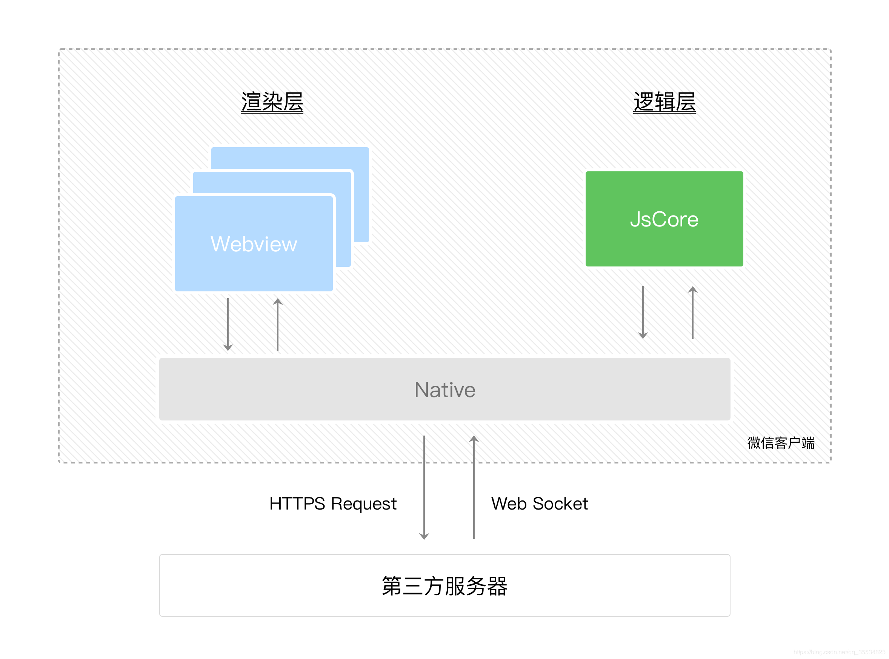
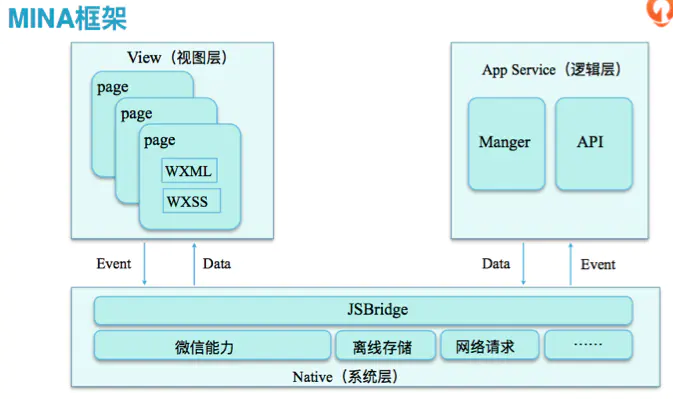

# 微信小程序原理是什么

小程序在设计之初，首要目标就是快。一般来说，渲染界面的技术有三种：

1. 用纯客户端原生技术来渲染
2. 用纯 Web 技术来渲染
3. Hybrid 技术

而微信不可能用纯客户端技术把小程序放入微信中，这样小程序代码就会和微信一起打包，跟随微信一起发布版本。

但是如果用纯 Web 技术来渲染又会造成性能问题，因为 UI 线程和 JS 线程是互斥的。

考虑微信需要建立一个生态，所以需要对小程序进行管控，所以不希望开发者进行 DOM 相关操作。所以提供了一个沙箱环境（不提供任何浏览器接口，只提供纯 JS 的解释器环境）。

所以自然地 JS 被隔离出来，并且我们还需要通过微信客户端进行 Native 操作，所以这个架构如下：

WXML 和 WXSS 工作在渲染层（webview），JS 脚本工作在逻辑层（jsCore）。并且每个小程序页面都是对应一个 webview 线程，这样性能比较好。

其内部也是通过 virtual dom 进行管理 DOM 的，当我们调用 setData 后，会重新生成一个新的 virtual dom 进行 diff 比对，然后进行 patch。

---

微信小程序采用 JavaScript、WXML、WXSS 三种技术进行开发,本质就是一个单页面应用，所有的页面渲染和事件处理，都在一个页面内进行，但又可以通过微信客户端调用原生的各种接口微信的架构，是数据驱动的架构模式，它的 UI 和数据是分离的，所有的页面更新，都需要通过对数据的更改来实现

小程序分为两个部分 `webview` 和 `appService` 。其中 `webview` 主要用来展现 UI ，`appService` 有来处理业务逻辑、数据及接口调用。它们在两个进程中运行，通过系统层 `JSBridge` 实现通信，实现 UI 的渲染、事件的处理

## 参考资源

- [小程序的架构和原理](https://blog.csdn.net/qq_35534823/article/details/98121588)
- [微信小程序开发框架](https://www.jianshu.com/p/3db8484fc521)
