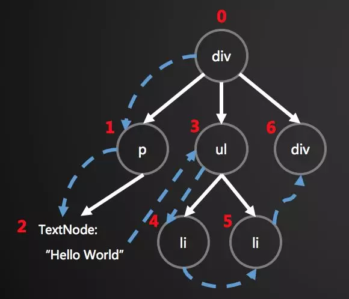

# Diff 算法是什么

## 目标

Diff 算法是指在 React 中对比新旧 [Virtual DOM](../VirtualDOM是什么/main.html) 时执行的算法，目标是找出更新变化的范围。

## 算法介绍

### 策略优化

Diff 算法提出了三个策略来保证整体界面构建的性能，具体是：

1. Web UI 中 DOM 节点跨层级的移动操作特别少，可以忽略不计。

2. 拥有相同类的两个组件将会生成相似的树形结构，拥有不同类的两个组件将会生成不同的树形结构。

3. 对于同一层级的一组子节点，它们可以通过唯一 id 进行区分。

基于以上三个前提策略，React 分别对 tree diff、component diff 以及 element diff 进行算法优化。

### 深度遍历

比较“树”的差异，首先是要对树进行遍历，常用的有两种遍历算法，分别是深度优先遍历和广度优先遍历，一般的 diff 算法中都采用的是深度优先遍历。对新旧两棵树进行一次深度优先的遍历，这样每个节点都会有一个唯一的标记。在遍历的时候，每遍历到一个节点就把该节点和新的树的同一个位置的节点进行对比，如果有差异的话就记录到一个对象里面。



例如，上面的 div 和新的 div 有差异，当前的标记是 0，那么：`patches[0] = [{difference}, {difference}, …]`。同理 p 是`patches[1]`，ul 是`patches[3]`，以此类推。这样当遍历完整棵树的时候，就可以获得一个完整的差异对象。

### 差异类型

差异对象是对 DOM 操作的抽象，可能的操作如下：

- 替换节点

- 增加/删除子节点

- 修改节点属性

- 改变文本内容

所以我们定义了几种差异类型：

```ts
var REPLACE = 0;
var REORDER = 1;
var PROPS = 2;
var TEXT = 3;
```

对于节点替换，很简单。判断新旧节点的 tagName 是不是一样的，如果不一样的说明需要替换掉。如 div 换成 section，就记录下：

```ts
patches[0] = [
  {
    type: REPALCE,
    node: newNode, // el('section', props, children)
  },
];
```

如果给 div 新增了属性 id 为 container，就记录下：

```ts
patches[0] = [
  {
    type: PROPS,
    props: {
      id: 'container',
    },
  },
];
```

如果修改了文本节点的内容，就记录下：

```ts
patches[2] = [
  {
    type: TEXT,
    content: 'Virtual DOM2',
  },
];
```

具体对比流程如下：

在遍历中，还需要对每个 VDOM 进行一些对比，具体分为以下几种情况：

1. 旧节点不存在，插入新节点；新节点不存在，删除旧节点

2. 新旧节点如果都是 VNode，且新旧节点 tag 相同

   1. 对比新旧节点的属性

   2. 对比新旧节点的子节点差异，通过 key 值进行重排序，key 值相同节点继续向下遍历

3. 新旧节点如果都是 VText，判断两者文本是否发生变化

4. 其他情况直接用新节点替代旧节点

### 子节点比较

这一部分可以说是 diff 算法中，变动最多的部分，因为前面的部分，各个库对比的方向基本一致，而关于子节点的对比，各个仓库都在前者基础上不断得进行改进。

首先需要明白，为什么需要改进子节点的对比方式。如果我们直接按照深度优先遍历的方式，一个个去对比子节点，子节点的顺序发生改变，那么就会导致 diff 算法认为所有子节点都需要进行 replace，重新将所有子节点的虚拟 DOM 转换成真实 DOM，这种操作是十分消耗性能的。

但是，如果我们能够找到新旧虚拟 DOM 对应的位置，然后进行移动，那么就能够尽量减少 DOM 的操作。

#### 列表对比算法

virtual-dom 在一开始就进行了这方面的尝试，对子节点添加 key 值，通过 key 值的对比，来判断子节点是否进行了移动。通过 key 值对比子节点是否移动的模式，被各个库沿用，这也就是为什么主流的视图库中，子节点如果缺失 key 值，会有 warning 的原因。


具体是怎么对比的，我们先看代码：

```ts
function diffChildren(oldNode, newNode, patches, patch, index) {
  const oldChildren = oldNode.children;
  // 新节点按旧节点的顺序重新排序
  const sortedSet = sortChildren(oldChildren, newNode.children);
  const newChildren = sortedSet.children;
  const oldLen = oldChildren.length;
  const newLen = newChildren.length;
  const len = oldLen > newLen ? oldLen : newLen;
  for (let i = 0; i < len; i++) {
    var leftNode = oldChildren[i];
    var rightNode = newChildren[i];
    index++;

    if (!leftNode) {
      if (rightNode) {
        // 旧节点不存在，新节点存在，进行插入操作
        patch = appendPatch(patch, {
          type: PATCH.INSERT,
          vNode: rightNode,
        });
      }
    } else {
      // 相同节点进行比对
      walk(leftNode, rightNode, patches, index);
    }
    if (isVNode(leftNode) && isArray(leftNode.children)) {
      index += leftNode.children.length;
    }
  }

  if (sortedSet.moves) {
    // 最后进行重新排序
    patch = appendPatch(patch, {
      type: PATCH.ORDER,
      moves: sortedSet.moves,
    });
  }

  return patch;
}
```

这里首先需要对新的子节点进行重排序，先进行相同节点的 diff ，最后把子节点按照新的子节点顺序重新排列。


这里有个较复杂的部分，就是对子节点的重新排序。

```ts
function sortChildren(oldChildren, newChildren) {
  // 找出变化后的子节点中带 key 的 vdom (keys)，和不带 key 的 vdom (free)
  const newChildIndex = keyIndex(newChildren);
  const newKeys = newChildIndex.keys;
  const newFree = newChildIndex.free;

  // 所有子节点无 key 不进行对比
  if (newFree.length === newChildren.length) {
    return {
      children: newChildren,
      moves: null,
    };
  }

  // 找出变化前的子节点中带 key 的 vdom (keys)，和不带 key 的 vdom (free)
  const oldChildIndex = keyIndex(oldChildren);
  const oldKeys = oldChildIndex.keys;
  const oldFree = oldChildIndex.free;

  // 所有子节点无 key 不进行对比
  if (oldFree.length === oldChildren.length) {
    return {
      children: newChildren,
      moves: null,
    };
  }

  // O(MAX(N, M)) memory
  const shuffle = [];

  const freeCount = newFree.length;
  let freeIndex = 0;
  let deletedItems = 0;

  // 遍历变化前的子节点，对比变化后子节点的 key 值
  // 并按照对应顺序将变化后子节点的索引放入 shuffle 数组中
  for (let i = 0; i < oldChildren.length; i++) {
    const oldItem = oldChildren[i];
    let itemIndex;

    if (oldItem.key) {
      if (newKeys.hasOwnProperty(oldItem.key)) {
        // 匹配到变化前节点中存在的 key
        itemIndex = newKeys[oldItem.key];
        shuffle.push(newChildren[itemIndex]);
      } else {
        // 移除变化后节点不存在的 key 值
        deletedItems++;
        shuffle.push(null);
      }
    } else {
      if (freeIndex < freeCount) {
        // 匹配变化前后的无 key 子节点
        itemIndex = newFree[freeIndex++];
        shuffle.push(newChildren[itemIndex]);
      } else {
        // 如果变化后子节点中已经不存在无 key 项
        // 变化前的无 key 项也是多余项，故删除
        deletedItems++;
        shuffle.push(null);
      }
    }
  }

  const lastFreeIndex =
    freeIndex >= newFree.length ? newChildren.length : newFree[freeIndex];

  // 遍历变化后的子节点，将所有之前不存在的 key 对应的子节点放入 shuffle 数组中
  for (let j = 0; j < newChildren.length; j++) {
    const newItem = newChildren[j];
    if (newItem.key) {
      if (!oldKeys.hasOwnProperty(newItem.key)) {
        // 添加所有新的 key 值对应的子节点
        // 之后还会重新排序，我们会在适当的地方插入新增节点
        shuffle.push(newItem);
      }
    } else if (j >= lastFreeIndex) {
      // 添加剩余的无 key 子节点
      shuffle.push(newItem);
    }
  }

  const simulate = shuffle.slice();
  const removes = [];
  const inserts = [];
  let simulateIndex = 0;
  let simulateItem;
  let wantedItem;

  for (let k = 0; k < newChildren.length; ) {
    wantedItem = newChildren[k]; // 期待元素: 表示变化后 k 的子节点
    simulateItem = simulate[simulateIndex]; // 模拟元素: 表示变化前 k 位置的子节点

    // 删除在变化后不存在的子节点
    while (simulateItem === null && simulate.length) {
      removes.push(remove(simulate, simulateIndex, null));
      simulateItem = simulate[simulateIndex];
    }

    if (!simulateItem || simulateItem.key !== wantedItem.key) {
      // 期待元素的 key 值存在
      if (wantedItem.key) {
        if (simulateItem && simulateItem.key) {
          // 如果一个带 key 的子元素没有在合适的位置，则进行移动
          if (newKeys[simulateItem.key] !== k + 1) {
            removes.push(remove(simulate, simulateIndex, simulateItem.key));
            simulateItem = simulate[simulateIndex];
            // if the remove didn't put the wanted item in place, we need to insert it
            if (!simulateItem || simulateItem.key !== wantedItem.key) {
              inserts.push({ key: wantedItem.key, to: k });
            }
            // items are matching, so skip ahead
            else {
              simulateIndex++;
            }
          } else {
            inserts.push({ key: wantedItem.key, to: k });
          }
        } else {
          inserts.push({ key: wantedItem.key, to: k });
        }
        k++;
      }
      // 该位置期待元素的 key 值不存在，且模拟元素存在 key 值
      else if (simulateItem && simulateItem.key) {
        // 变化前该位置的元素
        removes.push(remove(simulate, simulateIndex, simulateItem.key));
      }
    } else {
      // 如果期待元素和模拟元素 key 值相等，跳到下一个子节点比对
      simulateIndex++;
      k++;
    }
  }

  // 移除所有的模拟元素
  while (simulateIndex < simulate.length) {
    simulateItem = simulate[simulateIndex];
    removes.push(
      remove(simulate, simulateIndex, simulateItem && simulateItem.key),
    );
  }

  // 如果只有删除选项中有值
  // 将操作直接交个 delete patch
  if (removes.length === deletedItems && !inserts.length) {
    return {
      children: shuffle,
      moves: null,
    };
  }

  return {
    children: shuffle,
    moves: {
      removes: removes,
      inserts: inserts,
    },
  };
}

function keyIndex(children) {
  const keys = {};
  const free = [];
  const length = children.length;

  for (let i = 0; i < length; i++) {
    const child = children[i];

    if (child.key) {
      keys[child.key] = i;
    } else {
      free.push(i);
    }
  }

  return {
    keys: keys, // 子节点中所有存在的 key 对应的索引
    free: free, // 子节点中不存在 key 值的索引
  };
}

function remove(arr, index, key) {
  arr.splice(index, 1); // 移除数组中指定元素

  return {
    from: index,
    key: key,
  };
}
```

但是要注意的是，因为 tagName 是可重复的，不能用这个来进行对比。所以需要给子节点加上唯一标识 key，列表对比的时候，使用 key 进行对比，这样才能复用老的 DOM 树上的节点。这样，我们就可以通过深度优先遍历两棵树，每层的节点进行对比，记录下每个节点的差异了。

```ts
patches[0] = [{
  type: REORDER,
  moves: [{remove or insert}, {remove or insert}, ...]
}]
```

## Diff 算法的进化

> 最开始出现的是 virtual-dom 这个库，是大家好奇 React 为什么这么快而搞鼓出来的。它的实现是非常学院风格，通过深度优先搜索与 in-order tree 来实现高效的 diff 。它与 React 后来公开出来的算法是很不一样。然后是 cito.js 的横空出世，它对今后所有虚拟 DOM 的算法都有重大影响。它采用两端同时进行比较的算法，将 diff 速度拉高到几个层次。紧随其后的是 kivi.js，在 cito.js 的基出提出两项优化方案，使用 key 实现移动追踪以及及基于 key 的最长自增子序列算法应用（算法复杂度 为 O(n^2)）。但这样的 diff 算法太过复杂了，于是后来者 snabbdom 将 kivi.js 进行简化，去掉编辑长度矩离算法，调整两端比较算法。速度略有损失，但可读性大大提高。再之后，就是著名的 vue2.0 把 sanbbdom 整个库整合掉了。引用自司徒正美的文章 去哪儿网迷你 React 的研发心得


cito 两端同时进行比较，kivi 对排序进行优化，优先找到最小编辑距离，snabbdom 在可读性上大大提高，去掉了编辑长度算法，同时调整了两端比较算法

leetcode 上有一道简单的求编辑距离的[题目](https://leetcode-cn.com/problems/edit-distance/)可以帮助理解含义

### 复杂度

两个树的完全的 diff 算法是一个时间复杂度为 O(n^3) 的问题。但在比较的过程中，我们只比较同级的节点，非同级的节点不在我们的比较范围内，这样既可以满足我们的需求，又可以简化算法实现。


上面的 div 只会和同一层级的 div 对比，第二层级的只会跟第二层级对比。这样算法复杂度就可以达到 O(n)。

## 16 版本的变化

1. 链表的每一个节点是 Fiber，而不是在 16 之前的虚拟 DOM 节点
2. Diff 不仅是对比的过程，同时是构建 WorkInProgress Tree 的过程，得到 `Effect List`，给下一个阶段 `commit` 做准备

## 参考资源

- [深入理解虚拟 DOM，它真的不快](https://link.zhihu.com/?target=https%3A//github.com/livoras/blog/issues/13)
- [详解 React 16 的 Diff 策略](https://mp.weixin.qq.com/s/_jAW4Z3VR-uW0AEnjHgAEw)
- [虚拟 DOM 到底是什么？(长文建议收藏)](https://mp.weixin.qq.com/s/oAlVmZ4Hbt2VhOwFEkNEhw)
