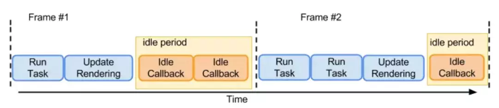
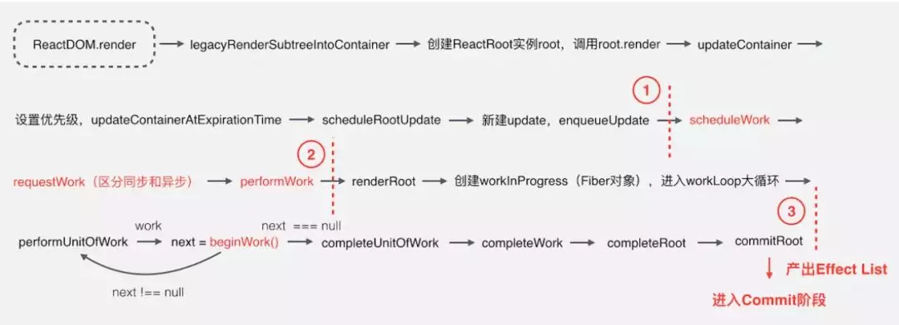
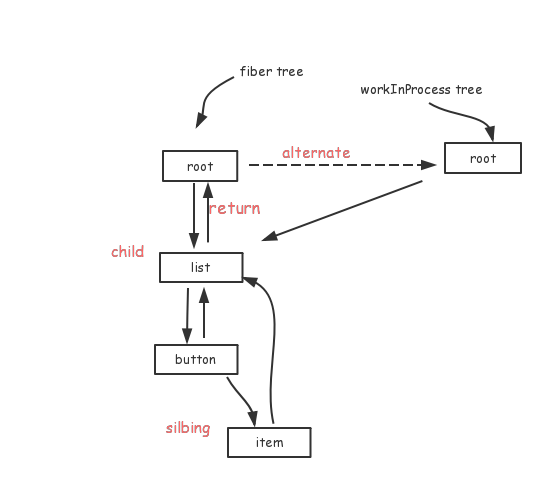
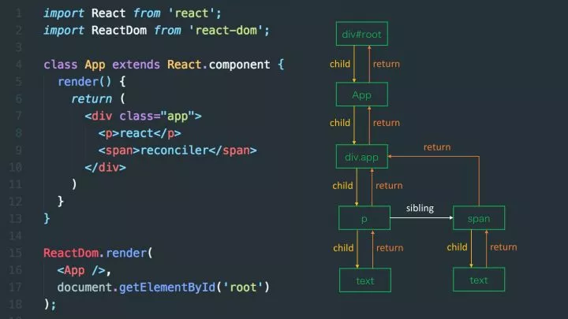

# Fiber 是什么

## 产生的动机

### React 16 之前的不足

首先我们了解一下 React 的工作过程，当我们通过 render()和 setState() 进行组件渲染和更新的时候，[React 主要有两个阶段](/前端/框架/React/VirtualDOM是什么/main.html#执行流程)

在协调阶段阶段，由于是采用的递归的遍历方式，这种也被成为 Stack Reconciler，主要是为了区别 Fiber Reconciler 取的一个名字。

这种方式有一个特点：一旦任务开始进行，就无法中断，那么 js 将一直占用主线程， 一直要等到整棵 Virtual DOM 树计算完成之后，才能把执行权交给渲染引擎，那么这就会导致一些用户交互、动画等任务无法立即得到处理，就会有[卡顿](/前端/浏览器代理/浏览器页面为什么会卡顿/main.html)，非常的影响用户体验。

### 解决方案

把渲染更新过程拆分成多个子任务，每次只做一小部分，做完看是否还有剩余时间，如果有继续下一个任务；如果没有，挂起当前任务，将时间控制权交给主线程，等主线程不忙的时候在继续执行。

这种策略叫做 Cooperative Scheduling（合作式调度），操作系统常用任务调度策略之一。

合作式调度主要就是用来分配任务的，当有更新任务来的时候，不会马上去做 Diff 操作，而是先把当前的更新送入一个 Update Queue 中，然后交给 Scheduler 去处理，Scheduler 会根据当前主线程的使用情况去处理这次 Update。

为了实现这种特性，使用了 [requestIdelCallbackAPI](/前端/浏览器代理/性能优化/requestIdleCallback是什么/main.html)。对于不支持这个 API 的浏览器，React 会加上 pollyfill。

在两个执行帧之间，主线程通常会有一小段空闲时间，requestIdleCallback 可以在这个空闲期（Idle Period）调用空闲期回调（Idle Callback），执行一些任务。



1. 低优先级任务由 requestIdleCallback 处理；

2. 高优先级任务，如动画相关的由 requestAnimationFrame 处理；

3. requestIdleCallback 可以在多个空闲期调用空闲期回调，执行任务；

4. requestIdleCallback 方法提供 deadline，即任务执行限制时间，以切分任务，避免长时间执行，阻塞 UI 渲染而导致掉帧；

这个方案看似确实不错，但是怎么实现可能会遇到几个问题：

1. 如何拆分成子任务？

2. 一个子任务多大合适？

3. 怎么判断是否还有剩余时间？

4. 有剩余时间怎么去调度应该执行哪一个任务？

5. 没有剩余时间之前的任务怎么办？

接下里整个 Fiber 架构就是来解决这些问题的。

## 工作目标

为了解决之前提到解决方案遇到的问题，提出了以下几个目标：

1. 暂停工作，稍后再回来。

2. 为不同类型的工作分配优先权。

3. 重用以前完成的工作。

4. 如果不再需要，则中止工作。

为了做到这些，我们首先需要一种方法将任务分解为单元。从某种意义上说，这就是 Fiber，Fiber 代表一种**工作单元**。

但是仅仅是分解为单元也无法做到中断任务，因为函数调用栈就是这样，每个函数为一个工作，每个工作被称为堆栈帧，它会一直工作，直到堆栈为空，无法中断。

所以我们需要一种**增量渲染的调度**，那么就需要重新实现一个堆栈帧的调度，这个堆栈帧可以按照自己的调度算法执行他们。另外由于这些堆栈是可以自己控制的，所以可以加入并发或者错误边界等功能。

因此 Fiber 就是重新实现的堆栈帧，本质上 Fiber 也可以理解为是一个虚拟的堆栈帧，将可**中断的任务拆分成多个子任务**，通过按照优先级来自由调度子任务，分段更新，从而将之前的同步渲染改为异步渲染。

所以我们可以说 Fiber 是一种数据结构(堆栈帧)，也可以说是一种解决可中断的调用任务的一种解决方案，它的特性就是**时间分片(time slicing)**和**暂停(supense)**。

## 工作流程是什么

1. ReactDOM.render() 和 setState 的时候开始创建更新。

2. 将创建的更新加入任务队列，等待调度。

3. 在 requestIdleCallback 空闲时执行任务。

4. 从根节点开始遍历 Fiber Node，并且构建 WokeInProgress Tree。

5. 生成 effectList。

6. 根据 EffectList 更新 DOM。

下面是一个详细的执行过程图：



1. 第一部分从 ReactDOM.render() 方法开始，把接收的 React Element 转换为 Fiber 节点，并为其设置优先级，创建 Update，加入到更新队列，这部分主要是做一些初始数据的准备。

2. 第二部分主要是三个函数：`scheduleWork`、`requestWork`、`performWork`，即安排工作、申请工作、正式工作三部曲，React 16 新增的异步调用的功能则在这部分实现，这部分就是 `Schedule` 阶段，前面介绍的 Cooperative Scheduling 就是在这个阶段，只有在这个阶段获取到可执行的时间片，第三部分才会继续执行。具体是如何调度的，后面文章再介绍，这是 React 调度的关键过程。

3. 第三部分是一个大循环，遍历所有的 Fiber 节点，通过 Diff 算法计算所有更新工作，产出 EffectList 给到 commit 阶段使用，这部分的核心是 beginWork 函数，这部分基本就是 Fiber Reconciler ，包括 reconciliation 和 commit 阶段。

### Fiber Node

FIber Node，承载了非常关键的上下文信息，可以说是贯彻整个创建和更新的流程，下来分组列了一些重要的 Fiber 字段。

```ts
{
  ...
  // 跟当前Fiber相关本地状态（比如浏览器环境就是DOM节点）
  stateNode: any,

    // 单链表树结构
  return: Fiber | null,// 指向他在Fiber节点树中的`parent`，用来在处理完这个节点之后向上返回
  child: Fiber | null,// 指向自己的第一个子节点
  sibling: Fiber | null,  // 指向自己的兄弟结构，兄弟节点的return指向同一个父节点

  // 更新相关
  pendingProps: any,  // 新的变动带来的新的props
  memoizedProps: any,  // 上一次渲染完成之后的props
  updateQueue: UpdateQueue<any> | null,  // 该Fiber对应的组件产生的Update会存放在这个队列里面
  memoizedState: any, // 上一次渲染的时候的state

  // Scheduler 相关
  expirationTime: ExpirationTime,  // 代表任务在未来的哪个时间点应该被完成，不包括他的子树产生的任务
  // 快速确定子树中是否有不在等待的变化
  childExpirationTime: ExpirationTime,

 // 在Fiber树更新的过程中，每个Fiber都会有一个跟其对应的Fiber
  // 我们称他为`current <==> workInProgress`
  // 在渲染完成之后他们会交换位置
  alternate: Fiber | null,

  // Effect 相关的
  effectTag: SideEffectTag, // 用来记录Side Effect
  nextEffect: Fiber | null, // 单链表用来快速查找下一个side effect
  firstEffect: Fiber | null,  // 子树中第一个side effect
  lastEffect: Fiber | null, // 子树中最后一个side effect
  ....
};
```

### Fiber Reconciler

在第二部分，进行 Schedule 完，获取到时间片之后，就开始进行 reconcile。

Fiber Reconciler 是 React 里的调和器，这也是任务调度完成之后，如何去执行每个任务，如何去更新每一个节点的过程，对应上面的第三部分。

reconcile 过程分为 2 个阶段（phase）：

1. （可中断）reconciliation/render **通过构造 WorkInProgress Tree 得出 Change**。

2. （不可中断）commit 应用这些 DOM change。

#### reconciliation 阶段

在 reconciliation 阶段的每个工作循环中，每次处理一个 Fiber，**处理完可以中断/挂起整个工作循环**。通过每个节点更新结束时**向上归并 Effect List 来收集任务结果**，reconciliation 结束后，根节点的 Effect List 里记录了包括 DOM change 在内的所有 Side Effect。

#### render 阶段

render 阶段遍历 Fiber 节点，一边执行 Diff 的过程，一边构造 WorkInProgress Tree，diff 产生出的 Change(Effect List) 会标记在 WorkInProgress Tree 的镜像 fiber 上，通过节点 alternate 属性链接当前 fiber tree 和镜像 fiber tree, 用于断点恢复。

workInProgress tree 上每个节点都有一个 effect list，用来存放需要更新的内容。此节点更新完毕会向子节点或邻近节点合并 effect list。



render 阶段会执行[render 生命方法顺序前的生命周期方法](/前端/框架/React/生命周期执行顺序是什么/main.html#_16-版本-render-之前)，不过由于本阶段是可中断的，一旦中断之后恢复的时候又会重新执行，所以很可能阶段内的生命周期方法会被多次调用，所以在 reconciliation/render 阶段的生命周期的方法是不稳定的，我想这也是 React 为什么要废弃 componentWillMount 和 componentWillReceiveProps 方法而改为静态方法 getDerivedStateFromProps 的原因吧。

#### commit 阶段

commit 阶段可以理解为就是将 Diff 的结果反映到真实 DOM 的过程。

在 commit 阶段，在 commitRoot 里会根据 effect 的 effectTag ，进行对应的插入、更新、删除操作，根据 tag 不同，调用不同的更新方法。

commit 阶段会执行[render 生命方法顺序之后的生命周期方法](/前端/框架/React/生命周期执行顺序是什么/main.html#_16-版本-render-之后)

### Fiber Tree 和 WorkInProgress Tree

React 在 render 第一次渲染时，会通过 React.createElement 创建一颗 Element 树，可以称之为 Virtual DOM Tree。

由于需要停止/恢复操作，需要记录上下文信息。而当前只记录单一 dom 节点的 vDom tree 是无法完成的，为了记录必要的上下文信息，加入了 Fiber，每一个 Element 会对应一个 Fiber Node，将 Fiber Node 链接起来的结构成为 Fiber Tree。

Fiber Node 反映了用于渲染 UI 的应用程序的状态。这棵树通常被称为 current 树（当前树，记录当前页面的状态）。

在后续的更新过程中（setState），每次重新渲染都会重新创建 Element, 但是 Fiber 不会，Fiber 只会使用对应的 Element 中的数据来更新自己必要的属性。

Fiber Tree 一个重要的特点是**链表结构**，因此可以将**递归遍历变成循环遍历**，这样就摆脱了函数栈的执行顺序依赖（实现启停的重要前提），然后配合 requestIdleCallback API（Schedule 的调度）, 实现任务拆分、中断与恢复。

这个链接的结构是怎么构成的呢，这就要主要到之前 Fiber Node 的节点的这几个字段：

```ts
// 单链表树结构
{
   return: Fiber | null, // 指向父节点
   child: Fiber | null,// 指向自己的第一个子节点
   sibling: Fiber | null,// 指向自己的兄弟结构，兄弟节点的return指向同一个父节点
}
```

每一个 Fiber Node 节点与 Virtual Dom 一一对应，所有 Fiber Node 连接起来形成 Fiber tree, 是个单链表树结构，如下图所示：



对照图来看，是不是可以知道 Fiber Node 是如何联系起来的呢，Fiber Tree 就是这样一个单链表。

当 React.render 的时候有了这么一条单链表，当调用 setState 的时候又是如何 Diff 得到 change 的呢？

采用的是一种叫**双缓冲技术（double buffering）**，这个时候就需要另外一颗树：WorkInProgress Tree，它反映了要刷新到屏幕的未来状态，在 render 或者 setState 的方法调用的时候进行构建

WorkInProgress Tree 构造完毕，得到的就是新的 Fiber Tree，然后把 current 指针指向 WorkInProgress Tree，这样能够复用内存中已经存在的 Fiber 对象

## 名词解释

- Reconciler：是一个名词，可以说是 React 工作的一个模块，协调模块
- reconcile：是调和器调和的动作，是一个动词
- reconciliation：是 reconcile 过程的第一个阶段
- phase：表示调和过程的阶段

## 后记

Fiber 是 2016 年就已经透露出来的概念，React Conf 2017 会议上，Facebook 确认 React Fiber 会搭上 React 下一个大版本 v16 的顺风车发布。

有一个有意思的网站，它向我们展示了 Fiber 架构下 React 的 2164 个单元测试通过率，名字叫做 [Fiber 准备好了吗（isfiberreadyyet）](http://isfiberreadyyet.com/)，当然通过率早已是 100% 了。

## 参考资源

- [浅谈 React16 框架 - Fiber](https://www.cnblogs.com/zhuanzhuanfe/p/9567081.html)
- [Deep In React 之浅谈 React Fiber 架构(一)](https://mp.weixin.qq.com/s?__biz=MzI1ODk2Mjk0Nw==&mid=2247484469&idx=1&sn=f68d044f1b0e4e2eb981e3878427b75b&chksm=ea016759dd76ee4ff444c7be842f5f9588e9561af38e080440dccf9d8ed2049eded63442d73e&scene=21#wechat_redirect)
