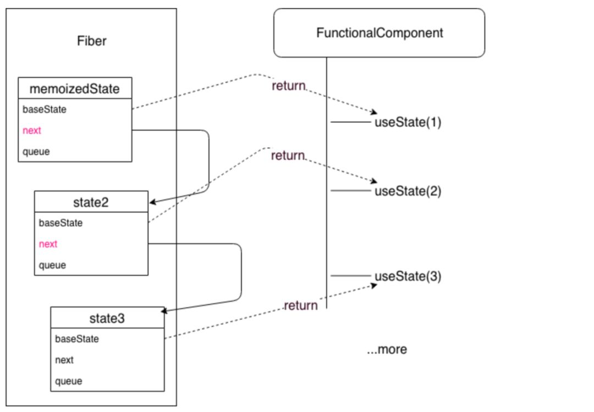
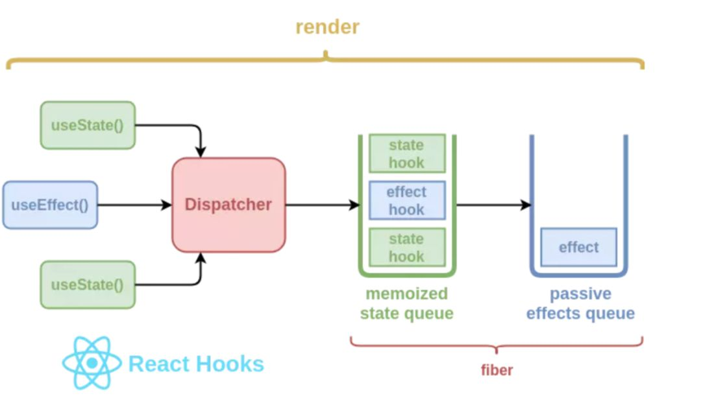
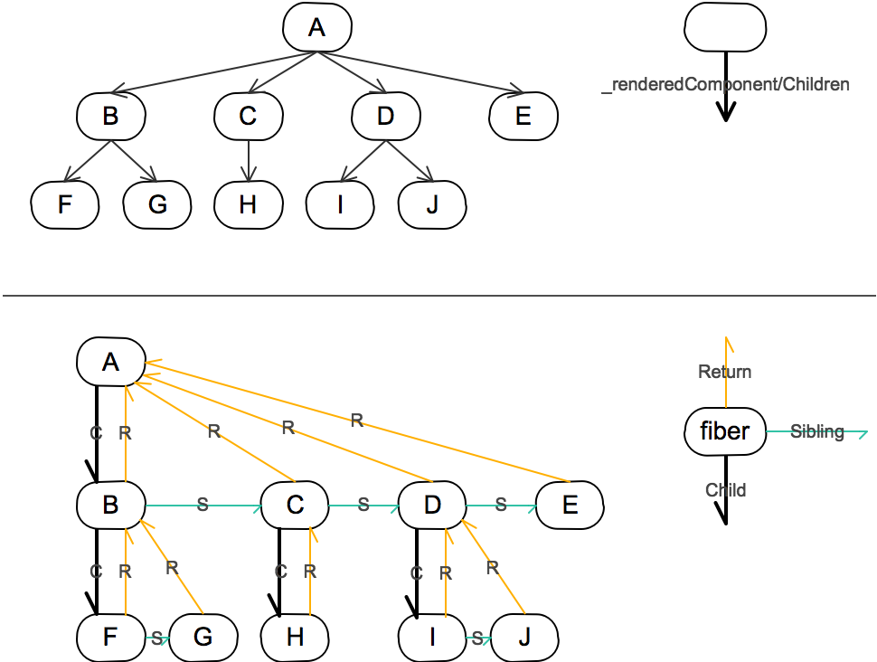

# ReactHook 的实现原理是什么

## 使用队列存储 hook 状态

使用队列存储状态

### 示例代码

```ts
let memoizedState = []; // hooks 存放在这个数组
let cursor = 0; // 当前 memoizedState 下标

function useState(initialValue) {
  memoizedState[cursor] = memoizedState[cursor] || initialValue;
  const currentCursor = cursor;
  function setState(newState) {
    memoizedState[currentCursor] = newState;
    render();
  }
  return [memoizedState[cursor++], setState]; // 返回当前 state，并把 cursor 加 1
}

function useEffect(callback, depArray) {
  const hasNoDeps = !depArray;
  const deps = memoizedState[cursor];
  const hasChangedDeps = deps
    ? !depArray.every((el, i) => el === deps[i])
    : true;
  if (hasNoDeps || hasChangedDeps) {
    callback();
    memoizedState[cursor] = depArray;
  }
  cursor++;
}
```

## React 中的实现

### memoizedState 状态存储

React 中是通过类似单链表的形式来代替数组的。通过 next 按顺序串联所有的 hook。

```ts
type Hooks = {
  memoizedState: any; // 指向当前渲染节点 Fiber
  baseState: any; // 初始化 initialState， 已经每次 dispatch 之后 newState
  baseUpdate: Update<any> | null; // 当前需要更新的 Update ，每次更新完之后，会赋值上一个 update，方便 react 在渲染错误的边缘，数据回溯
  queue: UpdateQueue<any> | null; // UpdateQueue 通过
  next: Hook | null; // link 到下一个 hooks，通过 next 串联每一 hooks
};

type Effect = {
  tag: HookEffectTag; // effectTag 标记当前 hook 作用在 life-cycles 的哪一个阶段
  create: () => mixed; // 初始化 callback
  destroy: (() => mixed) | null; // 卸载 callback
  deps: Array<mixed> | null;
  next: Effect; // 同上
};
```



```ts
function FunctionalComponent() {
  const [state1, setState1] = useState(1);
  const [state2, setState2] = useState(2);
  const [state3, setState3] = useState(3);
}
```



```ts
function FunctionalComponent() {
  const [state1, setState1] = useState(1);
  const [state2, setState2] = useState(2);
  const [state3, setState3] = useState(3);
}
```

我们知道，react 会生成一棵组件树（或 Fiber 单链表），树中每个节点对应了一个组件，hooks 的数据就作为组件的一个信息，存储在这些节点上，伴随组件一起出生，一起死亡。



## 注意调用位置

组件中 hooks 的调用顺序很重要，不然就获取到错误到状态，这就是为什么不要在循环、条件判断或者子函数中调用的原因

## 参考资源

- [React Hooks 原理](https://github.com/brickspert/blog/issues/26)
