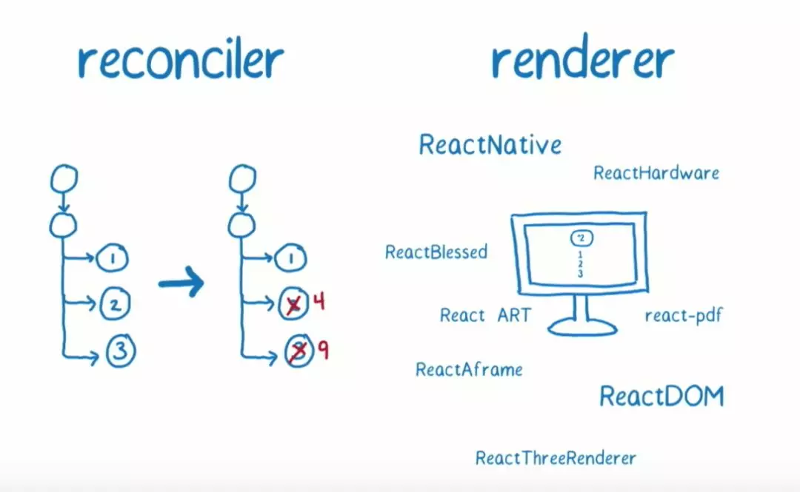
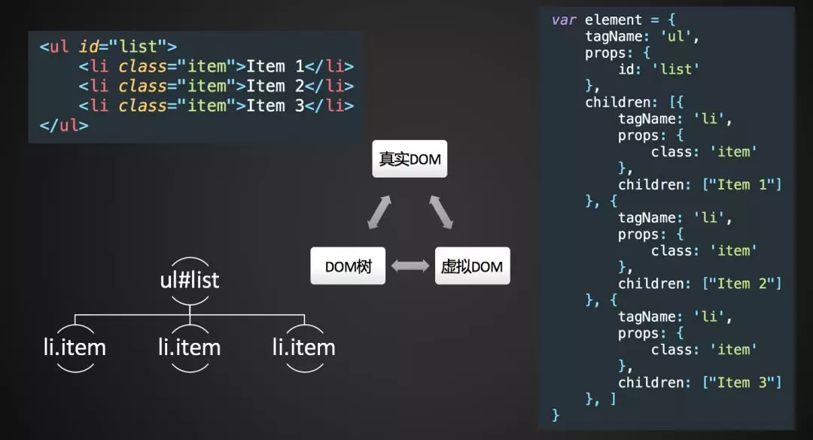
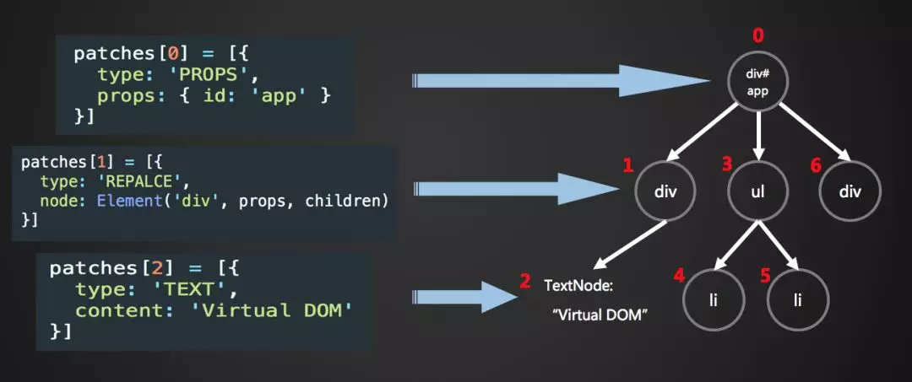

# Virtual DOM 是什么

## 概念介绍

Virtual DOM 的概念有很多解释，从我的理解来看，主要是三个方面，分别是：一个对象，两个前提，三个步骤。

一个对象指的是 Virtual DOM 是一个基本的 JavaScript 对象，也是整个 Virtual DOM 树的基本。

两个前提分别是 JavaScript 很快和直接操作 DOM 很慢，这是 Virtual DOM 得以实现的两个基本前提。得益于 V8 引擎的出现，让 JavaScript 可以高效地运行，在性能上有了极大的提高。直接操作 DOM 的低效和 JavaScript 的高效相对比，为 Virtual DOM 的产生提供了大前提。

三个步骤指的是 Virtual DOM 的三个重要步骤，分别是：生成 Virtual DOM 树、对比两棵树的差异、更新视图。这三个步骤的具体实现也是本文将简述的一大重点。

## 执行流程

当我们通过 render() 和 setState() 进行组件渲染和更新的时候，React 主要有两个阶段：



- 调和阶段(Reconciler)

  官方解释 React 会自顶向下通过递归，遍历新数据生成新的 Virtual DOM，然后通过 Diff 算法，找到需要变更的元素(Patch)，放到更新队列里面去。

- 渲染阶段(Renderer)

  遍历更新队列，通过调用宿主环境的 API，实际更新渲染对应元素。宿主环境，比如 DOM、Native、WebGL 等。

### 1. 生成 Virtual DOM 树

DOM 是前端工程师最常接触的内容之一，一个 DOM 节点包含了很多的内容，但是一个抽象出一个 DOM 节点却只需要三部分：节点类型，节点属性、子节点。所以围绕这三个部分，我们可以使用 JavaScript 简单地实现一棵 DOM 树，然后给节点实现渲染方法，就可以实现虚拟节点到真是 DOM 的转化。



### 2. 对比两棵树的差异

比较两棵 DOM 树的差异是 Virtual DOM 算法最核心的部分，这也是我们常说的的 Virtual DOM 的 [diff 算法](../Diff算法是什么/main.md)。在比较的过程中，我可以得到一组 patch 对象描述了更新的差异类型和内容

### 3. 更新视图

在第二步得到整棵树的差异之后，就可以根据这些差异的不同类型，对 DOM 进行针对性的更新。与四种差异类型相对应的，是更新视图时具体的更新方法，分别是：

因为步骤一所构建的 JavaScript 对象树和 render 出来真正的 DOM 树的信息、结构是一样的。所以我们可以对那棵 DOM 树也进行深度优先的遍历，遍历的时候从步骤二生成的 patches 对象中找出当前遍历的节点差异，然后进行 DOM 操作，分别是：

- replaceChild()

- appendChild()/removeChild()

- setAttribute()/removeAttribute()

- textContent



同时在更新真实 DOM 前后，执行不同阶段的组件的[生命周期方法](/前端/框架/React/生命周期执行顺序是什么/main.md)

### 通过代码理解完整执行的流程步骤：

```ts
// 1. 构建虚拟DOM
var tree = el('div', { id: 'container' }, [
  el('h1', { style: 'color: blue' }, ['simple virtal dom']),
  el('p', ['Hello, virtual-dom']),
  el('ul', [el('li')]),
]);

// 2. 通过虚拟DOM构建真正的DOM
var root = tree.render();
document.body.appendChild(root);

// 3. 生成新的虚拟DOM
var newTree = el('div', { id: 'container' }, [
  el('h1', { style: 'color: red' }, ['simple virtal dom']),
  el('p', ['Hello, virtual-dom']),
  el('ul', [el('li'), el('li')]),
]);

// 4. 比较两棵虚拟DOM树的不同
var patches = diff(tree, newTree);

// 5. 在真正的DOM元素上应用变更
patch(root, patches);
```

## 解决了什么问题

React 状态驱动的运行机制下，Virtual DOM 可以帮助找到新旧状态对比中的最小的变化，然后反应到真实 DOM 上，因为 DOM 的设计足够复杂，所以操作它意味着需要付出昂贵的执行时间代价，因此 Virtual DOM 可以帮助 React 以最高效的方式更新视图。

## 参考资源

- [深入理解虚拟 DOM，它真的不快](https://mp.weixin.qq.com/s?__biz=MzI1ODk2Mjk0Nw==&mid=2247484138&idx=1&sn=3c5d9af3c5ab684b697378503bc617af&scene=21#wechat_redirect)
