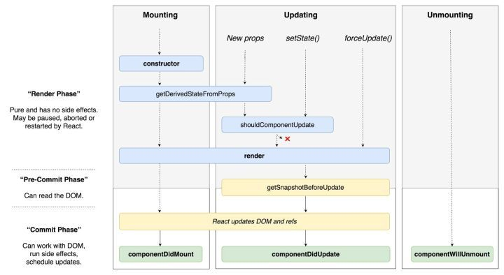

# 生命周期执行顺序是什么

## 15 版本的生命周期顺序

以 render 为分界线：

### 15 版本 render 之前

1. `componentWillMount`
2. `componentWillReceiveProps`
3. `shouldComponentUpdate`
4. `componentWillUpdate`

### 15 版本 render 之后

1. `componentDidMount`
2. `componentDidUpdate`
3. `componentWillUnmount`

## 16 版本的生命周期顺序

由于 Fiber 的架构的变化，导致 reconciliation 阶段可以反复执行，因此避免副作用的影响，去掉了一些方法，同时也有一批新增的方法加入

以 render 为分界线：

### 16 版本 render 之前

1. ~~`componentWillMount`（弃用）~~
2. ~~`componentWillReceiveProps`（弃用）~~
3. `getDerivedStateFromProps`（新增）
4. `shouldComponentUpdate`
5. ~~`componentWillUpdate`（弃用）~~

### 16 版本 render 之后

1. `getSnapshotBeforeUpdate`（新增）
2. `componentDidMount`
3. `componentDidUpdate`
4. `componentWillUnmount`

