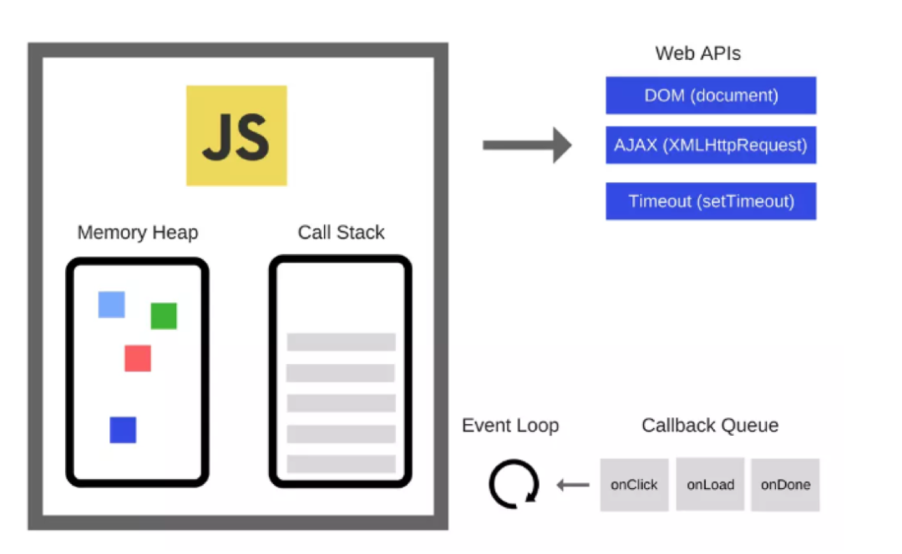
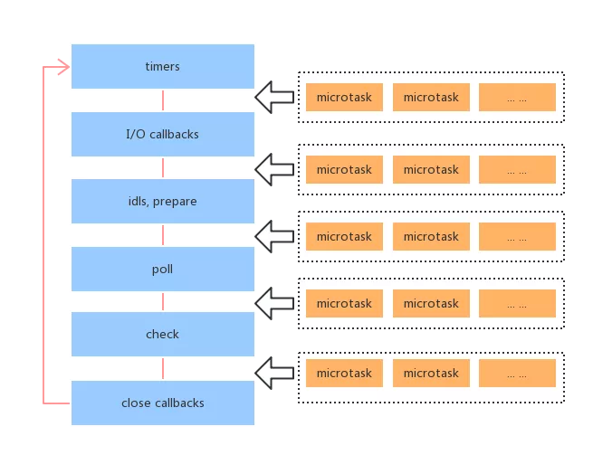
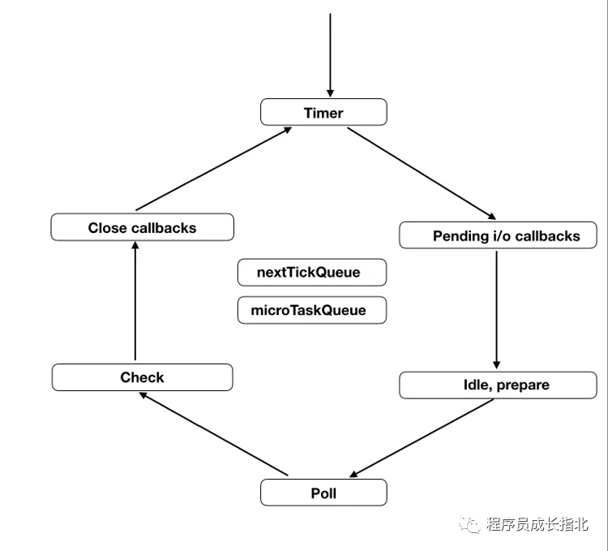

# EventLoop 是什么

## 同步和异步任务

简单的介绍一下同步任务和异步任务的概念。

- 同步任务：必须等到结果来了之后才能做其他的事情，举例来说就是你烧水的时候一直等在水壶旁边等水烧开，期间不做其他的任何事情。
- 异步任务：不需要等到结果来了才能继续往下走，等结果期间可以做其他的事情，结果来了会收到通知。举例来说就是你烧水的时候可以去做自己想做的事情，

听到水烧开的声音之后再去处理。从概念就可以看出来，异步任务从一定程度上来看比同步任务更高效一些，核心是提高了用户体验。

比如说向服务端请求资源，你不可能一直不停的循环判断有没有拿到数据，就好像你点了个外卖，点完之后就开始一直打电话问外卖有没有送到，外卖小哥都会抄着锅铲来打你(狗头)。因此，在 JavaScript 中任务有了同步任务和异步任务，异步任务通过注册回调函数，等到数据来了就通知主程序。

## 本轮循环与次轮循环

异步任务可以分成两种。

1. 追加在本轮循环的异步任务

2. 追加在次轮循环的异步任务

所谓”循环”，指的是事件循环（event loop）。这是 JavaScript 引擎处理异步任务的方式，后文会详细解释。这里只要理解，本轮循环一定早于次轮循环执行即可。

Node 规定，process.nextTick 和 Promise 的回调函数，追加在本轮循环，即同步任务一旦执行完成，就开始执行它们。而 setTimeout、setInterval、setImmediate 的回调函数，追加在次轮循环。

## 浏览器当中的 EventLoop

### 事件循环



上图是一张 JS 的运行机制图，Js 运行时大致会分为几个部分：

1. Call Stack：调用栈(执行栈)，所有同步任务在主线程上执行，形成一个执行栈，因为 JS 单线程的原因，所以调用栈中每次只能执行一个任务，当遇到的同步任务执行完之后，由任务队列提供任务给调用栈执行。

2. Task Queue：任务队列，存放着异步任务，当异步任务可以执行的时候，任务队列会通知主线程，然后该任务会进入主线程执行。任务队列中的都是已经完成的异步操作，而不是说注册一个异步任务就会被放在这个任务队列中。

JavaScript 的代码执行时，主线程会从上到下一步步的执行代码，同步任务会被依次加入执行栈中先执行，异步任务会在拿到结果的时候将注册的回调函数放入任务队列，当执行栈中的没有任务在执行的时候，引擎会从任务队列中读取任务压入执行栈(Call Stack)中处理执行。

说到这里，Event Loop 也可以理解为：不断地从任务队列中取出任务执行的一个过程。

### 宏任务和微任务

现在就有一个问题了，任务队列是一个消息队列，先进先出，那就是说，后来的事件都是被加在队尾等到前面的事件执行完了才会被执行。如果在执行的过程中突然有重要的数据需要获取，或是说有事件突然需要处理一下，按照队列的先进先出顺序这些是无法得到及时处理的。这个时候就催生了宏任务和微任务，微任务使得一些异步任务得到及时的处理。

曾经看到的一个例子很好，宏任务和微任务形象的来说就是：你去营业厅办一个业务会有一个排队号码，当叫到你的号码的时候你去窗口办充值业务(宏任务执行)，在你办理充值的时候你又想改个套餐(微任务)，这个时候工作人员会直接帮你办，不可能让你重新排队。

所以上文说过的异步任务又分为宏任务和微任务，JS 运行时任务队列会分为宏任务队列和微任务队列，分别对应宏任务和微任务。

先介绍一下(浏览器环境的)宏任务和微任务大致有哪些：

宏任务：

- script(整体的代码)
- setTimeout
- setInterval
- I/O 操作

微任务：

- Promise.then
- MutationObserver

在 chrome 里，每个页面都对应一个进程。而该进程又有多个线程，比如 JS 线程、渲染线程、IO 线程、网络线程、定时器线程等等，这些线程之间的通信是通过向对象的任务队列中添加一个任务（postTask）来实现的。宏任务的本质可以认为是多线程事件循环或消息循环，也就是线程间通信的一个消息队列。

### 事件运行顺序

1. 执行同步任务，同步任务不需要做特殊处理，直接执行(下面的步骤中遇到同步任务都是一样处理) --- 第一轮从 script 开始
2. 从宏任务队列中取出队头任务执行
3. 如果产生了宏任务，将宏任务放入宏任务队列，下次轮循的时候执行
4. 如果产生了微任务，将微任务放入微任务队列
5. 执行完当前宏任务之后，取出微任务队列中的所有任务依次执行
6. 如果微任务执行过程中产生了新的微任务，则继续执行微任务，直到微任务的队列为空
7. 轮循，循环以上 2 - 6

总的来说就是：同步任务/宏任务 -> 执行产生的所有微任务(包括微任务产生的微任务) -> 同步任务/宏任务 -> 执行产生的所有微任务(包括微任务产生的微任务) -> 循环......

注意：微任务队列

### 注意

1. async 函数返回一个 Promise 对象

   当函数执行的时候，一旦遇到 await 就会先返回，等到触发的异步操作完成，再接着执行函数体内后面的语句。

   ```ts
   async function async1() {
     console.log('async1 start');
     await async2();
     console.log('async1 end');
   }
   async function async2() {
     console.log('async2');
   }

   Promise.resolve().then(() => console.log('p1'));
   async1();

   // async1 start
   // async2
   // p1
   // async1 end
   ```

## Node 当中的 EventLoop

Node 中也有宏任务和微任务，与浏览器中的事件循环类似。Node 与浏览器事件循环不同，其中有多个宏任务队列，而浏览器是只有一个宏任务队列。Node 中多了一种 NextTick 队列，优先级比微任务队列高

Node 的架构底层是有 libuv，它是 Node 自身的动力来源之一，通过它可以去调用一些底层操作，Node 中的 Event Loop 功能就是在 libuv 中封装实现的。

Node 中的宏任务和微任务在浏览器端的 JS 相比增加了一些，这里只列出浏览器端没有的：

宏任务

- setImmediate

NextTickQueue

- process.nextTick

### 事件循环机制的六个阶段



Node 的事件循环分成了六个阶段，每个阶段对应一个宏任务队列，相当于是宏任务进行了一个分类。

- timers(计时器)

  本阶段执行已经被 setTimeout() 和 setInterval() 的调度回调函数。

- pending I/O callbacks

执行延迟到下一个循环迭代的 I/O 回调。

- idel, prepare

  仅系统内部使用

- poll(轮循)

  检索新的 I/O 事件;执行与 I/O 相关的回调（几乎所有情况下，除了关闭的回调函数，那些由计时器和 setImmediate() 调度的之外），其余情况 node 将在适当的时候在此阻塞。

- check(检查)

  setImmediate() 回调函数在这里执行

- close callbacks

  一些关闭的回调函数，如：socket.on('close', ...)

### 轮循顺序

每个阶段都要等对应的宏任务队列执行完毕才会进入到下一个阶段的宏任务队列

1. timers
2. I/O callbacks
3. poll
4. setImmediate
5. close events

每两个阶段之间执行微任务队列



顺序的整体总结就是:

同步任务 -> 本轮循环 -> 次轮循环

具体过程如下：

1. 执行全局的 script 同步代码
2. 执行微任务队列，先执行所有 Next Tick 队列中的所有任务，再执行其他的微任务队列中的所有任务
3. 开始执行宏任务，共六个阶段，从第一个阶段开始执行自己宏任务队列中的所有任务(浏览器是从宏任务队列中取第一个执行！！)
4. 每个阶段的宏任务执行完毕之后，开始执行微任务
5. TimersQueue -> 步骤 2 -> I/O Queue -> 步骤 2 -> Check Queue -> 步骤 2 -> Close Callback Queue -> 步骤 2 -> TimersQueue ...

这里要注意的是，nextTick 事件是一个单独的队列，它的优先级会高于微任务，所以在当前宏任务/同步任务执行完成之后，会先执行 nextTick 队列中的所有任务，再去执行微任务队列中的所有任务。

### setTimeOut 与 setImmediate

由于 setTimeout 在 timers 阶段执行，而 setImmediate 在 check 阶段执行。所以，setTimeout 会早于 setImmediate 完成。

```ts
setTimeout(() => console.log(1));
setImmediate(() => console.log(2));
```

上面代码应该先输出 1，再输出 2，但是实际执行的时候，结果却是不确定，有时还会先输出 2，再输出 1。

这是因为 setTimeout 的第二个参数默认为 0。但是实际上，Node 做不到 0 毫秒，最少也需要 1 毫秒，根据官方文档，第二个参数的取值范围在 1 毫秒到 2147483647 毫秒之间。也就是说，setTimeout(f, 0)等同于 setTimeout(f, 1)。

实际执行的时候，进入事件循环以后，有可能到了 1 毫秒，也可能还没到 1 毫秒，取决于系统当时的状况。如果没到 1 毫秒，那么 timers 阶段就会跳过，进入 check 阶段，先执行 setImmediate 的回调函数。

但是，下面的代码一定是先输出 2，再输出 1。

```ts
const fs = require('fs');
fs.readFile('test.js', () => {
  setTimeout(() => console.log(1));
  setImmediate(() => console.log(2));
});
```

上面代码会先进入 I/O callbacks 阶段，然后是 check 阶段，最后才是 timers 阶段。因此，setImmediate 才会早于 setTimeout 执行。

## 一道大厂面试题

```ts
// node 下执行
async function async1() {
  console.log('async1 start');
  await async2();
  console.log('async1 end');
}
async function async2() {
  console.log('async2');
}
console.log('script start');
setTimeout(function () {
  console.log('setTimeout0');
}, 0);
setTimeout(function () {
  console.log('setTimeout3');
}, 3);
setImmediate(() => console.log('setImmediate'));
process.nextTick(() => console.log('nextTick'));
async1();
new Promise(function (resolve) {
  console.log('promise1');
  resolve();
  console.log('promise2');
}).then(function () {
  console.log('promise3');
});
console.log('script end');
```

搞清楚这题的打印顺序，基本事件循环就没啥大问题了

再来一道考察执行顺序

```ts
new Promise((r) => {
  console.log(1);
  r();
  new Promise((r) => {
    console.log(2);
    r();
    new Promise((r) => {
      console.log(3);
      r();
    }).then(() => console.log(4));
  }).then(() => console.log(5));
}).then(() => console.log(6));

// 1
// 2
// 3
// 4
// 5
// 6
```

## 参考资源

- [你不知道的 Event Loop](https://mp.weixin.qq.com/s/ETDqdo3JIcUxbeIlddSq-Q)
- [用一道大厂面试题带你搞懂事件循环机制](https://mp.weixin.qq.com/s/TiRTCYvfKMCuLmeJ2XOzKw)
- [Node.js 事件循环，定时器和 process.nextTick()](https://nodejs.org/zh-cn/docs/guides/event-loop-timers-and-nexttick/)
