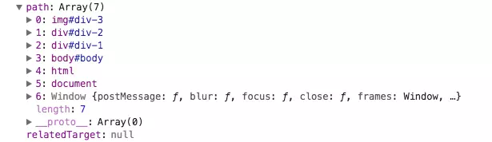
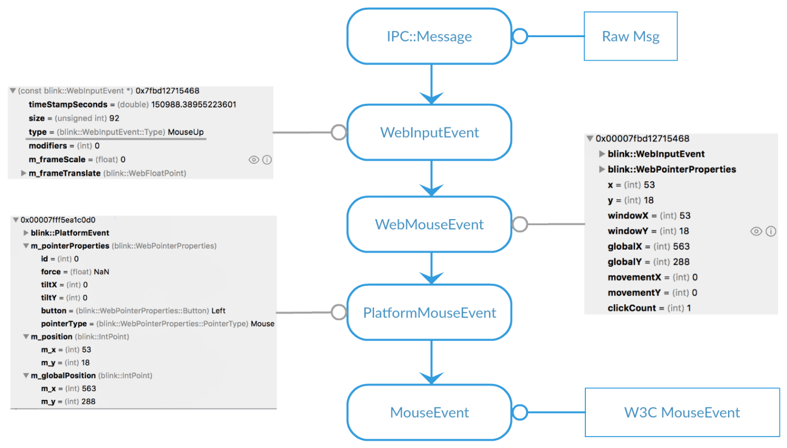
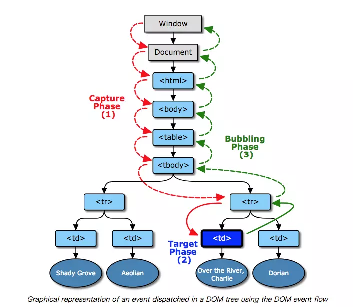
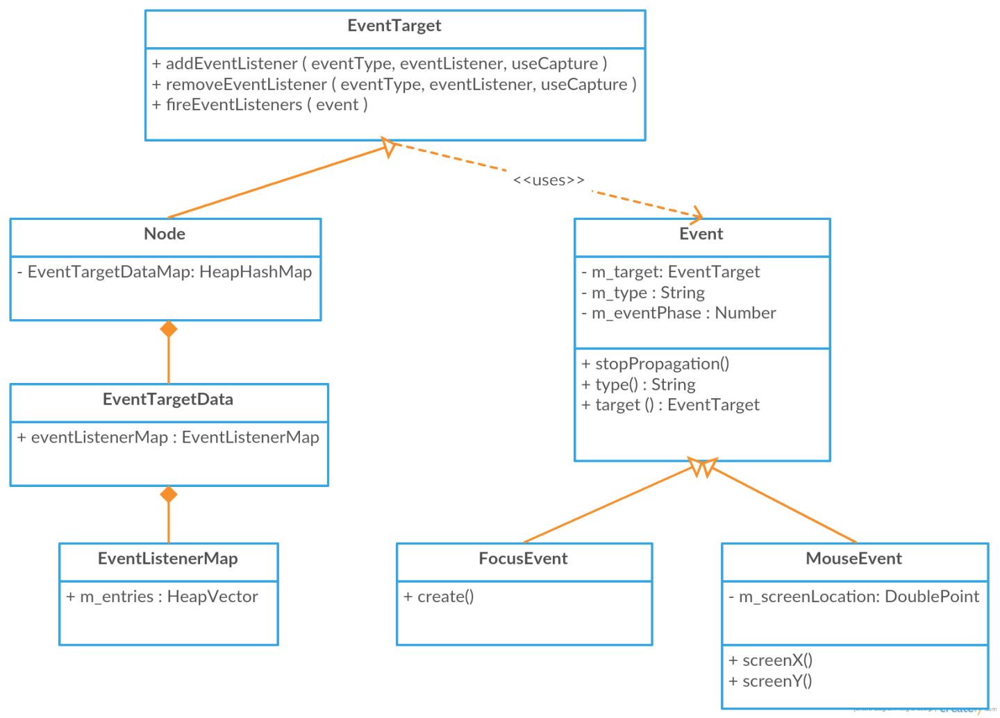
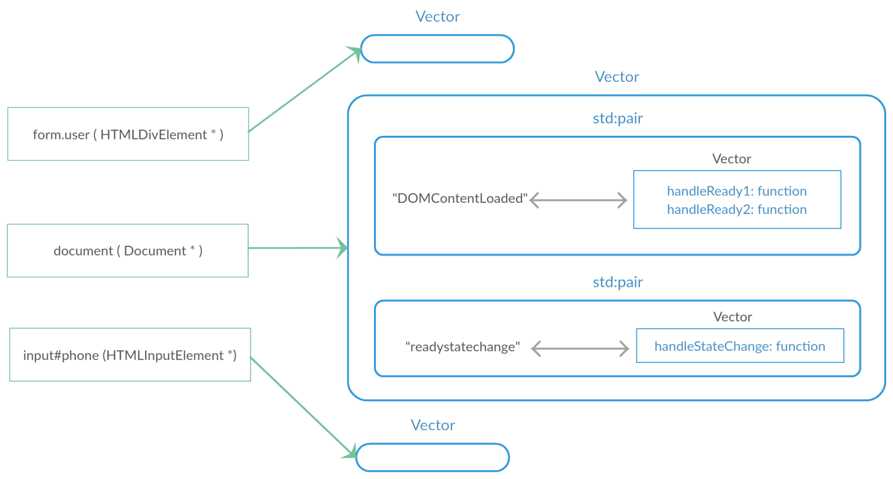

# 浏览器事件机制是什么

## 事件流

DOM(文档对象模型)结构是一个树型结构，当一个 HTML 元素产生一个事件时，该事件会在元素结点与根结点之间的路径传播，路径所经过的结点都会收到该事件，这个传播过程可称为 DOM 事件流。

事件对象的 path 属性，既该对象的传播路径，`path[0]` 为目标元素，最外层为 window 对象



### 事件创建



上图展示了从原始的 msg 转化成了 W3C 标准的 MouseEvent 的过程。Blink 的消息处理引擎把 msg 转化成了 WebInputEvent，这个 event 能够直接静态转化成可读的 WebMouseEvent，也就是事件在底层的时候已经被封装成带有相关数据且可读的事件了，上层再把它这些数据转化成 W3C 规定格式的 MouseEvent。

MouseEventManager 里在 dispatchEvent 的时候，会初始化 EventPath

### 事件阶段

IE 最开始实现实现事件流的方式：冒泡事件(event bubbling)，Netscape 提出了另外一种事件流方式：事件捕获(event capturing)，不同的浏览器实现上有一些差别，用起来就有些繁琐。幸好现代浏览器都实现了 W3C 制定的"DOM2 级事件 addEventListener"，"DOM2 级事件"把事件流分为三个阶段：捕获阶段、目标阶段、冒泡阶段。



- 捕获

  事件对象(event object) 从 window 派发到 目标对象父级的过程

- 目标

  目标（Target）阶段是 事件对象派发到目标元素时的阶段，如果事件类型指示其不冒泡，那事件传播将在此阶段终止

- 冒泡

  冒泡（Bubbling）阶段 和捕获相反，是以目标对象父级到 window 的过程

  mouseenter 和 mouseleave 是不会冒泡的

### 事件注册



在 Node 类组合了一个 `EventTargetDataMap`，这是一个哈希 map，并且它是静态成员变量。它的 key 值是当前结点 Node 实例的指针，value 值是事件名称和对应的 listeners



每个 value，都是一个 vector，元素为 eventType:handlers 的 pair，记录了当前节点注册的所有事件类型对应的事件处理函数

1. addEventListener

   ```ts
   addEventListener(type: string, listener: EventListenerOrEventListenerObject, options?: boolean | AddEventListenerOptions): void;
   ```

   可以接受参数以指定是否在捕获阶段触发本次事件，默认值为否(既冒泡阶段)，以事件处理器注册的事件在非捕获阶段触发

2. onclick、onfocus 等属性

   DOM Level 0 事件，就是使用 dom 结点的 onclick、onfocus 等属性，添加事件，由于这个提得比较早，所以它的兼容性最好。如下：

   ```js
   function clickHandle() {
     console.log('addEventListener click');
   }
   var p = document.getElementById('text');
   p.addEventListener('click', clickHandle);
   p.onclick = function () {
     console.log('onclick trigger');
   };
   ```

onclick 等属性内部还是调用 addEventListener，只是在此之前要先 clear 掉上一次绑的属性事件：

```js
// bind
bool EventTarget::setAttributeEventListener(const AtomicString& eventType,
                                            EventListener* listener) {
  clearAttributeEventListener(eventType);
  if (!listener)
    return false;
  return addEventListener(eventType, listener, false);
}

// unbind
bool EventTarget::clearAttributeEventListener(const AtomicString& eventType) {
  EventListener* listener = getAttributeEventListener(eventType);
  if (!listener)
    return false;
  return removeEventListener(eventType, listener, false);
}
```

onclick 等属性事件只能绑一次，并且和 addEventListener 的事件不冲突

### 事件阻止

阻止传播

1. 调用 stopPropagation 严格来说不是阻止冒泡，是阻止事件传播，任何阶段都可以直接阻止

2. 事件接口还有一个 cancelBubble 因历史原因的 stopPropagation 的别名，给其赋值 true 可以达到调用 stopPropagation 同样的效果（不要被名字欺骗了，任何阶段都可操作，阻止事件进一步传播）

阻止默认行为

1. 调用事件对象 preventDefault 方法

2. **属性绑定** 回调函数返回 false

3. ie 中 设置 `window.event.returnValue = false`

> jQuery 注册事件时返回 false 是一种用于同时调用 e.preventDefault 和 e.stopPropagation 的快捷方式

### 事件解绑

1. removeEventListener

   ```ts
   removeEventListener(type: string, listener: EventListenerOrEventListenerObject, options?: boolean | EventListenerOptions): void;
   ```

2. 属性绑定 设置为空

3. ie 下的 detachEvent

删除事件可以不清除事件绑定，GC 会定时清理无用内存，但是注意不要有外部对删除元素的引用

```js
var p = document.getElementById('text');
p.remove();
p = null;
window.gc();
```

### 事件调用顺序

按照注册顺序依次调用，需要注意的是 onclick 的重新赋值，不会影响第一次注册的顺序 [查看 demo](http://localhost:8000/?path=/story/%E5%89%8D%E7%AB%AF-%E4%BB%A3%E7%90%86-%E6%B5%8F%E8%A7%88%E5%99%A8%E4%BA%8B%E4%BB%B6%E6%9C%BA%E5%88%B6%E6%98%AF%E4%BB%80%E4%B9%88--via-order)

### 事件代理

事件代理是指，某元素的事件自己不处理，而是借助事件冒泡原理交由目标元素的父级或祖级元素处理的机制

#### 为什么要事件代理

1. 减少事件绑定带来的内存占用

2. 动态监听，比如插入 html 字符串内容

#### 流程

事件到达目标元素前，或者事件到达目标元素后，冒泡返回，被已绑定事件的父级或祖级元素响应执行。其中，事件对象中的 target 属性记录实际触发本次事件的元素
