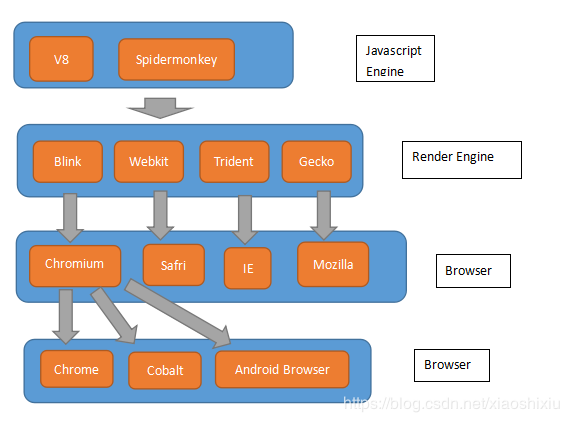

# 浏览器内核有哪些分类

## 关系概括

- Mozjs 是 SpiderMonley 的具体实现方式。
- Chrome 在 Chromium 上新增了一些 Google 相关功能。
- Cobalt 在 Chromium 上裁减了一些功能。
- BLINK 内核就是谷歌公司，针对 WEBKIT 内核，做的修订和精简。去掉了几十万行的没用的复杂代码，让效率更高。然后针对未来的网页格式，做了进一步优化，和效率提升的处理。

## 内核介绍

- Trident：俗称 IE 内核，也被叫做 MSHTML 引擎，目前在使用的浏览器有 IE11 -，以及各种国产多核浏览器中的 IE 兼容模块。另外微软的 Edge 浏览器不再使用 MSHTML 引擎，而是使用类全新的引擎 EdgeHTML。

- Gecko：俗称 Firefox 内核，Netscape6 开始采用的内核，后来的 Mozilla FireFox（火狐浏览器）也采用了该内核，Gecko 的特点是代码完全公开，因此，其可开发程度很高，全世界的程序员都可以为其编写代码，增加功能。因为这是个开源内核，因此受到许多人的青睐，Gecko 内核的浏览器也很多，这也是 Gecko 内核虽然年轻但市场占有率能够迅速提高的重要原因。

- Presto：Presto 是挪威产浏览器 opera 的 “前任” 内核，最新的 opera 浏览器内核现为 Blink。

- Webkit：Safari 内核，也是 Chrome 内核原型，主要是 Safari 浏览器在使用的内核，也是特性上表现较好的浏览器内核。也被大量使用在移动端浏览器上。

- Blink： 由 Google 和 Opera Software 开发，在 Chrome（28 及往后版本）、Opera（15 及往后版本）和 Yandex 浏览器中使用。Blink 其实是 Webkit 的一个分支，添加了一些优化的新特性，例如跨进程的 iframe，将 DOM 移入 JavaScript 中来提高 JavaScript 对 DOM 的访问速度等，目前较多的移动端应用内嵌的浏览器内核也渐渐开始采用 Blink。

### 移动端内核

由于移动互联网的普及，我们还可以单独说一说目前移动设备上浏览器常用的内核情况：

- iPhone 和 iPad 等苹果 iOS 平台主要是 WebKit

- Android 4.4 之前的 Android 系统浏览器内核是 WebKit，Android4.4 系统浏览器切换到了 Chromium，内核是 Webkit 的分支 Blink

- Windows Phone 8 系统浏览器内核是 Trident

 
 
 
<ContributorsList />
 
 
 
<Vssue :title="$title" />
  