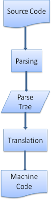
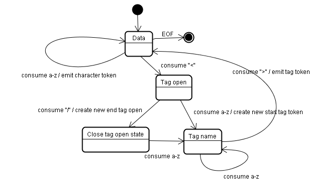
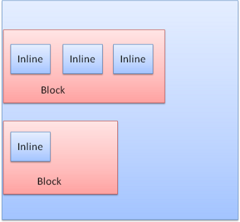
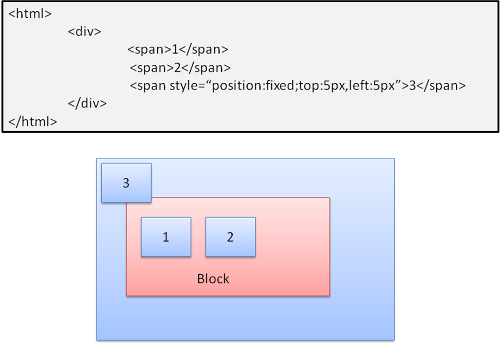

# 浏览器渲染页面的过程是什么

## 浏览器的高层结构

1. 用户界面 - 包括地址栏、前进/后退按钮、书签菜单等。除了浏览器主窗口显示的您请求的页面外，其他显示的各个部分都属于用户界面。

2. 浏览器引擎 - 在用户界面和呈现引擎之间传送指令。

3. 呈现引擎 - 负责显示请求的内容。如果请求的内容是 HTML，它就负责解析 HTML 和 CSS 内容，并将解析后的内容显示在屏幕上。

4. 网络 - 用于网络调用，比如 HTTP 请求。其接口与平台无关，并为所有平台提供底层实现。

5. 用户界面后端 - 用于绘制基本的窗口小部件，比如组合框和窗口。其公开了与平台无关的通用接口，而在底层使用操作系统的用户界面方法。

6. JavaScript 解释器。用于解析和执行 JavaScript 代码。

7. 数据存储。这是持久层。浏览器需要在硬盘上保存各种数据，例如 Cookie。新的 HTML 规范 (HTML5) 定义了“网络数据库”，这是一个完整（但是轻便）的浏览器内数据库。


和大多数浏览器不同，Chrome 浏览器的每个标签页都分别对应一个呈现引擎实例。每个标签页都是一个独立的进程。

## 呈现引擎

本文所讨论的浏览器（Firefox、Chrome 浏览器和 Safari）是基于两种呈现引擎构建的。Firefox 使用的是 Gecko，这是 Mozilla 公司“自制”的呈现引擎。而 Safari 和 Chrome 浏览器使用的都是 WebKit。

WebKit 是一种开放源代码呈现引擎，起初用于 Linux 平台，随后由 Apple 公司进行修改，从而支持苹果机和 Windows。有关详情，请参阅 webkit.org。

### 主流程

呈现引擎一开始会从网络层获取请求文档的内容，内容的大小一般限制在 8000 个块以内。

然后进行如下所示的基本流程：


呈现引擎将开始解析 HTML 文档，并将各标记逐个转化成“内容树”上的 DOM 节点。同时也会解析外部 CSS 文件以及样式元素中的样式数据。HTML 中这些带有视觉指令的样式信息将用于创建另一个树结构：呈现树。

呈现树构建完毕之后，进入“布局”处理阶段，也就是为每个节点分配一个应出现在屏幕上的确切坐标。下一个阶段是绘制 - 呈现引擎会遍历呈现树，由用户界面后端层将每个节点绘制出来。

需要着重指出的是，这是一个渐进的过程。为达到更好的用户体验，呈现引擎会力求尽快将内容显示在屏幕上。它不必等到整个 HTML 文档解析完毕之后，就会开始构建呈现树和设置布局。在不断接收和处理来自网络的其余内容的同时，呈现引擎会将部分内容解析并显示出来。

详细流程示例：


在这里，需要注意的是不同呈现引擎在主流程中会稍有不同，例如 CSS 样式表的解析时机，Webkit 内核下，HTML 和 CSS 文件的解析是同步的，而 Geoko 内核下，CSS 文件需要等到 HTML 文件解析成内容 Sink 后才进行解析。

## 解析和 DOM 树构建

### 解析综述

解析文档是指将文档转化成为有意义的结构，也就是可让代码理解和使用的结构。解析得到的结果通常是代表了文档结构的节点树，它称作解析树或者语法树。

#### 解析过程

解析的过程可以分成两个子过程：词法分析和语法分析。


解析器通常将解析工作分给以下两个组件来处理：词法分析器（有时也称为标记生成器），负责将输入内容分解成一个个有效标记；而解析器负责根据语言的语法规则分析文档的结构，从而构建解析树。词法分析器知道如何将无关的字符（比如空格和换行符）分离出来。

- 词法分析

  词汇通常用正则表达式表示。

  词法分析是将输入内容分割成大量标记的过程。标记是语言中的词汇，即构成内容的单位。在人类语言中，它相当于语言字典中的单词。

- 语法分析

  语法通常使用一种称为 BNF 的格式来定义。

  语法分析是应用语言的语法规则的过程。

#### 翻译

很多时候，解析树还不是最终产品。解析通常是在翻译过程中使用的，而翻译是指将输入文档转换成另一种格式。编译就是这样一个例子。编译器可将源代码编译成机器代码，具体过程是首先将源代码解析成解析树，然后将解析树翻译成机器代码文档。



#### 词汇和语法的正式定义

词汇通常用正则表达式表示。

语法通常使用一种称为 BNF 的格式来定义。

#### 解析器类型

有两种基本类型的解析器：自上而下解析器和自下而上解析器。

#### 自动生成解析器

有一些工具可以帮助您生成解析器，它们称为解析器生成器。您只要向其提供您所用语言的语法（词汇和语法规则），它就会生成相应的解析器

WebKit 使用了两种非常有名的解析器生成器：

- 用于创建词法分析器的 Flex
- 用于创建解析器的 Bison（您也可能遇到 Lex 和 Yacc 这样的别名）

### HTML 解析器

HTML 解析器的任务是将 HTML 标记解析成解析树。

HTML 的词汇和语法在 W3C 组织创建的规范中进行了定义。当前的版本是 HTML5

解析器的输出“解析树”是由 DOM 元素和属性节点构成的树结构。DOM 是文档对象模型 (Document Object Model) 的缩写。它是 HTML 文档的对象表示，同时也是外部内容（例如 JavaScript）与 HTML 元素之间的接口。解析树的根节点是“Document”对象。

#### HTML 解析算法

HTML 无法用常规的自上而下或自下而上的解析器进行解析。

原因在于：

- 语言的宽容本质。
- 浏览器历来对一些常见的无效 HTML 用法采取包容态度。
- 解析过程需要不断地反复。源内容在解析过程中通常不会改变，但是在 HTML 中，脚本标记如果包含 document.write，就会添加额外的标记，这样解析过程实际上就更改了输入内容。

由于不能使用常规的解析技术，浏览器就创建了自定义的解析器来[解析](https://html.spec.whatwg.org/multipage/parsing.html) HTML。

此算法由两个阶段组成：

- 标记化
- 树构建

标记化是词法分析过程，将输入内容解析成多个标记。HTML 标记包括起始标记、结束标记、属性名称和属性值。

标记生成器识别标记，传递给树构造器，然后接受下一个字符以识别下一个标记；如此反复直到输入的结束。


#### 标记化算法

使用到了 `状态机` 算法



#### 树构建算法

同样使用到了 `状态机` 算法


#### 解析结束后的操作

在此阶段，浏览器会将文档标注为 `交互状态`，并开始解析那些处于 `deferred` 模式的脚本，也就是那些应在文档解析完成后才执行的脚本。然后，文档状态将设置为 `完成` ，一个 `加载` 事件将随之触发。

#### 浏览器的容错机制

HTML5 规范定义了一部分这样的要求。WebKit 在 HTML 解析器类的开头注释中对此做了很好的概括。

> 解析器对标记化输入内容进行解析，以构建文档树。如果文档的格式正确，就直接进行解析。

> 遗憾的是，我们不得不处理很多格式错误的 HTML 文档，所以解析器必须具备一定的容错性。

> 我们至少要能够处理以下错误情况：

> - 明显不能在某些外部标记中添加的元素。在此情况下，我们应该关闭所有标记，直到出现禁止添加的元素，然后再加入该元素。
> - 我们不能直接添加的元素。这很可能是网页作者忘记添加了其中的一些标记（或者其中的标记是可选的）。这些标签可能包括：HTML HEAD BODY TBODY TR TD LI（还有遗漏的吗？）。
> - 向 inline 元素内添加 block 元素。关闭所有 inline 元素，直到出现下一个较高级的 block 元素。
> - 如果这样仍然无效，可关闭所有元素，直到可以添加元素为止，或者忽略该标记。

错误事例：

- 使用了 `</br>` 而不是 `<br>`
- 离散表格
- 嵌套的表单元素
- 过于复杂的标记层次结构

  > 示例网站 www.liceo.edu.mx 嵌套了约 1500 个标记，全都来自一堆 `<b>` 标记。我们只允许最多 20 层同类型标记的嵌套，如果再嵌套更多，就会全部忽略。

- 放错位置的 html 或者 body 结束标记

  > 支持格式非常糟糕的 HTML 代码。我们从不关闭 body 标记，因为一些愚蠢的网页会在实际文档结束之前就关闭。我们通过调用 end() 来执行关闭操作。

### CSS 解析器

和 HTML 不同，CSS 是上下文无关的语法，可以使用简介中描述的各种解析器进行解析。事实上，CSS 规范定义了 CSS 的词法和语法。

WebKit 使用 Flex 和 Bison 解析器生成器，通过 CSS 语法文件自动创建解析器。正如我们之前在解析器简介中所说，Bison 会创建自下而上的移位归约解析器。Firefox 使用的是人工编写的自上而下的解析器。这两种解析器都会将 CSS 文件解析成 StyleSheet 对象，且每个对象都包含 CSS 规则。CSS 规则对象则包含选择器和声明对象，以及其他与 CSS 语法对应的对象。


### 处理脚本和样式表的顺序

- 脚本

  脚本执行可能会修改文档内容，因此 HTML 解析器遇到 `<script>` 标记时立即解析并执行脚本，此时，文档的解析将停止，直到脚本执行完毕。如果脚本是外部的，那么解析过程会停止，直到从网络同步抓取资源完成后再继续。将脚本标注为 `defer`，这样它就不会停止文档解析，而是等到解析结束才执行

  HTML5 增加了一个选项，可将脚本标记为异步，以便由其他线程解析和执行。

- 预解析

  在执行脚本的时候，虽然文档解析会停止，但是其他线程会解析文档的其余部分，找出并加载需要通过网络加载的其他资源。通过这种方式，资源可以在并行连接上加载，从而提高总体速度。

  预解析器不会修改 DOM 树，而是将这项工作交由主解析器处理；预解析器只会解析外部资源（例如外部脚本、样式表和图片）的引用。

- 样式表

  理论上来说，应用样式表不会更改 DOM 树，因此似乎没有必要等待样式表并停止文档解析。但是脚本在文档解析阶段会请求样式信息。如果当时还没有加载和解析样式，脚本就会获得错误的回复。因此 Firefox 在样式表加载和解析的过程中，会禁止所有脚本。而对于 WebKit 而言，仅当脚本尝试访问的样式属性可能受尚未加载的样式表影响时，它才会禁止该脚本。如果此时脚本正在执行，文档解析也会相应停止。

## 呈现树构建

在 DOM 树构建的同时，浏览器还会构建另一个树结构：呈现树。这是由可视化元素按照其显示顺序而组成的树，也是文档的可视化表示。它的作用是让您按照正确的顺序绘制内容。

Firefox 将呈现树中的元素称为“框架”。WebKit 使用的术语是呈现器或呈现对象。

呈现器知道如何布局并将自身及其子元素绘制出来。

WebKits RenderObject 类是所有呈现器的基类，其定义如下：

```ts
class RenderObject{
  virtual void layout();
  virtual void paint(PaintInfo);
  virtual void rect repaintRect();
  Node* node;  //the DOM node
  RenderStyle* style;  // the computed style
  RenderLayer* containgLayer; //the containing z-index layer
}
```

下面这段 WebKit 代码描述了根据 display 属性的不同，针对同一个 DOM 节点应创建什么类型的呈现器。

```ts
RenderObject* RenderObject::createObject(Node* node, RenderStyle* style)
{
    Document* doc = node->document();
    RenderArena* arena = doc->renderArena();
    ...
    RenderObject* o = 0;

    switch (style->display()) {
        case NONE:
            break;
        case INLINE:
            o = new (arena) RenderInline(node);
            break;
        case BLOCK:
            o = new (arena) RenderBlock(node);
            break;
        case INLINE_BLOCK:
            o = new (arena) RenderBlock(node);
            break;
        case LIST_ITEM:
            o = new (arena) RenderListItem(node);
            break;
       ...
    }

    return o;
}
```

元素类型也是考虑因素之一，例如表单控件和表格都对应特殊的框架。

在 WebKit 中，如果一个元素需要创建特殊的呈现器，就会替换 createRenderer 方法。呈现器所指向的样式对象中包含了一些和几何无关的信息。

### 呈现树和 DOM 树的关系

- 呈现器是和 DOM 元素相对应的，但并非一一对应。

  非可视化的 DOM 元素不会插入呈现树中，例如“head”元素。如果元素的 display 属性值为“none”，那么也不会显示在呈现树中（但是 visibility 属性值为“hidden”的元素仍会显示）。

- 有一些 DOM 元素对应多个可视化对象。

  它们往往是具有复杂结构的元素，无法用单一的矩形来描述。例如，“select”元素有 3 个呈现器：一个用于显示区域，一个用于下拉列表框，还有一个用于按钮。**如果由于宽度不够，文本无法在一行中显示而分为多行，那么新的行也会作为新的呈现器而添加。**

  另一个关于多呈现器的例子是格式无效的 HTML。根据 CSS 规范，inline 元素只能包含 block 元素或 inline 元素中的一种。如果出现了混合内容，则应创建匿名的 block 呈现器，以包裹 inline 元素。

- 有一些呈现对象对应于 DOM 节点，但在树中所在的位置与 DOM 节点不同。

  浮动定位和绝对定位的元素就是这样，它们处于正常的流程之外，放置在树中的其他地方，并映射到真正的框架，而放在原位的是占位框架。


### 构建呈现树的流程

在 Firefox 中，系统会针对 DOM 更新注册展示层，作为侦听器。展示层将框架创建工作委托给 FrameConstructor，由该构造器解析样式（请参阅样式计算）并创建框架。

在 WebKit 中，解析样式和创建呈现器的过程称为“附加”。每个 DOM 节点都有一个“attach”方法。附加是同步进行的，将节点插入 DOM 树需要调用新的节点“attach”方法。参考渐进式处理

根节点呈现对象对应于 CSS 规范中所说的容器 block，这是最上层的 block，包含了其他所有 block。它的尺寸就是视口，即浏览器窗口显示区域的尺寸。Firefox 称之为 ViewPortFrame，而 WebKit 称之为 RenderView。WebKit 中这就是文档所指向的呈现对象。呈现树的其余部分以 DOM 树节点插入的形式来构建。

### 样式计算

构建呈现树时，需要计算每一个呈现对象的可视化属性。这是通过计算每个元素的样式属性来完成的。

样式包括来自各种来源：

- 样式表
- inline 样式元素
- HTML 中的可视化属性（例如“bgcolor”属性）

其中后者将经过转化以匹配 CSS 样式属性。

样式表的来源包括：

- 浏览器的默认样式表
- 由网页作者提供的样式表
- 由浏览器用户提供的用户样式表

样式计算存在以下难点：

- 样式数据是一个超大的结构，存储了无数的样式属性，这可能造成内存问题。
- 如果不进行优化，为每一个元素查找匹配的规则会造成性能问题。

  要为每一个元素遍历整个规则列表来寻找匹配规则，这是一项浩大的工程。选择器会具有很复杂的结构，这就会导致某个匹配过程一开始看起来很可能是正确的，但最终发现其实是徒劳的，必须尝试其他匹配路径。

- 应用规则涉及到相当复杂的层叠规则（用于定义这些规则的层次）。

解决方案：

- 共享样式数据

  WebKit 节点会引用样式对象 (RenderStyle)。这些对象在某些情况下可以由不同节点共享。这些节点是同级关系，并且满足一些条件才可以

  Firefox 采用了另外两种树：规则树和样式上下文树。WebKit 也有样式对象，但它们不是保存在类似样式上下文树这样的树结构中，只是由 DOM 节点指向此类对象的相关样式。

  样式上下文包含端值。要计算出这些值，应按照正确顺序应用所有的匹配规则，并将其从逻辑值转化为具体的值。例如，如果逻辑值是屏幕大小的百分比，则需要换算成绝对的单位。规则树的点子很巧妙，它使得节点之间可以共享这些值，以避免重复计算，还可以节约空间。

- 对规则进行处理以简化匹配

  样式表解析完毕后，系统会根据选择器将 CSS 规则添加到某个哈希表中。这些哈希表的选择器各不相同，包括 ID、类名称、标记名称等，还有一种通用哈希表，适合不属于上述类别的规则。如果选择器是 ID，规则就会添加到 ID 表中；如果选择器是类，规则就会添加到类表中，依此类推。这种处理可以大大简化规则匹配。我们无需查看每一条声明，只要从哈希表中提取元素的相关规则即可。

  ```css
  table div {
    margin: 5px;
  }
  ```

  这条规则仍然会从标记表中提取出来，因为键是最右边的选择器，但这条规则并不匹配我们的 div 元素，因为 div 没有 table 祖先。剩下的工作就是找出哪些根据键提取的规则是真正匹配的了。

- 以正确的层叠顺序应用规则

  样式对象具有与每个可视化属性一一对应的属性（均为 CSS 属性但更为通用）。如果某个属性未由任何匹配规则所定义，那么部分属性就可由父代元素样式对象继承。其他属性具有默认值。如果定义不止一个，就会出现问题，需要通过层叠顺序来解决。

  样式表层叠顺序：

  1. 浏览器声明
  2. 用户普通声明
  3. 作者普通声明
  4. 作者重要声明
  5. 用户重要声明

  同样顺序的声明会根据特异性进行排序。HTML 可视化属性会转换成匹配的 CSS 声明。它们被视为低优先级的网页作者规则。

  特异性：

  选择器的特异性由 CSS2 规范定义如下：

  1. 如果声明来自于“style”属性，而不是带有选择器的规则，则记为 1，否则记为 0 (= a)
  2. 记为选择器中 ID 属性的个数 (= b)
  3. 记为选择器中其他属性和伪类的个数 (= c)
  4. 记为选择器中元素名称和伪元素的个数 (= d)

  将四个数字按 a-b-c-d 这样连接起来（位于大数进制的数字系统中），构成特异性。

  如果 a=14，您可以使用十六进制。如果 a=17，那么您需要使用十七进制

  ```css
  *             {}  /* a=0 b=0 c=0 d=0 -> specificity = 0,0,0,0 */
  li            {}  /* a=0 b=0 c=0 d=1 -> specificity = 0,0,0,1 */
  li:first-line {}  /* a=0 b=0 c=0 d=2 -> specificity = 0,0,0,2 */
  ul li         {}  /* a=0 b=0 c=0 d=2 -> specificity = 0,0,0,2 */
  ul ol+li      {}  /* a=0 b=0 c=0 d=3 -> specificity = 0,0,0,3 */
  h1 + *[rel=up]{}  /* a=0 b=0 c=1 d=1 -> specificity = 0,0,1,1 */
  ul ol li.red  {}  /* a=0 b=0 c=1 d=3 -> specificity = 0,0,1,3 */
  li.red.level  {}  /* a=0 b=0 c=2 d=1 -> specificity = 0,0,2,1 */
  #x34y         {}  /* a=0 b=1 c=0 d=0 -> specificity = 0,1,0,0 */
  style=""          /* a=1 b=0 c=0 d=0 -> specificity = 1,0,0,0 */
  ```

  规则排序：

  找到匹配的规则之后，应根据级联顺序将其排序。WebKit 对于较小的列表会使用冒泡排序，而对较大的列表则使用归并排序。对于以下规则，WebKit 通过替换“>”运算符来实现排序

### 渐进式处理

WebKit 使用一个标记来表示是否所有的顶级样式表（包括 @imports）均已加载完毕。如果在附加过程中尚未完全加载样式，则使用占位符，并在文档中进行标注，等样式表加载解析完毕后再重新计算。

## 布局

呈现器在创建完成并添加到呈现树时，并不包含位置和大小信息。计算这些值的过程称为布局或重排。

HTML 采用基于流的布局模型，这意味着大多数情况下只要一次遍历就能计算出几何信息。处于流中靠后位置元素通常不会影响靠前位置元素的几何特征，因此布局可以按从左至右、从上至下的顺序遍历文档。但是也有例外情况，比如 HTML 表格的计算就需要不止一次的遍历

坐标系是相对于根框架而建立的，使用的是上坐标和左坐标。

布局是一个递归的过程。它从根呈现器（对应于 HTML 文档的 `<html>` 元素）开始，然后递归遍历部分或所有的框架层次结构，为每一个需要计算的呈现器计算几何信息。

根呈现器的位置左边是 0,0，其尺寸为视口（也就是浏览器窗口的可见区域）。

所有的呈现器都有一个“layout”或者“reflow”方法，每一个呈现器都会调用其需要进行布局的子代的 layout 方法。

### Dirty 位系统

为避免对所有细小更改都进行整体布局，浏览器采用了一种“dirty 位”系统。如果某个呈现器发生了更改，或者将自身及其子代标注为“dirty”，则需要进行布局。

有两种标记：“dirty”和“children are dirty”。“children are dirty”表示尽管呈现器自身没有变化，但它至少有一个子代需要布局。

### 全局布局和增量布局

全局布局是指触发了整个呈现树范围的布局，触发原因可能包括：

- 影响所有呈现器的全局样式更改，例如字体大小更改。
- 屏幕大小调整。

布局可以采用增量方式，也就是只对 dirty 呈现器进行布局（这样可能存在需要进行额外布局的弊端）。当呈现器为 dirty 时，会异步触发增量布局。例如，当来自网络的额外内容添加到 DOM 树之后，新的呈现器附加到了呈现树中。


### 异步布局和同步布局

- 增量布局是异步执行的。

  Firefox 将增量布局的“reflow 命令”加入队列，而调度程序会触发这些命令的批量执行。WebKit 也有用于执行增量布局的计时器：对呈现树进行遍历，并对 dirty 呈现器进行布局。

- 请求样式信息（例如“offsetHeight”）的脚本可同步触发增量布局。
- 全局布局往往是同步触发的。
- 有时，当初始布局完成之后，如果一些属性（如滚动位置）发生变化，布局就会作为回调而触发。

### 优化

- 缓存尺寸计算：

  如果布局是由“大小调整”或呈现器的位置（而非大小）改变而触发的，那么可以从缓存中获取呈现器的大小，而无需重新计算。

- 最小化更改：

  在某些情况下，只有一个子树进行了修改，因此无需从根节点开始布局。这适用于在本地进行更改而不影响周围元素的情况，例如在文本字段中插入文本（否则每次键盘输入都将触发从根节点开始的布局）。

### 布局处理

布局通常具有以下模式：

1. 父呈现器确定自己的宽度。
2. 父呈现器依次处理子呈现器，并且：

   1. 放置子呈现器（设置 x,y 坐标）。
   2. 如果有必要，调用子呈现器的布局（如果子呈现器是 dirty 的，或者这是全局布局，或出于其他某些原因），这会计算子呈现器的高度。

3. 父呈现器根据子呈现器的累加高度以及边距和补白的高度来设置自身高度，此值也可供父呈现器的父呈现器使用。
4. 将其 dirty 位设置为 false。

### 宽度计算

呈现器宽度是根据容器块的宽度、呈现器样式中的“width”属性以及边距和边框计算得出的。

例如以下 div 的宽度：

```html
<div style="width:30%" />
```

将由 WebKit 计算如下（BenderBox 类，calcWidth 方法）：

1. 容器的宽度取容器的 availableWidth 和 0 中的较大值。availableWidth 在本例中相当于 contentWidth，计算公式如下：

   ```js
   clientWidth() - paddingLeft() - paddingRight();
   ```

   clientWidth 和 clientHeight 表示一个对象的内部（除去边框和滚动条）。

2. 元素的宽度是“width”样式属性。它会根据容器宽度的百分比计算得出一个绝对值。

3. 然后加上水平方向的边框和补白。

现在计算得出的是“preferred width”。然后需要计算最小宽度和最大宽度。如果首选宽度大于最大宽度，那么应使用最大宽度。如果首选宽度小于最小宽度（最小的不可破开单位），那么应使用最小宽度。

这些值会缓存起来，以用于需要布局而宽度不变的情况。

### 换行

如果呈现器在布局过程中需要换行，会立即停止布局，并告知其父代需要换行。父代会创建额外的呈现器，并对其调用布局。

## 绘制

在绘制阶段，系统会遍历呈现树，并调用呈现器的“paint”方法，将呈现器的内容显示在屏幕上。绘制工作是使用用户界面基础组件完成的。

### 全局绘制和增量绘制

~~和布局一样，绘制也分为全局（绘制整个呈现树）和增量两种。在增量绘制中，部分呈现器发生了更改，但是不会影响整个树。更改后的呈现器将其在屏幕上对应的矩形区域设为无效，这导致 OS 将其视为一块“dirty 区域”，并生成“paint”事件。OS 会很巧妙地将多个区域合并成一个。在 Chrome 浏览器中，情况要更复杂一些，因为 Chrome 浏览器的呈现器不在主进程上。Chrome 浏览器会在某种程度上模拟 OS 的行为。展示层会侦听这些事件，并将消息委托给呈现根节点。然后遍历呈现树，直到找到相关的呈现器，该呈现器会重新绘制自己（通常也包括其子代）。~~

上面原文我觉得理解起来很吃力（不应该是呈现器通知 OS 重画吗？），用自己的方式整理如下：

- 和布局一样，绘制也分为全局（绘制整个呈现树）和增量两种。

- 展示层会侦听重绘事件，并将消息委托给呈现根节点。然后遍历呈现树，直到找到相关的呈现器，该呈现器会重新绘制自己（通常也包括其子代）

- 在重新绘制之前，WebKit 会将原来的矩形另存为一张位图，然后只绘制新旧矩形之间的差异部分

- 呈现器将其在屏幕上对应的矩形区域设为无效，这导致 OS 将其视为一块“dirty 区域”，并进行重新绘制。OS 会很巧妙地将多个区域合并成一个。

### 绘制顺序

CSS2 规范定义了绘制流程的顺序。绘制的顺序其实就是元素进入堆栈样式上下文的顺序。这些堆栈会从后往前绘制，因此这样的顺序会影响绘制。**单个** 块呈现器的堆栈顺序如下：

1. 背景颜色
2. 背景图片
3. 边框
4. 子代
5. 轮廓

> 猜测每个 block 都有包含一个 堆栈样式上下文，包含其直接子代呈现器

### Firefox 显示列表

Firefox 遍历整个呈现树，为绘制的矩形建立一个显示列表。列表中按照正确的绘制顺序（先是呈现器的背景，然后是边框等等）包含了与**矩形相关的呈现器**。这样等到重新绘制的时候，只需遍历一次呈现树，而不用多次遍历（绘制所有背景，然后绘制所有图片，再绘制所有边框等等）。

Firefox 对此过程进行了优化，也就是不添加隐藏的元素，例如被不透明元素完全遮挡住的元素。

### WebKit 矩形存储

在重新绘制之前，WebKit 会将原来的矩形另存为一张位图，然后只绘制新旧矩形之间的差异部分。

## 动态变化（最小化更改）

在发生变化时，浏览器会尽可能做出最小的响应。因此，元素的颜色改变后，只会对该元素进行重绘。元素的位置改变后，只会对该元素及其子元素（可能还有同级元素）进行布局和重绘。添加 DOM 节点后，会对该节点进行布局和重绘。一些重大变化（例如增大“html”元素的字体）会导致缓存无效，使得整个呈现树都会进行重新布局和绘制。

## 呈现引擎的线程

呈现引擎采用了单线程。

### 事件循环

浏览器的主线程是事件循环。它是一个无限循环，永远处于接受处理状态，并等待事件（如布局和绘制事件）发生，并进行处理。这是 Firefox 中关于主事件循环的代码：

## CSS2 可视化模型

### 画布

根据 CSS2 规范，“画布”这一术语是指“用来呈现格式化结构的空间”，也就是供浏览器绘制内容的区域。画布的空间尺寸大小是无限的，但是浏览器会根据视口的尺寸选择一个初始宽度。

根据 www.w3.org/TR/CSS2/zindex.html，画布如果包含在其他画布内，就是透明的；否则会由浏览器指定一种颜色。

### CSS 框模型

CSS 框模型描述的是针对文档树中的元素而生成，并根据可视化格式模型进行布局的矩形框。每个框都有一个内容区域（例如文本、图片等），还有可选的周围补白、边框和边距区域。


所有元素都有一个“display”属性，决定了它们所对应生成的框类型。示例：

```
block  - generates a block box.
inline - generates one or more inline boxes.
none - no box is generated.
```

默认值是 inline，但是浏览器样式表设置了其他默认值。例如，“div”元素的 display 属性默认值是 block。

您可以在这里找到默认样式表示例：www.w3.org/TR/CSS2/sample.html

### 定位方案

有三种定位方案：

1. 普通：根据对象在文档中的位置进行定位，也就是说对象在呈现树中的位置和它在 DOM 树中的位置相似，并根据其框类型和尺寸进行布局。

2. 浮动：对象先按照普通流进行布局，然后尽可能地向左或向右移动。

3. 绝对：对象在呈现树中的位置和它在 DOM 树中的位置不同。

定位方案是由“position”属性和“float”属性设置的。

- 如果值是 static 和 relative，就是普通流
- 如果值是 absolute 和 fixed，就是绝对定位

static 定位无需定义位置，而是使用默认定位。对于其他方案，网页作者需要指定位置：top、bottom、left、right。

框的布局方式是由以下因素决定的：

- 框类型
- 框尺寸
- 定位方案
- 外部信息，例如图片大小和屏幕大小

### 框类型

block 框：形成一个 block，在浏览器窗口中拥有其自己的矩形区域。


inline 框：没有自己的 block，但是位于容器 block 内。


block 采用的是一个接一个的垂直格式，而 inline 采用的是水平格式。



inline 框放置在行中或“行框”中。这些行至少和最高的框一样高，还可以更高，当框根据“底线”对齐时，这意味着元素的底部需要根据其他框中非底部的位置对齐。如果容器的宽度不够，inline 元素就会分为多行放置。在段落中经常发生这种情况。


### 定位

#### 相对

相对定位：先按照普通方式定位，然后根据所需偏移量进行移动。


#### 浮动

浮动框会移动到行的左边或右边。有趣的特征在于，其他框会浮动在它的周围。下面这段 HTML 代码：

```html
<p>
  
  Lorem ipsum dolor sit amet, consectetuer...
</p>
```

显示效果如下：


#### 绝对定位和固定定位

这种布局是准确定义的，与普通流无关。元素不参与普通流。尺寸是相对于容器而言的。在固定定位中，容器就是可视区域。



请注意，即使在文档滚动时，固定框也不会移动。

## 分层展示

这是由 z-index CSS 属性指定的。它代表了框的第三个维度，也就是沿“z 轴”方向的位置。

这些框分散到多个堆栈（称为堆栈上下文）中。在每一个堆栈中，会首先绘制后面的元素，然后在顶部绘制前面的元素，以便更靠近用户。如果出现重叠，新绘制的元素就会覆盖之前的元素。堆栈是按照 z-index 属性进行排序的。具有“z-index”属性的框形成了本地堆栈。视口具有外部堆栈。

```html
<style type="text/css">
      div {
        position: absolute;
        left: 2in;
        top: 2in;
      }
</style>

<p>
    <div
         style="z-index: 3;background-color:red; width: 1in; height: 1in; ">
    </div>
    <div
         style="z-index: 1;background-color:green;width: 2in; height: 2in;">
    </div>
 </p>
```


虽然红色 div 在标记中的位置比绿色 div 靠前（按理应该在常规流程中优先绘制），但是 z-index 属性的优先级更高，因此它移动到了根框所保持的堆栈中更靠前的位置。

> zIndex 越高优先入栈，然后从后向前依次绘制；正常顺序是同级别节点倒序入栈

<br/>
<br/>
<br/>
<ContributorsList />
<br/>
<br/>
<br/>
<Vssue :title="$title" />
  