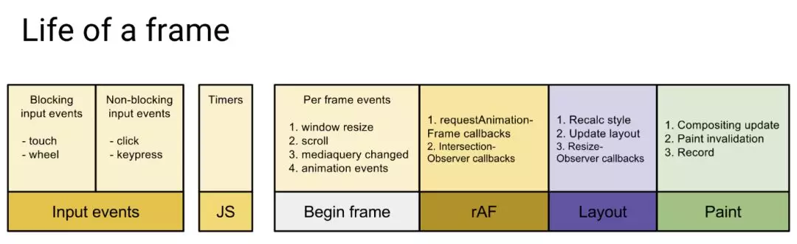

# 浏览器页面为什么会卡顿

## 什么是页面绘制帧数

页面是一帧一帧绘制出来的，当每秒绘制的帧数（FPS）达到 60 时，页面是流畅的，小于这个值时，用户会感觉到卡顿。

1s 60 帧，所以每一帧分到的时间是 1000/60 ≈ 16 ms。所以我们书写代码时力求不让一帧间隔内的工作量超过 16ms。

## 浏览器一帧内的工作

通过上图可看到，一帧内需要完成如下六个步骤的任务：

1. 处理用户的交互

2. JS 解析执行

3. 帧开始。窗口尺寸变更，页面滚动等的处理

4. rAF(requestAnimationFrame)

5. 布局

6. 绘制

如果这六个步骤中，任意一个步骤所占用的时间过长，总时间超过 16ms 了之后，用户也许就能看到卡顿。

我们也可以注意到 rAF 一定会在帧刷新前调用，所以动画属性修改应该通过 requestAnimationFrame 调用
