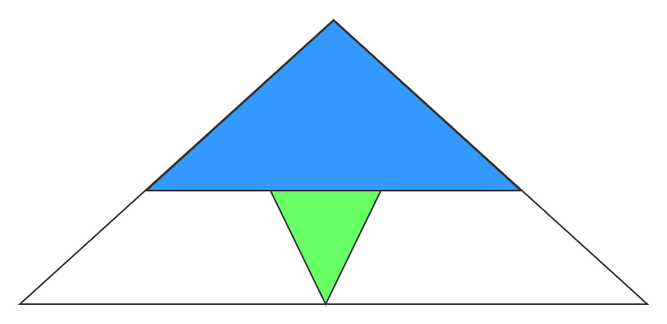

# 127-单词接龙

[查看原题](https://leetcode-cn.com/problems/word-ladder/)

## 思路

1. 求最短路径，首先想到都是使用 BFS

2. 根据题意，一个单词每次只能转换一个字母，假设这个单词为 hit
   1. 我们得到一个该单词每个字母位置的所有可能的通配 `*it`,`h*t`,`hi*`
   2. 每个通配可以只转换一次，变成另一个单词，题目要求所有单词都存在于数组 w 中，我们将每个通配词匹配的单词都找出来，比如 `h*t` 只有 hot 和它匹配
      1. 如果单词已经出现过，那么将其缓存，避免出现环

   3. 根据找到的词，重复 1，2 操作，继续扩展树结构，每次进入下一层将 level + 1

   4. 一旦找到结尾的单词，直接返回

<Visual relative="./visual/index.html" height="500" />

## 优化

1. 层级越高，代码的时间复杂度就指数增加，我们可以考虑，从结尾单词出发，这样就成了一个倒金字塔形状，参考下图，白色区域都可以跳过

## 参考代码

<<< @/docs/数据结构和算法/BFS（广度优先）/127-单词接龙/code.ts

