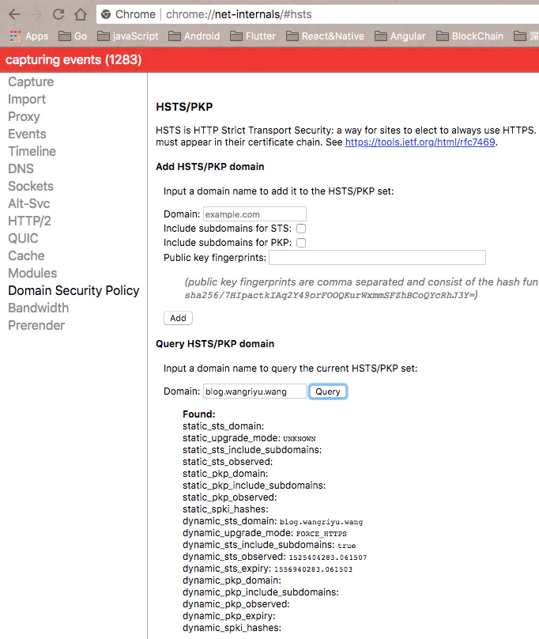

# HSTS 策略是什么

## 相应头字段定义

strict-transport-security: max-age=63072000; includeSubdomains 字段是服务器开启 HSTS 策略，让浏览器强制使用 HTTPS 进行通信，可以减少重定向造成的额外请求和会话劫持的风险

## 服务器开启方式

服务器开启 HSTS 的方法是: 以 nginx 为例，在相应站点的 server 模块中添加 add_header Strict-Transport-Security "max-age=63072000; includeSubdomains" always; 即可

## Chrome 调试方法

在 Chrome 中可以打开 chrome://net-internals/#hsts 进入浏览器的 HSTS 管理界面，可以增加 / 删除 / 查询 HSTS 记录，比如下图:

在 HSTS 有效期内且 TLS 证书仍有效，浏览器访问域名会自动加上 https:// ，而不需要做一次查询重定向到 https

## 总结

- HSTS 策略可以强制浏览器使用 HTTPS 进行通信，不需要做一次查询重定向

## 参考资源

- [HTTP2 详解](https://juejin.im/post/5b88a4f56fb9a01a0b31a67e)
