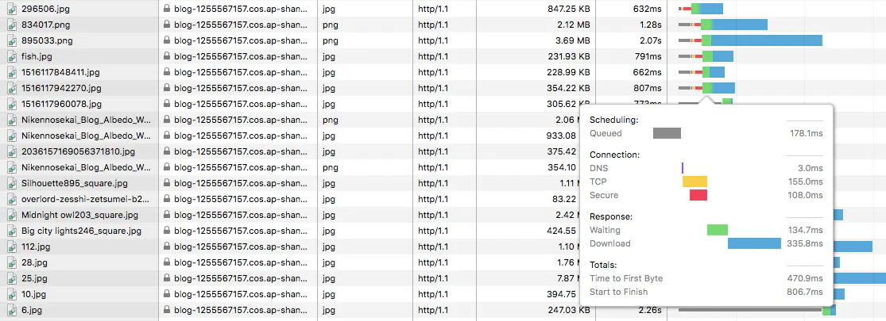
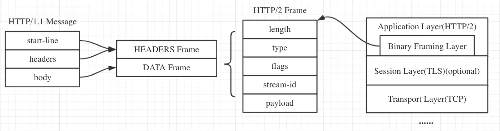

# HTTP2 比 HTTP1-1 具有哪些优势

## HTTP 1.1 的的缺点们

### 1. TCP 连接数限制

HTTP/1.1 对于同一个域名，浏览器最多只能同时创建 6~8 个 TCP 连接 (不同浏览器不一样)

为了解决数量限制，出现了 域名分片 技术，其实就是资源分域，将资源放在不同域名下 (比如二级子域名下)，这样就可以针对不同域名创建连接并请求，以一种讨巧的方式突破限制，但是滥用此技术也会造成很多问题，比如每个 TCP 连接本身需要经过 DNS 查询、三步握手、慢启动等，还占用额外的 CPU 和内存，对于服务器来说过多连接也容易造成网络拥挤、交通阻塞等，对于移动端来说问题更明显，可以参考这篇文章: [Why Domain Sharding is Bad News for Mobile Performance and Users](https://dev.mobify.com/blog/domain-sharding-bad-news-mobile-performance/)

在图中可以看到新建了六个 TCP 连接，每次新建连接 DNS 解析需要时间(几 ms 到几百 ms 不等)、TCP 慢启动也需要时间、TLS 握手又要时间，而且后续请求都要等待队列调度

### 2. [线头阻塞 (Head Of Line Blocking)](https://zh.wikipedia.org/wiki/%E9%98%9F%E5%A4%B4%E9%98%BB%E5%A1%9E) 问题

每个 TCP 连接同时只能处理一个请求 - 响应，浏览器按 FIFO 原则处理请求，如果上一个响应没返回，后续请求 - 响应都会受阻。

为了解决此问题，出现了 管线化 - pipelining 技术，但是管线化存在诸多问题，比如第一个响应慢还是会阻塞后续响应、服务器为了按序返回相应需要缓存多个响应占用更多资源、浏览器中途断连重试服务器可能得重新处理多个请求、还有必须客户端 - 代理 - 服务器都支持管线化

### 3. Header 头部无法压缩

Header 内容多，而且每次请求 Header 不会变化太多，没有相应的压缩传输优化方案

### 4. 为了减少请求数，导致内容变大，请求延迟变高

为了尽可能减少请求数，需要做合并文件、雪碧图、资源内联等优化工作，但是这无疑造成了单个请求内容变大延迟变高的问题，且内嵌的资源不能有效地使用缓存机制

### 5. 明文传输不安全

## HTTP2 的优势们

### 1. 二进制分帧

二进制分帧层 (Binary Framing Layer)

帧是数据传输的最小单位，以二进制传输代替原本的明文传输，原本的报文消息被划分为更小的数据帧:

帧：HTTP/2 数据通信的最小单位消息：指 HTTP/2 中逻辑上的 HTTP 消息。例如请求和响应等，消息由一个或多个帧组成。

流：存在于连接中的一个虚拟通道。流可以承载双向消息，每个流都有一个唯一的整数ID

HTTP/2 采用二进制格式传输数据，而非 HTTP 1.x 的文本格式，二进制协议解析起来更高效。

## 2. 多路复用 (MultiPlexing)

在一个 TCP 连接上，我们可以向对方不断发送帧，每帧的 stream identifier 的标明这一帧属于哪个流，然后在对方接收时，根据 stream identifier 拼接每个流的所有帧组成一整块数据。把 HTTP/1.1 每个请求都当作一个流，那么多个请求变成多个流，请求响应数据分成多个帧，**不同流中的帧交错地发送给对方**，这就是 HTTP/2 中的多路复用。

流的概念实现了单连接上**多请求 - 响应并行**，解决了线头阻塞的问题，减少了 TCP 连接数量和 TCP 连接慢启动造成的问题

所以 http2 对于同一域名只需要创建一个连接，而不是像 http/1.1 那样创建 6~8 个连接:

HTTP 1.x 中，如果想并发多个请求，必须使用多个 TCP 链接，且浏览器为了控制资源，还会对单个域名有 6-8个的TCP链接请求限制。

HTTP2中：

同域名下所有通信都在单个连接上完成。
单个连接可以承载任意数量的双向数据流。
数据流以消息的形式发送，而消息又由一个或多个帧组成，多个帧之间可以乱序发送，因为根据帧首部的流标识可以重新组装

## 3. 服务端推送 (Server Push)

浏览器发送一个请求，服务器主动向浏览器推送与这个请求相关的资源，这样浏览器就不用发起后续请求。 Server-Push 主要是针对资源内联做出的优化，相较于 http/1.1 资源内联的优势:

- 客户端可以缓存推送的资源
- 客户端可以拒收推送过来的资源
- 推送资源可以由不同页面共享
- 服务器可以按照优先级推送资源

服务端可以在发送页面HTML时主动推送其它资源，而不用等到浏览器解析到相应位置，发起请求再响应。例如服务端可以主动把JS和CSS文件推送给客户端，而不需要客户端解析HTML时再发送这些请求。

服务端可以主动推送，客户端也有权利选择是否接收。如果服务端推送的资源已经被浏览器缓存过，浏览器可以通过发送RST_STREAM帧来拒收。主动推送也遵守同源策略，服务器不会随便推送第三方资源给客户端。

## 4. Header 压缩 (HPACK)

使用 HPACK 算法来压缩首部内容

HTTP/1.x会在请求和响应中中重复地携带不常改变的、冗长的头部数据，给网络带来额外的负担。

HTTP/2在客户端和服务器端使用“首部表”来跟踪和存储之前发送的键－值对，对于相同的数据，不再通过每次请求和响应发送
首部表在HTTP/2的连接存续期内始终存在，由客户端和服务器共同渐进地更新;
每个新的首部键－值对要么被追加到当前表的末尾，要么替换表中之前的值。
你可以理解为只发送差异数据，而不是全部发送，从而减少头部的信息量

## 5. 应用层的重置连接

对于 HTTP/1 来说，是通过设置 tcp segment 里的 reset flag 来通知对端关闭连接的。这种方式会直接断开连接，下次再发请求就必须重新建立连接。HTTP/2 引入 RST_STREAM 类型的 frame，可以在不断开连接的前提下取消某个 request 的 stream，表现更好。

## 6. 请求优先级设置

HTTP/2 里的每个 stream 都可以设置依赖 (Dependency) 和权重，可以按依赖树分配优先级，解决了关键请求被阻塞的问题

## 7. 流量控制

每个 http2 流都拥有自己的公示的流量窗口，它可以限制另一端发送数据。对于每个流来说，两端都必须告诉对方自己还有足够的空间来处理新的数据，而在该窗口被扩大前，另一端只被允许发送这么多数据。

## 8. HTTP/1 的几种优化可以弃用

因为多路复用的存在，HTTP1 关于减少请求数，同时增大并行请求数量的优化就变得不重要了

合并文件、内联资源、雪碧图、域名分片对于 HTTP/2 来说是不必要的，使用 HTTP2 尽可能将资源细粒化，文件分解地尽可能散，不用担心请求数多

## 总结

- HTTP/2 使用二进制替代明文字符传输，提高安全性和速率
- HTTP/2 发送的每一帧上标识了属于哪个流，这样是实现多路复用的关键
- HTTP/2 可以在不断开连接的前提下取消某个 request 的 stream

## 参考资源

- [HTTP2 详解](https://juejin.im/post/5b88a4f56fb9a01a0b31a67e)
