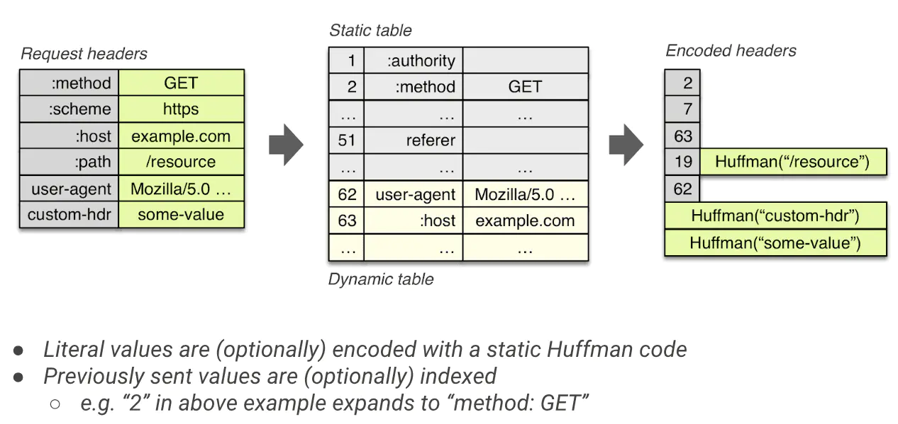

# HTTP2 的原理是什么

## 实现原理

### 帧 - Frame

#### 帧的结构

所有帧都是一个固定的 9 字节头部 (payload 之前) 跟一个指定长度的负载 (payload):

```text
+-----------------------------------------------+
|                 Length (24)                   |
+---------------+---------------+---------------+
|   Type (8)    |   Flags (8)   |
+-+-------------+---------------+-------------------------------+
|R|                 Stream Identifier (31)                      |
+=+=============================================================+
|                   Frame Payload (0...)                      ...
+---------------------------------------------------------------+
```

- Length 代表整个 frame 的长度，用一个 24 位无符号整数表示。除非接收者在 SETTINGS_MAX_FRAME_SIZE 设置了更大的值 (大小可以是 2^14(16384) 字节到 2^24-1(16777215) 字节之间的任意值)，否则数据长度不应超过 2^14(16384) 字节。头部的 9 字节不算在这个长度里

- Type 定义 frame 的类型，用 8 bits 表示。帧类型决定了帧主体的格式和语义，如果 type 为 unknown 应该忽略或抛弃。

- Flags 是为帧类型相关而预留的布尔标识。标识对于不同的帧类型赋予了不同的语义。如果该标识对于某种帧类型没有定义语义，则它必须被忽略且发送的时候应该赋值为 (0x0)

- R 是一个保留的比特位。这个比特的语义没有定义，发送时它必须被设置为 (0x0), 接收时需要忽略。

- Stream Identifier 用作流控制，用 31 位无符号整数表示。客户端建立的 sid 必须为奇数，服务端建立的 sid 必须为偶数，值 (0x0) 保留给与整个连接相关联的帧 (连接控制消息)，而不是单个流

- Frame Payload 是主体内容，由帧类型决定

#### 帧的类型

共分为十种类型的帧:

- HEADERS: 报头帧 (type=0x1)，用来打开一个流或者携带一个首部块片段

- DATA: 数据帧 (type=0x0)，装填主体信息，可以用一个或多个 DATA 帧来返回一个请求的响应主体

- PRIORITY: 优先级帧 (type=0x2)，指定发送者建议的流优先级，可以在任何流状态下发送 PRIORITY 帧，包括空闲 (idle) 和关闭 (closed) 的流

- RST_STREAM: 流终止帧 (type=0x3)，用来请求取消一个流，或者表示发生了一个错误，payload 带有一个 32 位无符号整数的错误码 (Error Codes)，不能在处于空闲 (idle) 状态的流上发送 RST_STREAM 帧

- SETTINGS: 设置帧 (type=0x4)，设置此 连接 的参数，作用于整个连接

- PUSH_PROMISE: 推送帧 (type=0x5)，服务端推送，客户端可以返回一个 RST_STREAM 帧来选择拒绝推送的流

- PING: PING 帧 (type=0x6)，判断一个空闲的连接是否仍然可用，也可以测量最小往返时间 (RTT)

- GOAWAY: GOWAY 帧 (type=0x7)，用于发起关闭连接的请求，或者警示严重错误。GOAWAY 会停止接收新流，并且关闭连接前会处理完先前建立的流

- WINDOW_UPDATE: 窗口更新帧 (type=0x8)，用于执行流量控制功能，可以作用在单独某个流上 (指定具体 Stream Identifier) 也可以作用整个连接 (Stream Identifier 为 0x0)，只有 DATA 帧受流量控制影响。初始化流量窗口后，发送多少负载，流量窗口就减少多少，如果流量窗口不足就无法发送，WINDOW_UPDATE 帧可以增加流量窗口大小

- CONTINUATION: 延续帧 (type=0x9)，用于继续传送首部块片段序列，见 首部的压缩与解压缩

#### DATA 帧格式

```text
 +---------------+
 |Pad Length? (8)|
 +---------------+-----------------------------------------------+
 |                            Data (*)                         ...
 +---------------------------------------------------------------+
 |                           Padding (*)                       ...
 +---------------------------------------------------------------+
```

- Pad Length: ? 表示此字段的出现时有条件的，需要设置相应标识 (set flag)，指定 Padding 长度，存在则代表 PADDING flag 被设置
- Data: 传递的数据，其长度上限等于帧的 payload 长度减去其他出现的字段长度
- Padding: 填充字节，没有具体语义，发送时必须设为 0，作用是混淆报文长度，与 TLS 中 CBC 块加密类似，[详见](https://httpwg.org/specs/rfc7540.html#padding)

#### HEADERS 帧格式

```text
 +---------------+
 |Pad Length? (8)|
 +-+-------------+-----------------------------------------------+
 |E|                 Stream Dependency? (31)                     |
 +-+-------------+-----------------------------------------------+
 |  Weight? (8)  |
 +-+-------------+-----------------------------------------------+
 |                   Header Block Fragment (*)                 ...
 +---------------------------------------------------------------+
 |                           Padding (*)                       ...
 +---------------------------------------------------------------+
```

- Pad Length: 指定 Padding 长度，存在则代表 PADDING flag 被设置
- E: 一个比特位声明流的依赖性是否是排他的，存在则代表 PRIORITY flag 被设置
- Stream Dependency: 指定一个 stream identifier，代表当前流所依赖的流的 id，存在则代表 PRIORITY flag 被设置
- Weight: 一个无符号 8 为整数，代表当前流的优先级权重值 (1~256)，存在则代表 PRIORITY flag 被设置
- Header Block Fragment: header 块片段
- Padding: 填充字节，没有具体语义，作用与 DATA 的 Padding 一样，存在则代表 PADDING flag 被设置

#### SETTINGS 帧格式

一个 SETTINGS 帧的 payload 由零个或多个参数组成，每个参数的形式如下:

```text
 +-------------------------------+
 |       Identifier (16)         |
 +-------------------------------+-------------------------------+
 |                        Value (32)                             |
 +---------------------------------------------------------------+
```

- Identifier: 代表参数类型，比如 SETTINGS_HEADER_TABLE_SIZE 是 0x1
- Value: 相应参数的值

在建立连接开始时双方都要发送 SETTINGS 帧以表明自己期许对方应做的配置，对方接收后同意配置参数便返回带有 ACK 标识的空 SETTINGS 帧表示确认，而且连接后任意时刻任意一方也都可能再发送 SETTINGS 帧调整，SETTINGS 帧中的参数会被最新接收到的参数覆盖 SETTINGS 帧作用于整个连接，而不是某个流，而且 SETTINGS 帧的 stream identifier 必须是 0x0，否则接收方会认为错误 (PROTOCOL_ERROR)。

#### 首部的压缩与解压缩

HTTP/2 里的首部字段也是一个键具有一个或多个值。这些首部字段用于 HTTP 请求和响应消息，也用于服务端推送操作。

首部列表 (Header List) 是零个或多个首部字段 (Header Field) 的集合。当通过连接传送时，首部列表通过压缩算法(即下文 HPACK) 序列化成首部块 (Header Block)。然后，序列化的首部块又被划分成一个或多个叫做首部块片段 (Header Block Fragment) 的字节序列，并通过 HEADERS、PUSH_PROMISE，或者 CONTINUATION 帧进行有效负载传送。

> Cookie 首部字段需要 HTTP 映射特殊对待，见 [8.1.2.5. Compressing the Cookie Header Field](https://httpwg.org/specs/rfc7540.html#CompressCookie)

一个完整的首部块有两种可能

- 一个 HEADERS 帧或 PUSH_PROMISE 帧加上设置 END_HEADERS flag
- 一个未设置 END_HEADERS flag 的 HEADERS 帧或 PUSH_PROMISE 帧，加上多个 CONTINUATION 帧，其中最后一个 CONTINUATION 帧设置 END_HEADERS flag

必须将首部块作为连续的帧序列传送，不能插入任何其他类型或其他流的帧。尾帧设置 END_HEADERS 标识代表首部块结束，这让首部块在逻辑上等价于一个单独的帧。接收端连接片段重组首部块，然后解压首部块重建首部列表。

### 流 - Stream

流只是一个逻辑上的概念，代表 HTTP/2 连接中在客户端和服务器之间交换的独立双向帧序列，每个帧的 Stream Identifier 字段指明了它属于哪个流。

流有以下特性:

- 单个 h2 连接可以包含多个并发的流，两端之间可以交叉发送不同流的帧
- 流可以由客户端或服务器来单方面地建立和使用，或者共享
- 流可以由任一方关闭
- 帧在流上发送的顺序非常重要，最后接收方会把相同 Stream Identifier (同一个流) 的帧重新组装成完整消息报文

#### 流的状态


> 注意图中的 send 和 recv 对象是指端点，不是指当前的流

##### idle

所有流以“空闲”状态开始。在这种状态下，没有任何帧的交换

##### reserved (local) / reserved (remote)

PUSH_PROMISE 预示的流由 idle 状态进入此状态，代表准备进行 Server push

##### open

处于 open 状态的流可以被两个对端用来发送任何类型的帧

##### half-closed (local)

流是双向的，半关闭表示这个流单向关闭了，local 代表本端到对端的方向关闭了，remote 代表对端到本端的方向关闭了

##### half-closed (remote)

此状态下的流不会被对端用于发送帧，执行流量控制的端点不再有义务维护接收方的流控制窗口。

##### closed

代表流已关闭

##### 流状态的转换


#### 流的标识符

流 ID 是 31 位无符号整数，客户端发起的流必须是奇数，服务端发起的流必须是偶数，0x0 保留为连接控制消息不能用于建立新流。

#### 流的优先级

客户端可以通过 HEADERS 帧的 PRIORITY 信息指定一个新建立流的优先级，其他期间也可以发送 PRIORITY 帧调整流优先级

##### 流依赖(Stream Dependencies)

每个流都可以显示地依赖另一个流，包含依赖关系表示优先将资源分配给指定的流(上层节点)而不是依赖流

##### 依赖权重

所有依赖流都会分配一个 1~256 权重值

##### 优先级调整 (Reprioritization)

使用 PRIORITY 帧可以调整流优先级

##### 流优先级的状态管理

当一个流从依赖树中移除，它的子级可以调整为依赖被关闭流的父级(应该就是连接上一层节点)，新的依赖权重将根据关闭流的权重以及流自身的权重重新计算。

##### 默认优先级

所有流都是初始为非独占地依赖于流 0x0。

### Server-Push

#### PUSH_PROMISE 帧格式

```text
 +---------------+
 |Pad Length? (8)|
 +-+-------------+-----------------------------------------------+
 |R|                  Promised Stream ID (31)                    |
 +-+-----------------------------+-------------------------------+
 |                   Header Block Fragment (*)                 ...
 +---------------------------------------------------------------+
 |                           Padding (*)                       ...
 +---------------------------------------------------------------+
```

- Pad Length: 指定 Padding 长度，存在则代表 PADDING flag 被设置
- R: 保留的 1bit 位
- Promised Stream ID: 31 位的无符号整数，代表 PUSH_PROMISE 帧保留的流，对于发送者来说该流标识符必须是可用于下一个流的有效值
- Header Block Fragment: 包含请求首部域的首部块片段
- Padding: 填充字节，没有具体语义，作用与 DATA 的 Padding 一样，存在则代表 PADDING flag 被设置

#### Push 的过程

#### nginx 配置 Server-Push

#### Server-Push 潜在的问题

### 流量控制

多路复用的流会竞争 TCP 资源，进而导致流被阻塞。流控制机制确保同一连接上的流不会相互干扰。流量控制作用于单个流或整个连接。HTTP/2 通过使用 WINDOW_UPDATE 帧来提供流量控制。

#### WINDOW_UPDATE 帧格式

#### 流量控制窗口

流量控制窗口是一个简单的整数值，指出了准许发送端传送的数据的字节数。窗口值衡量了接收端的缓存能力。

#### 合理使用流控制

流量控制的定义是用来保护端点在资源约束条件下的操作。例如，一个代理需要在很多连接之间共享内存，也有可能有缓慢的上游连接和快速的下游连接。流量控制解决了接收方无法在一个流上处理数据，但仍希望继续处理同一连接中的其他流的情况。

### HTTP/2 的协议协商机制

#### 非加密下的协商 - h2c

客户端使用 HTTP Upgrade 机制请求升级，HTTP2-Settings 首部字段是一个专用于连接的首部字段，它包含管理 HTTP/2 连接的参数(使用 Base64 编码)，其前提是假设服务端会接受升级请求

#### 加密的协商机制 - h2

TLS 加密中在 Client-Hello 和 Server-Hello 的过程中通过 ALPN 进行协议协商

### HPACK 算法



上图来自 [Ilya Grigorik 的 PPT - HTTP/2 is here, let's optimize!](https://juejin.im/post/5b88a4f56fb9a01a0b31a67e#references)

可以清楚地看到 HTTP2 头部使用的也是键值对形式的值，而且 HTTP1 当中的请求行以及状态行也被分割成键值对，还有所有键都是小写，不同于 HTTP1。除此之外，还有一个包含静态索引表和动态索引表的索引空间，实际传输时会把头部键值表压缩，使用的算法即 HPACK，其原理就是匹配当前连接存在的索引空间，若某个键值已存在，则用相应的索引代替首部条目，比如 “:method: GET” 可以匹配到静态索引中的 index 2，传输时只需要传输一个包含 2 的字节即可；若索引空间中不存在，则用字符编码传输，字符编码可以选择哈夫曼编码，然后分情况判断是否需要存入动态索引表中

## 使用 HTTP2 的建议

### 以下几点是 HTTP/1 和 HTTP/2 都同样适用的

- 开启压缩使用缓存
- CDN
- 加速减少 DNS 查询
- 减少重定向

### 但以下几点就不推荐在 HTTP/2 中用了

- 域名分片

  HTTP/2 对于同一域名使用一个 TCP 连接足矣，过多 TCP 连接浪费资源而且效果不见得一定好

  而且资源分域会破坏 HTTP/2 的优先级特性，还会降低头部压缩效果

- 资源合并

  资源合并会不利于缓存机制，而且单文件过大对于 HTTP/2 的传输不好，尽量做到细粒化更有利于 HTTP/2 传输

- 资源内联

  HTTP/2 支持 Server-Push，相比较内联优势更大效果更好

  而且内联的资源不能有效缓存

  如果有共用，多页面内联也会造成浪费

### HTTP/2 最佳实践

使用 HTTP/2 尽可能用最少的连接，因为同一个连接上产生的请求和响应越多，动态字典积累得越全，头部压缩效果也就越好，而且多路复用效率高，不会像多连接那样造成资源浪费

为此需要注意以下两点:

- 同一域名下的资源使用同一个连接，这是 HTTP/2 的特性
- 不同域名下的资源，如果满足能解析到同一 IP 或者使用的是同一个证书(比如泛域名证书)，HTTP/2 可以合并多个连接

所以使用相同的 IP 和证书部署 Web 服务是目前最好的选择，因为这让支持 HTTP/2 的终端可以复用同一个连接，实现 HTTP/2 协议带来的好处；而只支持 HTTP/1.1 的终端则会不同域名建立不同连接，达到同时更多并发请求的目的

## SPDY 与 HTTP2 的关系

SPDY 是 HTTP2 的前身，大部分特性与 HTTP2 保持一致，包括服务器端推送，多路复用和帧作为传输的最小单位。但 SPDY 与 HTTP2 也有一些实现上的不同，比如 SPDY 的头部压缩使用的是 DEFLATE 算法，而 HTTP2 使用的是 HPACK 算法，压缩率更高。

## 参考资源

- [HTTP2 详情](https://juejin.im/post/5b88a4f56fb9a01a0b31a67e#heading-16)
