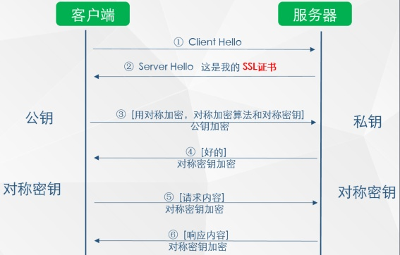

# HTTPS 工作流程是什么

RSA（非对称加密）结合对称加密

RSA 单向发消息和收消息要求绝对安全

对称加密算法比非对称加密算法快大约 1500 倍

1. 客户端发起请求，服务端返回 CA 证书
2. 客户端开始查找操作系统中已内置的受信任的证书发布机构 CA，与服务器发来的证书中的颁发者 CA 比对，用于校验证书是否为合法机构颁发
   1. 如果找不到，浏览器就会报错，说明服务器发来的证书是不可信任的。
3. 如果找到，那么浏览器就会从操作系统中取出 颁发者 CA 的公钥，然后对服务器发来的证书里面的签名进行解密
4. 浏览器使用相同的 hash 算法计算出服务器发来的证书的 hash 值，将这个计算的 hash 值与证书中签名做对比
   1. 对比结果一致，则证明服务器发来的证书合法，没有被修改过
5. 此时浏览器就可以读取证书中的公钥，用于后续加密
6. 客户端生成对称密钥并用公钥发送给服务端
   1. 客户端记录下来生成的密钥
7. 服务端用自己的公钥解析出对称密钥并存储
8. 客户端使用对称密钥加密数据发送
9. 服务端使用对称密钥解密数据，并把响应数据用对称密钥加密

## 对称加密的概念是什么

对称加密：

即通信的双方都使用同一个秘钥进行加解密，比如特务接头的暗号，就属于对称加密

对称加密虽然很简单性能也好，但是无法解决首次把秘钥发给对方的问题，很容易被 hacker 拦截秘钥。

## 非对称加密的概念是什么

非对称加密：

私钥 + 公钥= 密钥对即用私钥加密的数据,只有对应的公钥才能解密,用公钥加密的数据,只有对应的私钥才能解密因为通信双方的手里都有一套自己的密钥对,通信之前双方会先把自己的公钥都先发给对方然后对方再拿着这个公钥来加密数据响应给对方,等到到了对方那里,对方再用自己的私钥进行解密非对称加密虽然安全性更高，但是带来的问题就是速度很慢，影响性能。

解决方案：

那么结合两种加密方式，将对称加密的密钥使用非对称加密的公钥进行加密，然后发送出去，接收方使用私钥进行解密得到对称加密的密钥，然后双方可以使用对称加密来进行沟通。

## 中间人问题

如果此时在客户端和服务器之间存在一个中间人,这个中间人只需要把原本双方通信互发的公钥,换成自己的公钥,这样中间人就可以轻松解密通信双方所发送的所有数据。

所以这个时候需要一个安全的第三方颁发证书（CA），证明身份的身份，防止被中间人攻击。

证书中包括：签发者、证书用途、使用者公钥、使用者私钥、使用者的 HASH 算法、证书到期时间等

## 篡改证书

但是问题来了，如果中间人篡改了证书，那么身份证明是不是就无效了？这个证明就白买了，这个时候需要一个新的技术，数字签名。

数字签名就是用 CA 自带的 HASH 算法对证书的内容进行 HASH 得到一个摘要，再用 CA 的私钥加密，最终组成数字签名。

当别人把他的证书发过来的时候,我再用同样的 Hash 算法,再次生成消息摘要，然后用 CA 的公钥对数字签名解密,得到 CA 创建的消息摘要,两者一比,就知道中间有没有被人篡改了。

## CA 的公钥如何保证保证呢

无法保证

不过通常操作系统和浏览器会预制一些 CA 证书在本地。所以鲍勃应该去那些通过认证的 CA 处申请数字证书。这样是有保障的。

但是如果系统中被插入了恶意的 CA 证书，依然可以通过假冒的数字证书发送假冒的鲍勃公钥来验证假冒的正文信息。所以安全的前提是系统中不能被人插入非法的 CA 证书。

## 参考资源

- [https 工作原理](https://blog.csdn.net/sean_cd/article/details/6966130)
- [对称加密算法和非对称加密算法速度对比](https://blog.csdn.net/woshiaotian/article/details/46990899)
- [HTTPS工作流程](https://www.cnblogs.com/oaks/p/12731476.html)