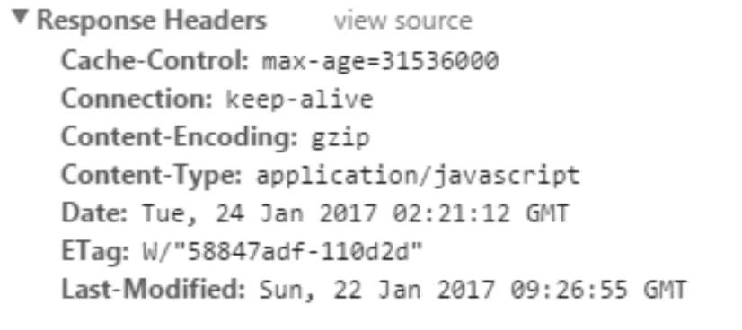
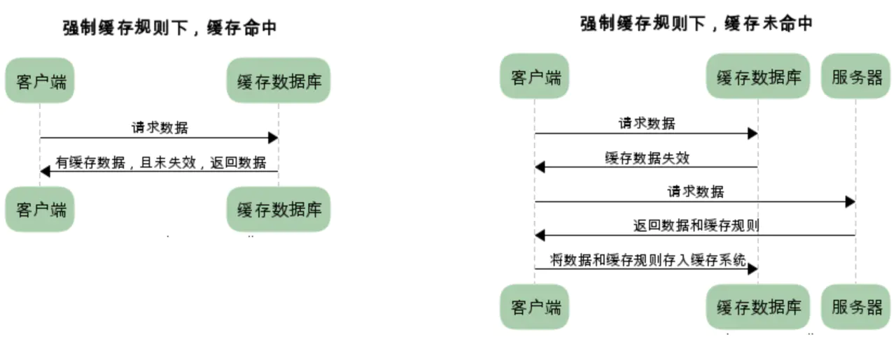

# HTTP 缓存机制是什么

> 每次发起请求，第一次直接请求，返回数据后，保存缓存策略，后续请求，将根据缓存策略判断是否过期，如果过期了继续请求真实服务端，返回的新的缓存策略将覆盖本地旧的策略

我们知道 HTTP 的缓存属于**客户端缓存**。所以我们认为浏览器存在一个缓存数据库，用于储存一些不经常变化的静态文件（图片、css、js 等）。我们将缓存分为强制缓存和协商缓存。下面我将分别详细的介绍这两种缓存的缓存规则。

## 如何判断缓存失效

服务器是如何判断缓存是否失效呢？我们知道浏览器和服务器进行交互的时候会发送一些请求数据和响应数据，我们称之为 HTTP 报文。报文中包含首部 header 和主体部分 body。与缓存相关的规则信息就包含在 header 中。boby 中的内容是 HTTP 请求真正要传输的部分。举个 HTTP 报文 header 部分的例子如下：

## 强制缓存

当缓存数据库中已有所请求的数据时。客户端直接从缓存数据库中获取数据。当缓存数据库中没有所请求的数据时，客户端的才会从服务端获取数据。

### 字段

对于强制缓存，服务器响应的 header 中会用两个字段来表明——Expires 和 Cache-Control。

#### Expires

Exprires 的值为服务端返回的数据到期时间。当再次请求时的请求时间小于返回的此时间，则直接使用缓存数据。但由于服务端时间和客户端时间可能有误差，这也将导致缓存命中的误差，另一方面，Expires 是 HTTP1.0 的产物，故现在大多数使用 Cache-Control 替代。

#### Cache-Control

Cache-Control 有很多值，不同的值代表的意义也不同。

- private：客户端可以缓存
- public：客户端和代理服务器都可以缓存
- max-age=t：缓存内容将在 t 秒后失效
- no-cache：需要使用协商缓存来验证缓存数据
- no-store：所有内容都不会缓存。

## 协商缓存

又称对比缓存，客户端会先从缓存数据库中获取到一个缓存数据的标识，得到标识后请求服务端验证是否失效（新鲜），如果没有失效服务端会返回 304，此时客户端直接从缓存中获取所请求的数据，如果标识失效，服务端会返回更新后的数据。

### 缓存标识

协商缓存需要进行对比判断是否可以使用缓存。浏览器第一次请求数据时，服务器会将缓存标识与数据一起响应给客户端，客户端将它们备份至缓存中。再次请求时，客户端会将缓存中的标识发送给服务器，服务器根据此标识判断。若未失效，返回 304 状态码，浏览器拿到此状态码就可以直接使用缓存数据了。对于协商缓存来说，缓存标识我们需要着重理解一下，下面我们将着重介绍它的两种缓存方案。

#### Last-Modified

服务器在响应请求时，会告诉浏览器资源的最后修改时间。

- if-Modified-Since:

  浏览器再次请求服务器的时候，请求头会包含此字段，后面跟着在缓存中获得的最后修改时间。服务端收到此请求头发现有 if-Modified-Since，则与被请求资源的最后修改时间进行对比，如果一致则返回 304 和响应报文头，浏览器只需要从缓存中获取信息即可。从字面上看，就是说：从某个时间节点算起，是否文件被修改了

  - 如果真的被修改：那么开始传输响应一个整体，服务器返回：200 OK
  - 如果没有被修改：那么只需传输响应 header，服务器返回：304 Not Modified

- if-Unmodified-Since:

  从字面上看, 就是说: 从某个时间点算起, 是否文件没有被修改

  - 如果没有被修改:则开始`继续'传送文件: 服务器返回: 200 OK
  - 如果文件被修改:则不传输,服务器返回: 412 Precondition failed (预处理错误)

这两个的区别是一个是修改了才下载一个是没修改才下载。 Last-Modified 说好却也不是特别好，因为如果在服务器上，一个资源被修改了，但其实际内容根本没发生改变，会因为 Last-Modified 时间匹配不上而返回了整个实体给客户端（即使客户端缓存里有个一模一样的资源）。为了解决这个问题，HTTP1.1 推出了 Etag。

#### Etag

服务器响应请求时，通过此字段告诉浏览器当前资源在服务器生成的唯一标识（生成规则由服务器决定）

- If-None-Match：

  再次请求服务器时，浏览器的请求报文头部会包含此字段，后面的值为在缓存中获取的标识。服务器接收到次报文后发现 If-None-Match 则与被请求资源的唯一标识进行对比。

  - 不同，说明资源被改动过，则响应整个资源内容，返回状态码 200。
  - 相同，说明资源内容没有改动，则响应 header，浏览器直接从缓存中获取数据信息。返回状态码 304.

但是实际应用中由于 Etag 的计算是使用算法来得出的，而算法会占用服务端计算的资源，所有服务端的资源都是宝贵的，所以就很少使用 Etag 了。

## 优先级

两类缓存机制可以同时存在，强制缓存的优先级高于协商缓存，当执行强制缓存时，如若缓存命中，则直接使用缓存数据库数据，不在进行缓存协商。

## 缓存的优点

- 减少了冗余的数据传递，节省宽带流量
- 减少了服务器的负担，大大提高了网站性能
- 加快了客户端加载网页的速度 这也正是 HTTP 缓存属于客户端缓存的原因。

## 不同刷新的请求执行过程

- 浏览器地址栏中写入 URL，回车

  浏览器发现缓存中有这个文件了，不用继续请求了，直接去缓存拿。（最快）

- F5

  F5 就是告诉浏览器，别偷懒，好歹去服务器看看这个文件是否有过期了。于是浏览器就胆胆襟襟的发送一个请求带上 If-Modify-since。

- Ctrl+F5

  告诉浏览器，你先把你缓存中的这个文件给我删了，然后再去服务器请求个完整的资源文件下来。于是客户端就完成了强行更新的操作.

## 参考资源

- [HTTP----HTTP 缓存机制](https://juejin.im/post/5a1d4e546fb9a0450f21af23)
