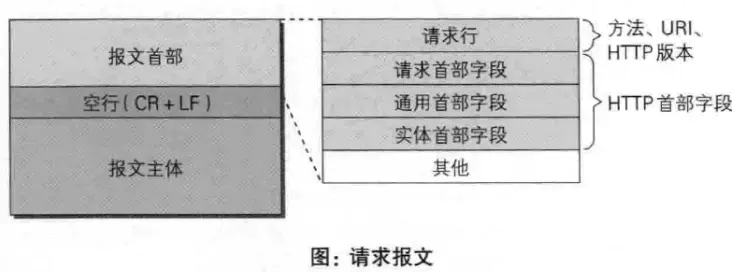
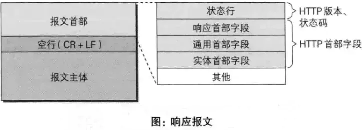

# HTTP 请求报文与响应报文格式是什么

## 请求报文

1. 请求行：包含请求方法、URI、HTTP 版本信息
2. 请求首部字段
3. 请求内容实体
4. 空行

## 响应报文

1. 状态行：包含 HTTP 版本、状态码、状态码的原因短语
2. 响应首部字段
3. 响应内容实体
4. 空行

## 常见的首部

通用首部字段（请求报文与响应报文都会使用的首部字段）

1. Date：创建报文时间
2. Connection：连接的管理
3. Cache-Control：缓存的控制
4. Transfer-Encoding：报文主体的传输编码方式
5. 请求首部字段（请求报文会使用的首部字段）
6. Host：请求资源所在服务器
7. Accept：可处理的媒体类型
8. Accept-Charset：可接收的字符集
9. Accept-Encoding：可接受的内容编码
10. Accept-Language：可接受的自然语言
11. 响应首部字段（响应报文会使用的首部字段）
12. Accept-Ranges：可接受的字节范围
13. Location：令客户端重新定向到的 URI
14. Server：HTTP 服务器的安装信息
15. 实体首部字段（请求报文与响应报文的的实体部分使用的首部字段）
16. Allow：资源可支持的 HTTP 方法
17. Content-Type：实体主类的类型
18. Content-Encoding：实体主体适用的编码方式
19. Content-Language：实体主体的自然语言
20. Content-Length：实体主体的的字节数
21. Content-Range：实体主体的位置范围，一般用于发出部分请求时使用

## 参考资源

- [https 工作原理](https://blog.csdn.net/sean_cd/article/details/6966130)
