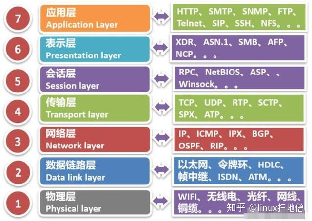

# TCP-IP 协议分层模型有哪些

1. 物理层

   将二进制的 0 和 1 和电压高低，光的闪灭和电波的强弱信号进行转换

2. 链路层代表驱动

3. 网络层

   使用 IP 协议，IP 协议基于 IP 转发分包数据 IP 协议是个不可靠协议，不会重发 IP 协议发送失败会使用 ICMP 协议通知失败 ARP 解析 IP 中的 MAC 地址，MAC 地址由网卡出厂提供 IP 还隐含链路层的功能，不管双方底层的链路层是啥，都能通信

4. 传输层

   通用的 TCP 和 UDP 协议

   TCP 协议面向有连接，能正确处理丢包，传输顺序错乱的问题，但是为了建立与断开连接，需要至少 7 次的发包收包，资源浪费 UDP 面向无连接，不管对方有没有收到，如果要得到通知，需要通过应用层

5. 会话层

6. 表示层

7. 应用层

## 参考资源

- [你学习的 TCP/IP 协议栈到底是几层](https://www.zhihu.com/search?q=tcp%2Fip%E5%8D%8F%E8%AE%AE%E5%8C%85%E5%90%AB%E5%93%AA%E5%87%A0%E5%B1%82&utm_content=search_history&type=content)
