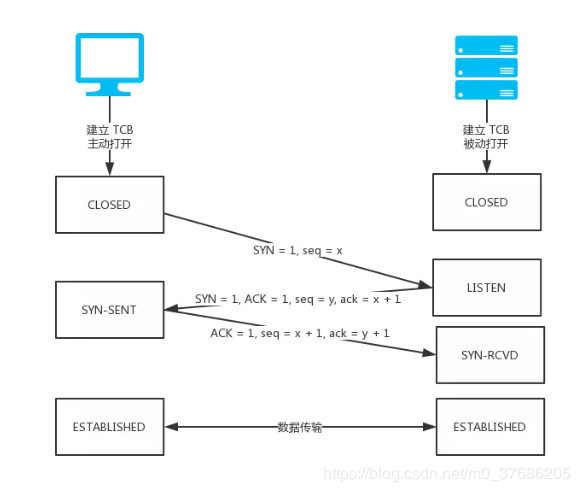
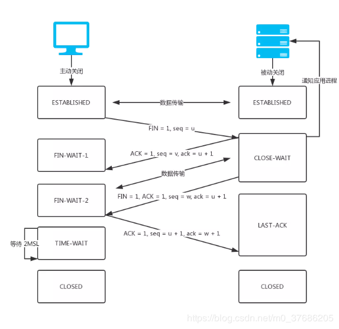

# 三次握手和四次挥手的流程是什么

## 三次握手流程是什么

解析 URL 时建立 TCP 连接阶段，TCP 是以后总归面向连接的，可靠的，基于字节流的传输控制协议。经历了三次握手，客户端与服务端就建立了连接。

### 1. 第一次握手

起初两端都处于 CLOSED 关闭状态，Client 将标志位 SYN(TCP/IP 建立连接时使用的握手信号) 置为 1，随机产生一个值 seq = x，并将该数据包发送给 Server，Client 进入 SYN-SENT 状态，等待 Server 确认。

### 2. 第二次握手

Server 收到数据包后由标志位 SYN = 1 得知 Client 请求建立连接，Server 将标志位 SYN 和 ACK 都置为 1，ack = x + 1，随机产生一个值 seq = y，并将该数据包发送给 Client 以确认连接请求，Server 进入 SYN-RCVD 状态，此时操作系统为该 TCP 连接分配 TCP 缓存和变量。

### 3. 第三次握手

Client 收到确认后，检查 seq 是否为 x + 1，ACK 是否为 1，如果正确则将标志位 ACK 置为 1，ack = y + 1，并且此时操作系统为该 TCP 连接分配 TCP 缓存和变量，并将该数据包发送给 Server，Server 检查 ack 是否为 y + 1，ACK 是否为 1，如果正确则连接建立成功，Client 和 Server 进入 established 状态，完成三次握手，随后 Client 和 Server 就可以开始传输数据。

## 为什么是三次握手

因为 TCP 需要保证数据传输的可靠性

主动方发送握手请求，被动方需要发送响应已确认，所以看上去一共是四次请求

不过被动方的握手请求和响应确认可以合并在一次请求中完成，所以就减少了一次

## 四次回收的流程是什么

解析 URL 时关闭 TCP 连接的操作

### 1. 第一次挥手

Client 的应用进程先向其 TCP 发出连接释放报文段（FIN<结束 TCP 回话的结束标志> = 1，序号 seq = u），并停止再发送数据，主动关闭 TCP 连接，进入 FIN-WAIT-1（终止等待 1）状态，等待 Server 的确认。

### 2. 第二次挥手

Server 收到连接释放报文段后即发出确认报文段，（ACK = 1，确认号 ack = u + 1，序号 seq = v），Server 进入 CLOSE-WAIT（关闭等待）状态，此时的 TCP 处于半关闭状态，Client 到 Server 的连接释放。

Client 收到 Server 的确认后，进入 FIN-WAIT-2（终止等待 2）状态，等待 Server 发出的连接释放报文段。

### 3. 第三次挥手

Server 已经没有要向 Client 发出的数据了，Server 发出连接释放报文段（FIN = 1，ACK = 1，序号 seq = w，确认号 ack = u + 1），Server 进入 LAST-ACK（最后确认）状态，等待 Client 的确认。

### 4. 第四次挥手

Client 收到 Server 的连接释放报文段后，对此发出确认报文段（ACK = 1，seq = u + 1，ack = w + 1），Client 进入 TIME-WAIT（时间等待）状态。此时 TCP 未释放掉，需要经过时间等待计时器设置的时间 2MSL 后，Client 才进入 CLOSED 状态。

## 为什么是四次回收

因为 TCP 是全双工通信的

1. 第一次挥手

   因此当主动方发送断开连接的请求（即 FIN 报文）给被动方时，仅仅代表主动方不会再发送数据报文了，但主动方仍可以接收数据报文。

2. 第二次挥手

   被动方此时有可能还有相应的数据报文需要发送，因此需要先发送 ACK 报文，告知主动方“我知道你想断开连接的请求了”。这样主动方便不会因为没有收到应答而继续发送断开连接的请求（即 FIN 报文）。

3. 第三次挥手

   被动方在处理完数据报文后，便发送给主动方 FIN 报文；这样可以保证数据通信正常可靠地完成。发送完 FIN 报文后，被动方进入 LAST_ACK 阶段（超时等待）。

4. 第四挥手

   如果主动方及时发送 ACK 报文进行连接中断的确认，这时被动方就直接释放连接，进入可用状态。

## 参考资源

- [浏览器解析 URL](https://blog.csdn.net/m0_37686205/article/details/88383396)
- [TCP 为什么是四次挥手，而不是三次？](https://www.zhihu.com/question/63264012/answer/298264454)
