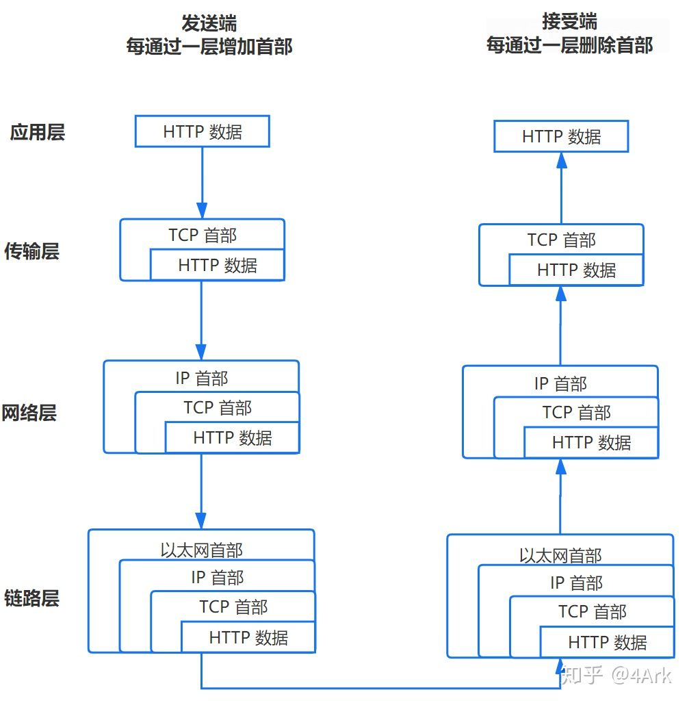
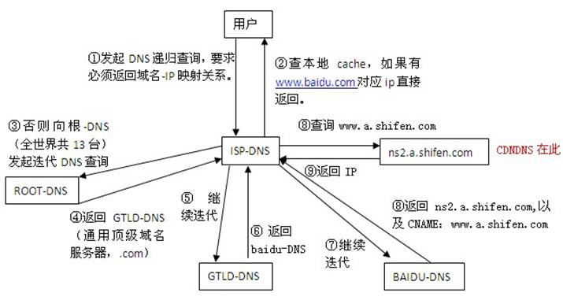
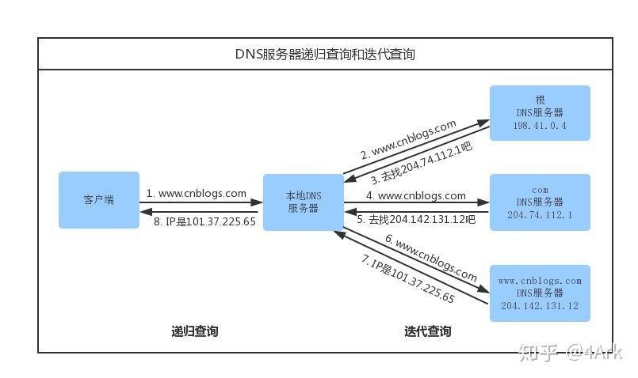
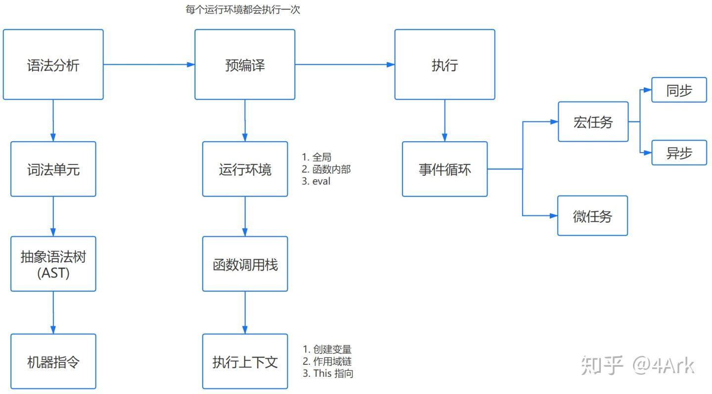

# 浏览器输入 url 到页面的展现发生了什么

1. 在浏览器地址栏输入 URL
2. 浏览器 URL 解析获取协议，主机，端口，path
3. HSTS：由于安全隐患，会使用 HSTS 强制客户端使用 HTTPS 访问页面
4. 检查本地缓存策略，判断资源是否过期
   1. 如果没有过期直接返回
5. 过期了根据缓存策略继续请求
6. DNS 解析得到 IP 地址
   1. DNS 缓存
      1. 浏览器缓存
      2. 操作系统缓存
      3. 路由器缓存
      4. ISP 缓存
      5. 根域名服务器缓存
   2. CDN 域名解析
      1. 经过本地 DNS 系统解析，DNS 系统会最终将域名的解析权交给 CNAME 指向的 CDN 专用 DNS 服务器
      2. CDN 的 DNS 服务器将 CDN 的全局负载均衡设备 IP 地址返回用户
      3. 用户向 CDN 的全局负载均衡设备发起内容 URL 访问请求
      4. CDN 全局负载均衡设备根据用户 IP 地址，以及用户请求的内容 URL，选择一台用户所属区域的区域负载均衡设备，发起请求。
      5. 区域负载均衡设备会将缓存服务器 IP 地址返回给 CDN 全局负载均衡设备
      6. CDN 全局负载均衡设备把缓存服务器的 IP 地址返回给用户
7. 客户端获取主机 IP 地址
8. 打开一个 socket 与目标 IP 地址，端口建立 TCP 连接，包装数据，进行发送
9. 服务器建立 TCP 连接，接收数据，解析数据
10. 服务器处理请求

    1. 接受 TCP 报文后，会对连接进行处理，对 HTTP 协议进行解析（请求方法、域名、路径等），并且进行一些验证
    2. 判断是否重定向
    3. URL 重写

       然后会查看 URL 重写规则，如果请求的文件是真实存在的，比如图片、html、css、js 文件等，则会直接把这个文件返回。

       否则服务器会按照规则把请求重写到 一个 REST 风格的 URL 上。

       然后根据动态语言的脚本，来决定调用什么类型的动态文件解释器来处理这个请求。

    4. 返回资源或者返回响应

11. 客户端接收响应，断开连接，TCP 四次挥手
12. 解析 HTML 文档

    1. 预解析
    2. 标记化
    3. 构建树
       1. 解析 Script 阻塞 HTML 解析
       2. 加载解析 CSS 会阻塞脚本执行
       3. CSSstyleSheet
          1. CSSRules
             1. 选择器：声明
       4. attachment
          1. 样式计算
             1. 选择器存储及权重计算
             2. 层叠样式表
                1. 浏览器声明
                1. 用户普通声明
                1. 作者普通声明
                1. 作者重要声明
                1. 用户重要声明
             3. renderStyle 对象
             4. 全局 CSS 加载完成后可能的重新计算
          2. renderTree
    4. layout
    5. paint
    6. 合并渲染
    7. 回流与重绘

13. 解析完毕：浏览器会将文档标注为 交互状态，并开始解析那些处于 deferred 模式的脚本，也就是那些应在文档解析完成后才执行的脚本。然后，文档状态将设置为 完成 ，一个 加载 事件将随之触发。

14. 最后展现出来给用户

## TCP 连接

TCP/IP 分为四层，在发送数据时，每层都要对数据进行封装：

### 应用层：发送 HTTP 请求

在前面的步骤我们已经得到服务器的 IP 地址，浏览器会开始构造一个 HTTP 报文，其中包括：

请求报头（Request Header）：请求方法、目标地址、遵循的协议等等请求主体（其他参数）

### 传输层：TCP 传输报文

传输层会发起一条到达服务器的 TCP 连接，为了方便传输，会对数据进行分割（以报文段为单位），并标记编号，方便服务器接受时能够准确地还原报文信息。

在建立连接前，会先进行 TCP 三次握手。

### 网络层：IP 协议查询 Mac 地址

将数据段打包，并加入源及目标的 IP 地址，并且负责寻找传输路线。

判断目标地址是否与当前地址处于同一网络中，是的话直接根据 Mac 地址发送，否则使用路由表查找下一跳地址，以及使用 ARP 协议查询它的 Mac 地址。

### 链路层：以太网协议

以太网协议

根据以太网协议将数据分为以“帧”为单位的数据包，每一帧分为两个部分：

标头：数据包的发送者、接受者、数据类型数据：数据包具体内容

#### Mac 地址

以太网规定了连入网络的所有设备都必须具备“网卡”接口，数据包都是从一块网卡传递到另一块网卡，网卡的地址就是 Mac 地址。每一个 Mac 地址都是独一无二的，具备了一对一的能力。

#### 广播

发送数据的方法很原始，直接把数据通过 ARP 协议，向本网络的所有机器发送，接收方根据标头信息与自身 Mac 地址比较，一致就接受，否则丢弃。

## DNS 查询方式

递归方式：一路查下去中间不返回，得到最终结果才返回信息（浏览器到本地 DNS 服务器的过程）

迭代方式，就是本地 DNS 服务器到根域名服务器查询的方式。

## JS 执行

