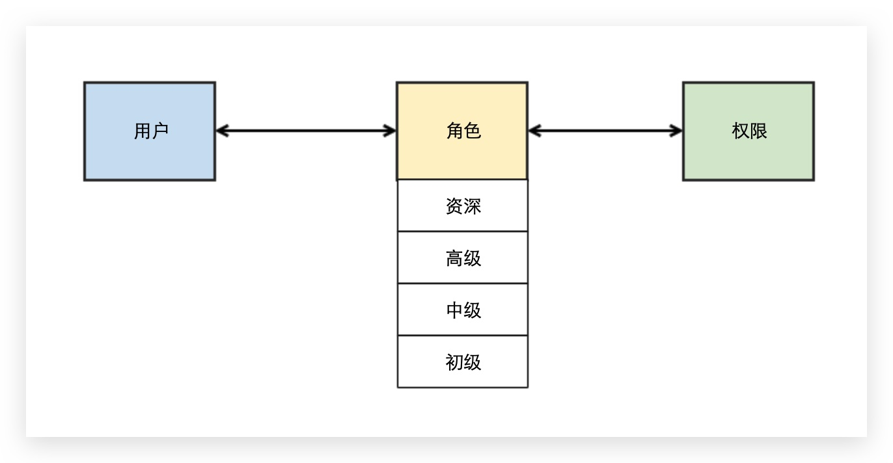

# RBAC 权限模型是什么

## 权限模型分类

权限 二字从字面上可拆分为 权力+限制，从使用者的角度来说，也就是在限制的范围内正确地行驶权力，而站在设计者的角度来解读，则是通过合理的手段控制使用者能访问到他们能够访问到的资源。

在权限设计领域，最常见的权限模型有以下四种：

1. ACL（Access Control List）：访问控制列表 用户 -> 权限
2. RBAC（Role-Based Access Control）：基于 角色 的权限控制 用户 -> 角色 -> 权限
3. ABAC（Attribute-Based Access Control）：基于 属性 的权限控制，该模型根据特殊的规则分配权限 （用户、资源、对象属性）-> 权限
4. PBAC（Policy-Based Access Control）：基于 策略 的权限控制，用户（组）隶属于角色，角色隶属于资源（项目）用户 -> 角色 -> （资源/项目 + 权限）

因此就出现了 RBAC 模型，这是软件设计中最常用的权限管理模型，相比于 ACL 模型，RBAC 模型在用户与权限之间多了一个元素「角色」，通过权限关联角色、角色关联用户的方法来间接地赋予用户权限，从而实现用户与权限的解耦。

后两种大概知道就行，因为一般不会用到，详情可自行 Google 了解。

## RBAC 模型的演进

在 RBAC 模型的演进发展出四个版本，分别是 RBAC 0~3。

### RBAC0 模型

RBAC9 是最基础的权限模型，很多产品基于该模型就已经能满足设计需求。用户和角色之间可以是一对多也可以是多对多关系，而角色和权限之间则多以多对多的关系为主，用户拥有的权限等于他所有的角色持有的权限之和。

#### 应用场景

例如在电商公司中抽象出几种管理业务的角色，诸如销售经理、项目经理、市场经理等等，小陈既担当营销部门的市场经理又担当销售部的销售经理，那么就需要将这两个角色的赋予给他。

### RBAC1 模型

RBAC1 模型其实是 RBAC0 的升级版，它对角色这层元素上进行了细分，引入继承的概念，也就是可以继承某个基础角色生成子角色。

#### RBAC1 应用场景

承接上面的例子，市场经理岗位可能会分为总监级别、经理级别、副经理级别，这时候如果小陈只是一个副经理级别的，那么他所拥有的市场经理的权限肯定就没有总监级别的多。

#### 优势

RBAC1 模型则更好地在角色层面进行细分，更好地映射了企业组织架构中的职能的权限，根据实际的管理权限对相似职能的角色进行删减以达到级别分明的效果。

### RBAC2 模型

在 RBAC2 中对角色层面增加了更多的限制：

#### 静态职责分离 SSD

1. 角色互斥：相同用户不能同时拥有互斥关系的角色，例如会计和出纳两个角色就是互斥的
2. 基数约束：角色被分配到的用户有数量上限，例如公司中只有一个 CEO 职位，那么这个角色的数量就是有限的
3. 先决条件角色：要拥有更高级别的角色权限，需要先获取到相对来说低级别的一些权限，例如副经理要想获取到总监级别权限，那么他需要先获取到经理级别的权限

#### 动态职责分离 DSD

动态的限制用户及其拥有的角色，例如一个用户可以同时拥有两个角色，但是运行时只能激活一个角色

### RBAC3 模型

RBAC3 模型就是 RBAC1 + RBAC2 两个模型的合集，所以 RBAC3 既有 RBAC1 的角色等级划分，也有 RBAC2 的角色限制。这种模型只有在系统比较复杂的时候才派得上用场，不然设计得过度复杂，对开发和后期维护也不是好事情。

### RBAC 模型的优缺点

#### 优点

简化了用户和权限的关系，权限只要一次赋予角色就能重复使用对后续的维护更加友好，用户和权限之间存在更多的斡旋空间，便于基于角色进行权限扩展

#### 缺点

RBAC 模型并未提供控制操作顺序的机制，会对有严格操作顺序的系统造成困难

## 参考资源

- [基于 RBAC 权限模型的架构设计](https://github.com/earlyBirdCamp/articles/issues/31)
